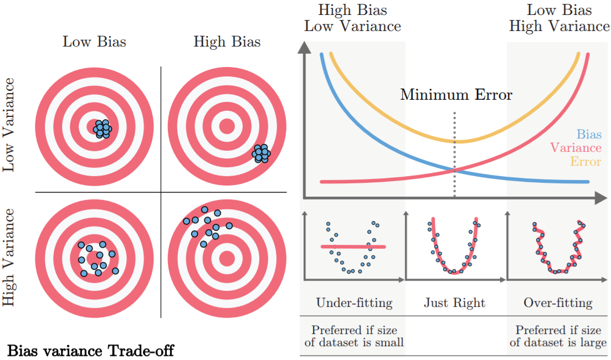
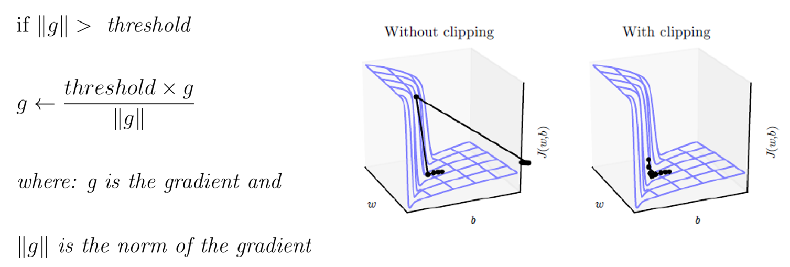

Gần đây, AI/ML là một cái trend, người người AI, nhà nhà AI. Sinh viên đổ xô đi học AI hết, các trường đại học cũng dần mở các môn về học máy, trí tuệ nhân tạo, rồi thị giác máy tính để "bắt kịp". <!--truncate-->Dưới đây, mình sẽ trình bày về các câu hỏi phỏng vấn cơ bản, dành cho các bạn muốn tìm các vị trí thực tập trong lĩnh vực này.

### 1. Bias, variance
**Các câu hỏi mục này sẽ xung quanh các thông số trên là gì, nó cao nó thấp thì ảnh hưởng như nào, xử lý thế nào?**
- Bias là sai số giữa kết quả dự đoán của model và các nhãn thực sự của chúng ta. Bias thể hiện năng lực của model trong việc dự đoán. Bias cao nói lên rằng model của chúng ta không quan tâm đến dữ liệu, model quá đơn giản để mà có thể học được các đặc trưng từ dữ liệu. Bias cao thường cho kết quả lỗi cao trên cả tập huấn luyện và tập kiểm thử. Hiện tượng này gọi là underfitting.
- Variance là độ phân tán của kết quả dự đoán của model chúng ta. Variance cao nói lên rằng model của chúng ta quá tập trung vào tập dữ liệu huấn luyện, có thể phân loại các điểm dữ liệu huấn luyện tốt mà không tổng quát tốt, thích ứng tốt với các điểm dữ liệu mới, model của chúng ta quá phức tạp nhưng lượng dữ liệu của chúng ta lại không đủ lớn. Hiện tượng này gọi là overfitting.

Dưới đây là hình ảnh minh họa cho bias và variance

Gọi ground truth (có nghĩa là giá trị nhãn thực sự của dữ liệu đầu vào) là điểm mà nằm ở tâm các hình tròn ở trên, còn các prediction (là các giá trị nhãn dự đoán của ta), là các chấm tròn màu xanh nước biển. Với trường hợp low bias và low variance, các điểm nhãn dự đoán sẽ rất sát nhau và sát với tâm của bia tròn, thể hiện rằng độ phân tán các kết quả dự đoán thấp và khoảng cách giữa nhãn dự đoán và nhãn thực tế thấp, tượng tự các trường hợp khác.

Các phương pháp giảm thiểu overfitting
- Kiếm nhiều dữ liệu hơn cho mô hình.
- Các kỹ thuật regularization, drop out, early stopping, batch normalization (cái này giảm thiểu một ít thôi).
- Chỉnh sửa các siêu tham số của mô hình để kiểm soát quá trình huấn luyện.

Các phương pháp giảm thiểu underfitting
- Huấn luyện nhiều epoch hơn.
- Xây mạng to hơn, tăng số đặc trưng đầu vào lên.
- Loại bỏ các điểm dữ liệu gây nhiễu.

### 2. Batch normalization
Là một kỹ thuật giúp mô hình ổn định hơn trong quá trình huấn luyện (ở đây mình sẽ không trình bày về toán của batch normalization). Một số tính chất của batch normalization như sau
- Batchnorm khiến quá trình huấn luyện ổn định hơn, mạng hội tụ nhanh hơn.
- Batchnorm cho phép ta sử dụng learning rate lớn hơn.
- Batchnorm khiến việc khởi tạo các ma trận trọng số dễ dàng hơn vì nó giúp giảm thiểu độ nhạy của mô hình với các vấn đề gradient vanishing/exploding. Từ đó, việc tạo dựng mạng của chúng ta dễ thở hơn.
- Batchnorm cho ta nhiều lựa chọn các hàm kích hoạt, bởi vì một số hàm kích hoạt có đạo hàm thường co về ${0}$ nhanh trong quá trình backpropagation như sigmoid,… Batchnorm điều tiết dữ liệu của chúng ta về 1 phân bố nhất định để trong khoảng giá trị đó, đạo hàm các hàm kích hoạt có độ lớn tương đối.
- Batchnorm cho một số hiệu ứng phụ của regularization, bởi vì Batchnorm khiến các điểm dữ liệu có kỳ vọng là ${0}$, độ lệch chuẩn nhỏ, ở đó, các hàm kích hoạt thường có dạng gần với tuyến tính, nên mô hình của ta nó đỡ độ phi tuyến hơn.

**Tại sao Batchnorm giúp thuật toán hội tụ nhanh hơn?**

- Batchnorm khiến cho các đầu vào trước các hàm kích hoạt của chúng ta về khoảng giá trị nhất định và có kỳ vọng là ${0}$. Đầu vào lúc đó không quá to hay cũng không quá nhỏ, nên đạo hàm của hàm kích hoạt sẽ không gần đến ${0}$, do đó hội tụ nhanh hơn.
- Batchnorm khiến cho các đầu vào nằm trong 1 khoảng giá trị nhỏ, khi đó thì hàm mất mát của ta có đồ thị tròn hơn, do vậy, khoảng cách từ 1 điểm bất kỳ trên đồ thị tới một điểm cực tiểu bất kỳ sẽ ngắn hơn, model của chúng ta sẽ tìm được điểm cực tiểu nhanh hơn.

**Sự khác nhau của train và test khi thực hiện Batchnorm?**

Khi train, Batchnorm có thể được áp dụng trên các minibatch, 1 mini-batch có N điểm dữ liệu. Trong quá trình train, ta Batchnorm trên $N$ điểm dữ liệu đó. Nhưng ở test time, ta chỉ có 1 dữ liệu 1 lần và phải đưa dự đoán với 1 điểm dữ liệu đó. Có 1 cách là ta ước lượng $\mu$ và $\sigma$ bằng Exponentially Weighted Average để sử dụng vào test time.

Ví dụ: Trong quá trình train, tại layer $L$, nó cho $\mu$ và $\sigma$ nhất định, ta lưu nó,… Khi hoàn tất quá trình train, mỗi layer $L$ đều số cặp $\mu$ và $\sigma$ bằng số mini-batch. Và ta sử dụng kỹ thuật Exponentially Weighted Average để tính $\mu$ và $\sigma$ cho layer $L$ cho điểm dữ liệu ở test time đó.

### 3. Mini-batch nhỏ hay lớn ảnh hưởng thế nào?
- Mini-batch nhỏ thì trên đồ thị hàm loss, đường đi từ 1 điểm bất kỳ đến 1 điểm cực trị local minimum sẽ rất gồ ghề và có thể cần nhiều epoch hơn để có được 1 local minimum tốt. Nhưng việc tính toán sẽ nhanh hơn, bộ nhớ nạp dữ liệu tốn ít hơn.
- Mini-batch lớn thì đường đi thẳng về đích hơn nhưng việc tính toán đắt đỏ hơn sẽ làm quá trình huấn luyện chạy lâu hơn.

### 4. Hiện tượng Imbalanced Data
Là hiện tượng mà tập dữ liệu của ta có các lớp phân loại có sự sai khác lớn về số lượng dữ liệu.
Ví dụ: trong chuẩn đoán bệnh ung thư, tập dữ liệu cho thấy, có $95\%$ được đánh nhãn là không có dấu hiệu bị ung thư, $5\%$ còn lại là có dấu hiệu bị ung thư. Khi đó mô hình của ta sẽ rất khó khăn để đưa ra dự đoán, thậm chí trong trường hợp đưa ra dự đoán âm tính hết thì cũng đã có accuracy là $\sim95\%$. Khi này accuracy không còn là 1 metric tốt để mà đánh giá mô hình nữa, ta sẽ dùng precision, recall, hay F2-score.

Để giải quyết, dùng các kỹ thuật sau
- Ta có thể data augmentation lớp phân loại mà có số lượng ít dữ liệu, như crop, xoay hình, làm méo,…
- Sử dụng metric phù hợp để đánh giá.
- Oversampling và Undersampling.
- Thay đổi hàm mất mát của ta, bằng việc tăng trọng số cho phần hàm mất mát tại các điểm ở lớp phân loại có lượng dữ liệu thấp, trừng phạt nặng nếu mô hình dự đoán sai các điểm dữ liệu đó.

### 5. Gradient vanishing/exploding
Theo lý thuyết, mạng của ta càng sâu, thì độ chính xác trong quá trình dự đoán càng cao hơn, bởi vì khi đó mạng của ta sẽ học được nhiều đặc trưng phức tạp. Nhưng thực tế, độ chính xác của mạng sẽ bão hòa đến một mức sâu nào đó của mạng, thậm chí còn giảm khi mạng ta quá sâu. Nguyên nhân là bởi các hiện tượng gradient vanishing/exploding.

**Hiện tượng Gradient vanishing/exploding là gì?**

Quá trình khởi tạo ma trận trọng số, các giá trị thường có kỳ vọng là ${0}$, độ lệch chuẩn là $1$, do vậy các giá trị đó thường nằm trong khoảng $[-1, 1]$. Các hàm kích hoạt thường có giá trị đầu ra nằm trong khoảng $(0, 1)$ để biểu diễn xác suất của quá trình phân loại.
- Gradient vanishing: hiện tượng mà khi trong quá trình thực hiện thuật toán lan truyền ngược backpropagation, gradient càng về các lớp nông hơn sẽ càng co dần về ${0}$, làm cho các lớp ở đầu đó không thể cập nhật, không thể “học” được nữa. Các giá trị gradient ở tầng $L - 1$ sẽ phụ thuộc vào giá trị gradient ở tầng $L$, giá trị đầu ra hàm kích hoạt tại tầng $L - 1$ và giá trị ma trận trọng số tại tầng $L - 1$. Do vậy, giá trị sẽ co về ${0}$ rất nhanh vì nó bao gồm nhiều số nhỏ hơn $1$ nhân với nhau.
- Gradient exploding: tương tự như trên nhưng ngược lại.

**Các phương pháp chống Gradient vanishing/exploding?**

- Khởi tạo ma trận trọng số bằng cách khởi tạo khác: Xavier initialization,…
- Chọn hàm kích hoạt phù hợp: những biến thể của Relu (ELU, SELU)…
- Sử dụng Batchnorm. Tuy nhiên sử dụng Batchnorm sẽ khiến mạng phức tạp hơn, tính toán lâu hơn, ta nên cân nhắc giải pháp sử dụng các hàm kích hoạt phù hợp trước khi áp dụng Batchnorm.
- Gradient clipping (xử lý gradient exploding).

