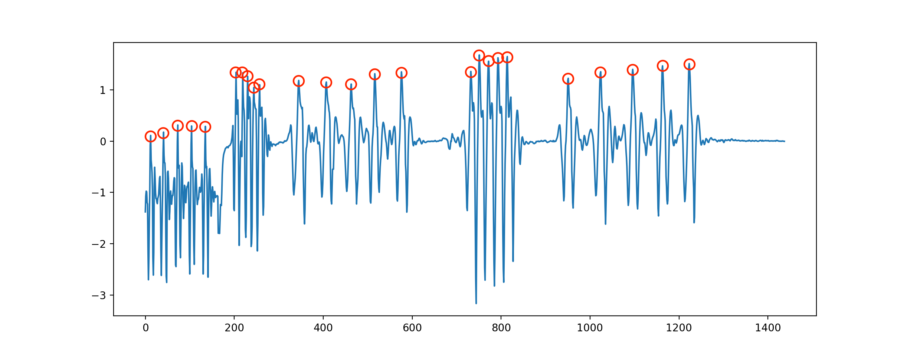
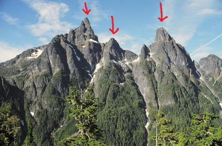
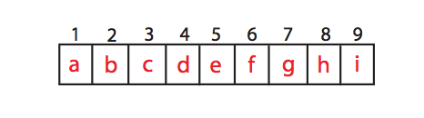
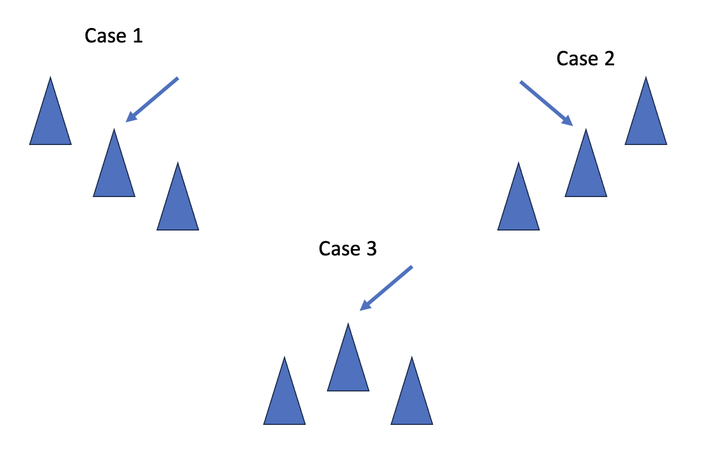

Today I will talk about an extremely basic algorithm that I and most of you who are starting to learn about algorithmic programming have done. That is the Peak Finding algorithm.

<!--truncate-->

## Introduction to the algorithm

In an array, a number is said to be a "peak" if and only if its adjacent elements are less than or equal to the element in question. Imagine that there is a mountain range like this



The red arrows above point to the peaks of a mountain range, because those points are higher than the neighboring points around it (the points on the mountainside).

To be more intuitive in programming, let's take an example with the following array:


Considering the array of symbols above, the element at position 3 is called a peak if and only if **${c \ge b}$** and **${c \ge d}$**. The 9th element is called a peak if and only if **${i \ge h}$**.

Notice that:

- In an array, there will always be at least one peak.
- This problem of ours will be to find one peak, not all the peaks.

## Finding peak in 1-dimensional array

Suppose we have a 1-dimensional array of **${n}$** elements, find a peak of that array.

### Linear Traversing

**Idea:** Iterate through each element of the array and check if the element under consideration satisfies the property of being a peak.

**Algorithm analysis:** Each element being browsed will have conditional statements to check if the element is a peak, these conditional statements take constant time ${\Theta(1)}$. In the worst case, we'll have to go through all **${n}$** elements of the array to find the peak. Therefore, the worst case of the algorithm will have a time complexity of ${\Theta(n)}$.

### Binary Search

**Idea:** In this way, we will always look at the middle of the traversed array and decide which half of the array to traverse to find the peak.

**Algorithm:**

- Look at the location ${\frac{n}{2}}$.
- If ${a[\frac{n}{2}] \lt a[\frac{n}{2} - 1]}$, we look at the left half (the elements ${1, 2,...,\frac{n}{2} - 1)}$ of the array under consideration to find the peak.
- If ${a[\frac{n}{2}] \lt a[\frac{n}{2} + 1]}$, we look at the right half (the elements ${\frac{n}{2} + 1, \frac{n}{2} + 2,..., n)}$ of the array under consideration to find the peak.
- If both conditions are not satisfied, we return the position element ${\frac{n}{2}}$ is a peak.

To explain this, I have a drawing to make it more intuitive



The red arrow points to the current position. Suppose we are standing on a position in the mountains, so that we can climb to the top, we will always look to the side that we see its position higher than where we are standing, and that is also the algorithm to solve for this problem.

**Algorithm analysis:** Using divide and conquer, we have the following expression

<p style={{textAlign: "center"}}>

${T(n) = T(\frac{n}{2}) + \Theta(1)}$

</p>

Time complexity for comparative conditionals ${\Theta(1)}$, base case here is ${T(1) = \Theta(1)}$.
From that, ${T(n) = \Theta(1) + \Theta(1) +...+ \Theta(1) = \Theta(log{_2}{n})}$.

**Python Code**

```python
import math
ini_arr = [10, 20, 15, 2, 23, 90, 67]

def peak_finding(arr):
    length = len(arr)
    middle = math.floor(length / 2)
    if length == 1:
        return arr[0]
    if length == 2:
        return arr[0] if (arr[0] >= arr[1]) else arr[1]
    if arr[middle] < arr[middle - 1]:
        return peak_finding(arr[:middle])
    elif arr[middle] < arr[middle + 1]:
        return peak_finding(arr[middle + 1:])
    else:
        return arr[middle]


print(peak_finding(ini_arr))
```

Output

```python
20
```

## Finding peak in 2-dimensional array

Suppose we have a 2-dimensional array **${m \times n}$** represented as a matrix of m rows and n columns


An element is considered to be a peak if and only if it is greater than or equal to all adjacent elements vertically and horizontally.

### Direct traversal

**Idea:** Iterate through each element of the array and check if the element under consideration satisfies the property of being a peak.

**Algorithm analysis:** the worst case of the algorithm will have a time complexity of ${\Theta(m \times n)}$.

### Greedy Ascent Algorithm

**Idea:** We start at a random point. With the point under consideration, we compare it with 4 adjacent points vertically and horizontally, if any value is greater than the point under consideration, we will consider the next point to be that point.

**Algorithm analysis:** At first glance, the algorithm seems to be more efficient, but its worst case is still ${\Theta(m \times n)}$ when we have to traverse most of the elements.

### Jamming Binary Search Algorithm

**Idea:** We rely on Binary Search as applied to the 1-dimensional array above.

**Algorithm:**

- Select the column in the middle ${i = \frac{n}{2}}$. Find the maximum value of that column. Assume that value is at position ${(j, i)}$.
- Compare elements at positions ${(j, i - 1), (j, i), (j, i + 1)}$.
- We choose the left-part submatrix if ${a[j, i - 1] \gt a[j, i]}$, choose the right-part submatrix if ${a[j, i + 1] \gt a[j, i]}$ to consider the next step.
- Otherwise, we return the value ${a[j, i]}$ is a peak.

**Algorithm analysis:** The base case here will be that we only have a single column, find the maximum value of that column. From this, we have the following expression

<p style={{textAlign: "center"}}>

${T(m, n) = T(m, \frac{n}{2}) + \Theta(m) }$

</p>

With ${T(m, 1) = \Theta(m)}$.
Therefore, ${T(m, n) = \Theta(m) + \Theta(m) +...+ \Theta(m) = \Theta(mlog{_2}{n})}$.

**Python Code**

```python
import numpy as np
import math
ini_matrix = np.array([[14, 13, 12, 6], [15, 9, 11, 7], [
                      16, 17, 19, 92], [17, 18, 17, 12]])

def peak_finding_2d(matrix):
    (rows, cols) = matrix.shape
    j = math.floor(cols / 2)
    i_in_max = np.argmax(matrix[:, j])
    if cols == 1:
        return matrix[i_in_max, j]
    if cols == 2:
        peak_1 = np.amax(matrix[:, 0])
        peak_2 = np.amax(matrix[:, 1])
        return peak_1 if peak_1 >= peak_2 else peak_2
    if matrix[i_in_max, j] < matrix[i_in_max, j-1]:
        return peak_finding_2d(matrix[:, :j])
    elif matrix[i_in_max, j] < matrix[i_in_max, j+1]:
        return peak_finding_2d(matrix[:, (j+1):])
    else:
        return matrix[i_in_max, j]


print(peak_finding_2d(ini_matrix))
```

Output

```python
92
```
