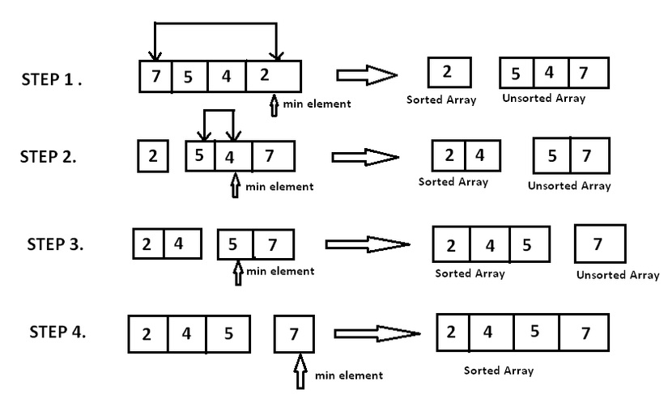
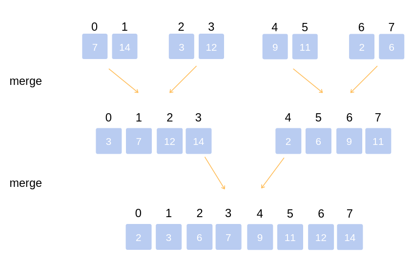
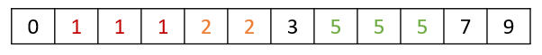

In these early blogs, I will only write about the most basic algorithms when I'm just starting to learn programming. First, let me relearn the basics (because I'm extremely forgetful). Second, for those who are new to programming, you can refer to it. This article will talk about the basic sorting algorithms I learned in school, and also taught myself.

<!--truncate-->

### 1. Why do we need sorting algorithms?

**Firstly**, simply to pass exams at university, learn some Programming Languages, Data Structures and Algorithms, etc., it's easy to be asked these sorts of questions when taking the exam.

**Second**, element arrangement is usually an intermediate stage, pre-processing data in many problems, processing systems,... to perform larger jobs after it. Since the amount of data in real systems is always very large, we need efficient sorting algorithms to save the cost (time and memory).

**Basic examples of applying sorting algorithms**

- Sort the list of customers by name in the customer management system.
- Find the median element in ${\Theta(1)}$, or search for an element with ${\Theta(logn)}$ if there is a sorted array.
- The database uses merge sort algorithms to sort data sets when they are too large to load locally into memory.
- Files search, data compression, routes finding.
- Graphic application also use sorting algorithms to arrange layers to render efficiently.
- After finishing the meal, your mother made you wash the dishes. You struggled with dozens of bowls for an hour and now you don't want to waste any more time on those bowls. As it turns out, the remaining job is to arrange the dishes so that they are neat, beautiful, and most of all, quickly so that you can play with your phone. Instinctively for all Asians of average intelligence, you've sorted them out very quickly and stacked them up from small to big chunks, and then you realize you've accidentally applied Counting Sort algorithm.

**Basic operations using in the intermediate stages**

- Compare 2 elements ${(a, b)}$, return ${True}$ if ${(a > b)}$, otherwise return ${False}$.
- Swap 2 elements ${(a, b)}$, in Python, it can be performed easily like

```python
a, b = b, a
```

During the analysis of algorithms, we assume that the above operations take only constant time ${\Theta(1)}$.

### 2. Bubble sort

Bubble sort is a simple and inefficient sort that is taught in almost all algorithm courses because it is quite intuitive. Bubble sort compares each pair of numbers in an array and swaps places if they're out of order. The largest elements will be pushed to the bottom of the array, while the smaller elements will gradually "float" to the top of the array.

**Algorithm:**

- Compare ${arr[0]}$ to ${arr[1]}$, if ${arr[0] > arr[1]}$, swap their positions. Continue doing this with (${arr[1], arr[2]}$), (${arr[2], arr[3]}$),...
- Repeat this step ${n}$ times.

To make it more intuitive, I give the following descriptive image


**Algorithm analysis:**

- **Best case:** occurs when we apply the algorithm on the sorted array. Then, there will be no swap steps in the first pass, only comparison steps, from which the algorithm will end after this pass. So the time complexity will be ${\Theta(n)}$. For this reason, bubble sort is also used to check if an array is sorted.
- **Worst case:** occurs when the array is sorted in reverse, therefore, ${n-1}$ comparisons and swaps will be performed on the first pass, ${n-2}$ comparisons and swaps will be performed on the second pass,... Therefore, the total number of comparisons and swaps will be ${Sum = (n-1) + (n-2) +...+ 2 + 1 = \frac{n \times (n-1)}{2}}$. Time complexity will be ${\Theta(n^2)}$.
- **Space complexity:** ${\Theta(1)}$.

**Python Code**

```python
ini_arr = [1, 5, 2, 45, 2, 32, 12, 55, 26, 77, 8]

def bubble_sort(arr):
    for i in range(len(arr)):
        swapped = False
        for j in range(len(arr) - i - 1):
            if arr[j] > arr[j+1]:
                arr[j], arr[j+1] = arr[j+1], arr[j]
                swapped = True
        if not swapped:
            return

bubble_sort(ini_arr)
print(ini_arr)
```

Output

```python
[1, 2, 2, 5, 8, 12, 26, 32, 45, 55, 77]
```

### 3. Insertion sort

Imagine you play card game, when you have the deck in your hand, you have many ways to arrange it depending on your personality. For me, I usually arrange the cards in order from smallest to largest. When I want to arrange a new card into the deck of cards in my hand that is in order, I just insert the card into the appropriate position, and that is also the idea of ​​insertion sort.

**Algorithm:**
With ${i = 1, 2,..., n - 1}$, we will insert ${arr[i]}$ into the sorted array ${arr[0:i-1]}$ by moving the elements greater than ${arr[i]}$ of the array ${arr[0:i-1]}$ to the top and put ${arr[i]}$ in the desired position.

To make it more intuitive, I give the following descriptive image


**Algorithm analysis:**

- **Best case:** occurs when we apply the algorithm to the sorted array. Then, we only need to iterate over the array, only compare and do not need to perform a swap step at all. So the time complexity will be ${\Theta(n)}$.
- **Worst case:** occurs when the array is sorted in reverse, there will be 1 comparison and assignment in the first pass, 2 comparisons and assignment in the second,... Therefore, the total number of operations compare and assign would be ${Sum = 1 + 2 +...+ (n-1) = \frac{n \times (n-1)}{2}}$. Therefore, time complexity will be ${\Theta(n^2)}$.
- **Space complexity:** ${\Theta(1)}$.

**Python Code**

```python
ini_arr = [1, 5, 2, 45, 2, 32, 12, 55, 26, 77, 8]

def insertion_sort(arr):
    for key in range(1, len(arr)):
        value = arr[key]
        j = key - 1
        while j >= 0 and value < arr[j]:
            arr[j+1] = arr[j]
            j -= 1
        if key != j+1:
            arr[j+1] = value

insertion_sort(ini_arr)
print(ini_arr)
```

Output

```python
[1, 2, 2, 5, 8, 12, 26, 32, 45, 55, 77]
```

### 4. Selection sort

The idea is that we will **assume** to split our array into 2 parts: sorted subarray ${arr{_1}}$ and unsorted subarray ${arr{_2}}$. At this moment, ${arr = (arr{_1})(arr{_2})}$.
We will in turn find the smallest element of ${arr{_2}}$, detach and push the element to ${arr{_1}}$. The **assumption** here, that we are not actually creating 2 new sub-arrays, but the operations are performed on the original array.

**Algorithm:**

- Find the smallest element of ${arr{_2}}$.
- Swap the position of that smallest element with the first element of ${arr{_2}}$. At this point, we assume in ${arr{_2}}$, ​that smallest element is gone, and now it has been merged into ${arr{_1}}$.

I have an image to make the algorithm more intuitive



**Algorithm analysis:**

- **Best case:** occurs when applying the algorithm on the sorted array, we only have to compare, not swap positions. So the time complexity will be ${\Theta(n)}$.
- **Worst case:** occurs when the above array is sorted in reverse, each time we have to find the smallest element of the subarray ${arr{_2}}$. Therefore, the total number of traversals to find the smallest elements will be ${Sum = (n-1) + (n-2) +...+ 1 = \frac{n \times (n-1)}{2}}$. Time complexity will be ${\Theta(n^2)}$.
- **Space complexity:** ${\Theta(1)}$.

**Python Code**

```python
ini_arr = [1, 5, 2, 45, 2, 32, 12, 55, 26, 77, 8]

def selection_sort(arr):
    for i in range(len(arr) - 1):
        min_index = i
        for j in range(i+1, len(arr)):
            if arr[j] < arr[min_index]:
                min_index = j
        if i != min_index:
            arr[min_index], arr[i] = arr[i], arr[min_index]

selection_sort(ini_arr)
print(ini_arr)
```

Output

```python
[1, 2, 2, 5, 8, 12, 26, 32, 45, 55, 77]
```

### 5. Merge sort

Merge sort is one of the most efficient algorithms. The algorithm works on the principle of divide and conquer, separating the arrays into 2 sub-arrays, respectively, until the sub-arrays have only 1 element left. Then the algorithm "merge" those sub-arrays into a fully sorted array.

**Algorithm:**

- Divide the original array into 2 sub-arrays, 2 sub-arrays into 4 more sub-arrays,... until we get ${n}$ subarrays, each subarray contains 1 element.


- Merge sub-arrays to create larger arrays sorted in order until we get a single array. That is the sorted array from the original array.



Summarize the algorithm in 1 image


**Algorithm analysis:**

- **Split array:** the algorithm will calculate the midpoint of the array by taking the array length and then dividing it by 2, so it takes constant time ${\Theta(1)}$ to split the array into 2 sub-arrays.
- **Sorting subarrays:** assuming array sorting costs ${T(n)}$ time. So to sort 2 sub-arrays, we spend ${2T(\frac{n}{2})}$ time.
- **Merge 2 subarrays:** using the "2-finger" algorithm, each index finger points to the beginning of each subarray. We in turn compare 2 numbers at 2 positions that 2 fingers point to and choose the smaller number to push into the resulting array. Every element in a subarray is pushed in, we move the index finger to the next element of that array. This will make us have to traverse ${2 \times \frac{n}{2} = n}$ elements, therefore, that costs ${\Theta(n)}$. Thus, we have the following expression

<p style={{textAlign: "center"}}>

${T(n) = \Theta(1) + 2T(\frac{n}{2}) + \Theta(n)}$

</p>

With base case here is ${T(1) = \Theta(1)}$.


For each tree level, the algorithm executes ${\Theta(n)}$ units of work, there are total ${1+logn}$ levels. Therefore, ${T(n) = \Theta(n + nlogn) = \Theta(nlogn)}$. Time complexity will be ${\Theta(nlogn)}$.

- **Space complexity:** Because in the "merge" step, we have to manually create 2 sub-arrays, each with a number of elements ${\frac{n}{2}}$, so the auxiliary memory space will be ${\Theta(n)}$.

**Python Code**

```python
import math
ini_arr = [1, 5, 2, 45, 2, 32, 12, 55, 26, 77, 8]

def merge(arr, l, m, r):
    n1 = m - l + 1
    n2 = r - m
    L = []
    R = []
    for i in range(n1):
        L.append(arr[l+i])
    for j in range(n2):
        R.append(arr[m+j+1])
    i = 0
    j = 0
    k = l
    while i < n1 and j < n2:
        if L[i] <= R[j]:
            arr[k] = L[i]
            i += 1
        else:
            arr[k] = R[j]
            j += 1
        k += 1
    while i < n1:
        arr[k] = L[i]
        i += 1
        k += 1
    while j < n2:
        arr[k] = R[j]
        j += 1
        k += 1

def merge_sort(arr, l, r):
    if l < r:
        m = math.floor(l + (r-l)/2)
        merge_sort(arr, l, m)
        merge_sort(arr, m+1, r)
        merge(arr, l, m, r)

merge_sort(ini_arr, 0 ,len(ini_arr) - 1)
print(ini_arr)
```

Output

```python
[1, 2, 2, 5, 8, 12, 26, 32, 45, 55, 77]
```

### 6. Heap sort

The heap sort is based on the binary heap data structure.

**Binary heap data structure:**
An array of data can be represented as a binary tree as follows


For any node with the corresponding index ${i}$ in the binary tree above

- Parent node of ${i}$, which is ${parent(i)}$ will have the index of ${\Bigl\lfloor\dfrac{i}{2}\Bigr\rfloor\qquad}$.
- Left child node, which is ${leftchild(i)}$ will have the index of ${2i}$.
- Right child node, which is ${rightchild(i)}$ will have the index of ${2i + 1}$.

There are two types of this data structure: max-heap and min-heap.

- In max-heap, we always have ${A[parent(i)] \ge A[i]}$. Therefore, the largest element is in the root, and the smallest element is in the leaf.
- In min-heap, we always have ${A[parent(i)] \le A[i]}$. Therefore, the smallest element is in the root, and the largest element is in the leaf.

From there, this sorting algorithm applies max-heap or min-heap (in this article, I will use max-heap) to create an ordered array.

**Create a max-heap:** called **max_heapify**
I will give a simple example with a 3-element array for added visualization, but with an n-element array it will need to be done in a more general way


Python code for **max_heapify** at a node with index ${i = index}$, ${length}$ is the length of the array, added as a constraint for the index of child nodes. The algorithm below says that, if the node is at ${i = index}$ ot in accordance with the max-heap rule, we will **max_heapify** the tree with the root as that node, and **max_heapify** the trees with the root being the left and right child nodes of that node.

```python
def max_heapify(arr, length, index):
    l = (index + 1) * 2 - 1
    r = (index + 1) * 2
    largest = index
    if l < length and arr[index] < arr[l]:
        largest = l
    if r < length and arr[largest] < arr[r]:
        largest = r
    if largest != index:
        arr[index], arr[largest] = arr[largest], arr[index]
        max_heapify(arr, length, largest)
```

**max_heapify** will cost ${\Theta(logn)}$ for each node under consideration. Because each time, that node will need to go down 1 level in the tree to be considered, the algorithm will choose the correct branch to go down and it will not backtrack back up. Therefore, the longest path this algorithm can take is from root to a leaf, which is the height of the tree. The height of the binary tree has ${n}$ nodes is ${\Theta(logn)}$.

**Algorithm:**

- We represent the array and sort the elements to get a max-heap tree. Therefore, the root of this tree (this will correspond to the element with index ${i = 0}$ in the array, for ${i = 0, 1,..., n-1}$) will be the largest element.
- We swap the location of root ${arr[0]}$ with the last element of the array ${arr[n-1]}$. At this point, the largest element of the array is in the last index.
- Repeat steps 1 and 2 with the rest of the array ${arr[0:n-2]}$,...

**Algorithm analysis:**
Building a max-heap tree from an unsorted array needs ${\Theta(n)}$ functiohn calls **max_heapify**, each **max_heapify** cost ${\Theta(logn)}$ time. Thus, the whole algorithm has a time complexity of ${\Theta(nlogn)}$.
However, the heap sort algorithm has an advantage over merge sort in that it only uses ${\Theta(1)}$ temporary memory, while merge sort is ${\Theta(n)}$. If the memory factor is also important in your system (eg. small memory systems like embedded systems, etc.), you should consider using heap sort rather than merge sort.

**Python Code**

```python
import math
ini_arr = [1, 5, 2, 45, 2, 32, 12, 55, 26, 77, 8]

def max_heapify(arr, length, index):
    l = (index + 1) * 2 - 1
    r = (index + 1) * 2
    largest = index
    if l < length and arr[index] < arr[l]:
        largest = l
    if r < length and arr[largest] < arr[r]:
        largest = r
    if largest != index:
        arr[index], arr[largest] = arr[largest], arr[index]
        max_heapify(arr, length, largest)

def heap_sort(arr):
    length = len(arr)
    last = math.floor(length / 2)
    # Tại đây, chỉ duyệt từ phần tử n/2 đổ về, vì phần tử từ n/2 + 1,..., n đều là leaves. Các leaves đã được thỏa mãn tính chất max-heap
    for i in range(last - 1, -1, -1):
        max_heapify(arr, length, i)
    for i in range(length - 1, 0, -1):
        arr[i], arr[0] = arr[0], arr[i]
        max_heapify(arr, i, 0)

heap_sort(ini_arr)
print(ini_arr)
```

Output

```python
[1, 2, 2, 5, 8, 12, 26, 32, 45, 55, 77]
```

### 7. Quick sort

The quick sort algorithm, developed by a British computer scientist Tony Hoare in 1959, uses the principle of divide and conquer to sort an array.

**Algorithm:**

- **Split array:**
  - Select any element (called pivot), ${A[m]}$. If we choose a good pivot, our algorithm will run very fast. However, it will be difficult to know which element is considered a good pivot. There are a few common pivot selections:
    - Choose a random pivot.
    - Select the leftmost or rightmost element.
    - Take 3 elements: first, middle, last of the array and pick the median from them.
  - Split our array into 2 subparts: ${A[l:m-1]}$ consists of elements smaller than ${A[m]}$, and ${A[m+1:r]}$ consists of elements larger than ${A[m]}$. The image below shows more visually how to divide the array, with pivot always taking the last element


- **Conquer:** recursively sort the above 2 subsections using quick sort.
- **Merge:** no need to combine the divided subsections because the final result is already sorted array.
- **The complete recursive algorithm:**
  - Select a pivot. Split array into 2 parts based on pivot.
  - Apply quick sort on the smaller half of the pivot.
  - Apply quick sort on half larger than pivot.

**Algorithm analysis:**

<p style={{textAlign: "center"}}>

${T(n) = T(k) + T(n-k-1) + \Theta(n)}$

</p>

With ${k}$ is the number of elements which are smaller than pivot. The time complexity for **partitioning** process is ${\Theta(n)}$.

- **Best case:** occurs when the **partitioning** algorithm always divides our array into exactly 2 equal or nearly equal parts.


Thus, in the best case, the time complexity will be ${\Theta(nlogn)}$.

- **Worst case:** occurs when the **partitioning** algorithm always chooses the largest or the smallest number as the pivot. If we choose the pivot using the "always pick the last element of the array" strategy, the worst case will happen when the array is sorted in descending order. At this moment

<p style={{textAlign: "center"}}>

${T(n) = T(0) + T(n-1) + \Theta(n) = T(n-1) + \Theta(n)}$

</p>

With the base case being ${\Theta(1)}$ then in the worst case, time complexity will be ${T(n) = \Theta(1) + \Theta(n) + \Theta(n) +...+ \Theta(n) = \Theta(n^2)}$

Although the worst case of quick sort is much slower than other sorting algorithms, in practice the partition loop can be implemented efficiently on almost all data structures, because it contains relatively fewer "constant factors" (operators that require constant time ${\Theta(1)}$) than other algorithms, and if two algorithms have the same time complexity ${\Theta(nlogn)}$, the algorithm with fewer "constant factors" runs faster. Furthermore, the worst case of quick sort will rarely happen. However, with a very large amount of data and stored in external memory, merge sort will be preferred over quick sort.

**Python Code**

```python
ini_arr = [1, 5, 2, 45, 2, 32, 12, 55, 26, 77, 8]

def partition(arr, l, r):
    pointer = l - 1
    pivot = arr[r]
    for j in range(l, r):
        if arr[j] < pivot:
            pointer += 1
            arr[pointer], arr[j] = arr[j], arr[pointer]
    arr[pointer+1], arr[r] = arr[r], arr[pointer+1]
    return pointer + 1

def quick_sort(arr, l, r):
    if l < r:
        pivot_index = partition(arr, l, r)
        quick_sort(arr, l, pivot_index - 1)
        quick_sort(arr, pivot_index+1, r)

quick_sort(ini_arr, 0, len(ini_arr) - 1)
print(ini_arr)
```

Output

```python
[1, 2, 2, 5, 8, 12, 26, 32, 45, 55, 77]
```

### 8. Counting sort

An interesting algorithm I learned that even runs at linear time is counting sort. This algorithm is applied almost exclusively to integers, it is difficult or impossible to apply to real numbers.

**Algorithm:**

- Assume the elements of the original array ${A[0, 1, 2,..., n-1]}$ contains elements with values ​​in the range ${[0, k]}$. Counting sort creates another temporary array to count as array ${B[0, 1, 2,..., k-1]}$ including ${k}$ elements. The ${i^{th}}$ element of ${B}$ will contain the number of elements ${A[j]}$ satisfy ${A[j] = i }$ with ${j = 0, 1, 2,..., n-1}$.
- From ${B}$, if we flatten it, we will get an array ${C[0, 1, 2,..., n-1]}$ contains ordered elements. To be more intuitive, I have the following example


For the case ${A}$ contains negative elements, we find the smallest element of ${A}$ and store that element of ${A}$ at the index ${0}$ of the array ${B}$ (because there cannot exist negative index in an array).

**Algorithm analysis:**

- Create empty array ${B}$ cost ${\Theta(k)}$ time.
- Calculate the elements of the array ${B}$ based on ${A}$ cost ${\Theta(n)}$ time.
- Flatten ${B}$ to have ${C}$ will cost ${\Theta(n)}$ time.

Total time complexity will be ${\Theta(n+k)}$.

This analysis will be clearly written in the comments of the code.

- **Space complexity:** ${\Theta(n+k)}$

**Python Code**

```python
ini_arr = [-10, -5, -20, -10, -1, -5, 5, 2, 45, 2, 32, 12, 55, 26, 77, 8]

def counting_sort(A):
    min_ele = int(min(A))
    max_ele = int(max(A))
    range_ele = max_ele - min_ele + 1
    B = []
    # This costs O(k) time
    for i in range(range_ele):
        B.append(0)
    ###############################

    # This costs O(n) time
    for i in range(len(A)):
        B[A[i] - min_ele] += 1
    ###############################

    C = []
    # We have sum(B)= n = len(A) and append() cost constant time O(1). So this step costs O(n) time
    for i in range(range_ele):
        for j in range(B[i]):
            C.append(i + min_ele)
    ###############################

    # ----> In total, the algorithm costs O(n+k) time complexity
    return C

print(counting_sort(ini_arr))
```

Output

```python
[-20, -10, -10, -5, -5, -1, 2, 2, 5, 8, 12, 26, 32, 45, 55, 77]
```

**Counting sort comments:**

- As we saw above, counting sort has a time complexity and a space complexity ${\Theta(n+k)}$, o counting sort is very efficient when the range of the input data is small, not much larger than ${n}$ (or when ${k}$ is quite small). For example, if ${k}$ is large, about ${k = \Theta(n^2)}$, then time complexity and space complexity will be ${\Theta(n^2)}$, that is very bad.
- Counting sort can also be suitable for problems where the elements of the array are another data structure, but that data structure must have a ${key}$ is the integer to represent each object in that data structure.
- Counting sort is also a subroutine for a more powerful algorithm called Radix sort, a sort algorithm that runs at linear time with values ${k}$ greater than in counting sort, which is ${k = n^{\Theta(1)}}$ (constant power of ${n}$).
- As mentioned in the introduction, you arrange the bowls in order from small to large, accumulating the number of bowls by size into blocks one by one. That is using counting sort. As the example below, equal numbers are cubed by color.



### 9. Additional notes

Sorting algorithms are quite interesting. One of the things that makes people feel the most comfortable is seeing their bedrooms organized and clean, the same is true when we look at other things arranged. The website about animations of sorting algorithms that give you a sense of satisfaction and relaxation can be found **[here](https://www.toptal.com/developers/sorting-algorithms)**.

### 10. References

[Sorting Algorithms](https://www.interviewbit.com/tutorial/sorting-algorithms/#sorting-algorithms)

[Sorting Algorithms](https://brilliant.org/wiki/sorting-algorithms/)

[QuickSort](https://www.geeksforgeeks.org/quick-sort/)
