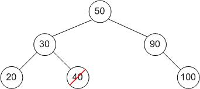
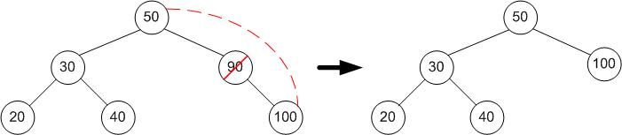

In the process of learning programming, you will encounter many types of data structures such as arrays, linked lists, maps, etc. Each type of data structure has its own advantages and disadvantages. Today, I will talk about an interesting type of data structure called a binary search tree, a very convenient data structure for the search problem.

<!--truncate-->

### 1. Highlight the main problem

The real problems that we or businesses solve are often divided into small problems and then applying algorithms, as well as appropriate data structures to come up with a way to do it, effectively, efficiently and least costly. For the following problem, I would like to take an example from MIT's course 6.006, which you can access **[here](https://ocw.mit.edu/courses/electrical-engineering-and-computer-science/6-006-introduction-to-algorithms-fall-2011/lecture-videos/lecture-5-binary-search-trees-bst-sort/)**.

Suppose an airline has a route management program. Each flight when it arrives at the airport must request a schedule to land at a certain time. In order not to have any conflicts, the landing times must be at least separated ${k}$ minutes ${(1)}$. The list of landing times is ${R}$ including ${n}$ elements. How to add a landing time ${t}$ to satisfy the constraint ${(1)}$ above.

I have an image to make the problem more intuitive


With the number of elements ${n}$, we want to perform a suitable position finding and insert new landing times in effective time complexity, like ${O(logn)}$. And the following will be the evaluations for the problem with some specific data structures.

#### 1.1. Unsorted array

Procedure for inserting elements into an unsorted array, regardless of the constraint condition ${(1)}$, will cost ${O(1)}$.
Procedure for inserting elements into an unsorted array, taking care of the constraint condition ${(1)}$, will cost ${O(n)}$.

Time complexity: ${O(n)}$.

#### 1.2. Sorted array

- Find the right index will costs ${O(logn)}$ (using binary search).
- Compare with the element on either side of the element cost ${O(1)}$.
- Inserting the element in the appropriate position takes ${O(n)}$ (when you will probably have to shift most of the elements up 1 position in the case of inserting the element at the beginning of the array).

Time complexity: ${O(n)}$.

#### 1.3. Sorted linked list

Inserting an element into a linked list will take ${O(1)}$. But finding the inserted position will takes ${O(n)}$ when we have to traverse from head to that position.


#### 1.4. Heap tree

Insertion into min-heap or max-heap

- Finding the insertion location will takes ${O(n)}$ when we may have to traverse all elements.
- Insertion into the min/max heap tree is unstable, because maybe after inserting in a certain position, we break the properties of the min/max heap tree and have to rerun **min/max-heapify** (refer to this article [Fundamental Sorting Algorithms](/blog/2021-02-20-sorting-algorithms/index.md) for **max-heapify** implementation) to get the right tree. Rerunning **min/max-heapify** will not able to guarantee the binding condition ${(1)}$.

_We need a better data structure to be able to do locating and inserting element in ${O(logn)}$._

### 2. Binary Search Tree

Binary Search Tree is a data structure that satisfy below conditions ${(2)}$

- Each node has a maximum of 2 child nodes.
- The value of the left child node is less than the parent node.
- The value of the right child node must be greater than the parent node.
- The left and right subtree is also a binary search tree.

Each node of the tree consists of

- The value of node.
- The pointer points to the left child node.
- The pointer points to the right child node.

```python
class Node:
    def __init__(self, val, left=None, right=None):
        self.val = val
        self.left = left
        self.right = right
```

Types of binary tree:

- **Full binary tree:** each node of the tree has 0 or 2 child nodes.
- **Complete binary tree:** all the tree layers are filled with nodes except for the last layer, and the bottom layer nodes must be filled from left to right
- **Degenerate binary tree:** a tree where all parent nodes have only one child node.
- **Perfect binary tree:** Every internal node has 2 children and the leaves are at the same level.
- **Balanced binary tree:** the height of the left and right subtrees differ by at most 1.

Here is an illustration


### 3. Operations on binary search treee

Consider a tree with ${n}$ nodes, height is ${h}$.

#### 3.1. Search - Finding a value in the tree

For searching for a key on the tree, we do it by recursive method. Starting at the root, we compare the value of the root node with the key. If the root node value is less than the key, we have to find it on the left subtree, if the root node value is greater than the key, we find that key on the right subtree. We do this with every node we go to. If the node value is equal to the key, we return that node. If the node value is null, we conclude that the key was not found in the tree.


Example of finding the key ${40}$. We first compare ${40 < 50}$, the go down the left subtree to continue to search. We compare ${40 > 30}$, then go down the right subtree to search. Finally, we find a node whose value is ${40}$.

**Python Code**

```python
def search(root, key):
    if root is None:
        print("Cannot find the key " + key +  " in bst")
        return None
    # continue to traverse
    if root.val < key:
        return search(root.right, key)
    elif root.val > key:
        return search(root.left, key)
    else:
        return root
```

**Algorithm analysis**: finding a key in a tree will cost ${O(h)}$.

- **Average case:** tree height ${h = \Theta(logn)}$, so the time complexity will be ${O(logn)}$.
- **Worst case:** when the tree is a degenerate binary tree, tree height ${h = n}$ so time complexity is ${O(n)}$.

#### 3.2. Insert - Add a node to the tree

The process of inserting a node with a certain value in the tree is quite similar to search. We search until we encounter an empty node, then we insert the node we want to insert at that position. During searching, we find a node with a value equal to the key, and we return that node.


Example of inserting the key with value ${4}$. Compare ${4 < 6}$, go down to the left subtree, compare ${4 > 3}$, go down to the right subtree. We encounter an empty position then we insert the key ${4}$ at that location.

**Python Code**

```python
def insert(root, key):
    # reached leaves
    if root is None:
        return Node(key)
    # continue to search, if encounter an equal value, return that node
    else:
        if root.val == key:
            return root
        elif root.val < key:
            root.right = insert(root.right, key)
        else:
            root.left = insert(root.left, key)

    return root
```

**Algorithm analysis**: finding the position to insert in the tree costs ${O(h)}$, insertion costs ${O(1)}$. Therefore, time complexity will be ${O(h)}$.

- **Average case:** tree height ${h = \Theta(logn)}$, so the time complexity will be ${O(logn)}$.
- **Worst case:** when the tree is a degenerate binary tree, tree height ${h = n}$ so time complexity is ${O(n)}$.

**Solving the problem in the first section:** because at the step of inserting the node into the tree, we can see that we can add conditional statements to approve the insertion or not without affecting the properties in the tree at ${(2)}$ of a binary search tree.


As with the tree above, with constraint value ${k = 3}$. We want to insert ${45}$. At the node ${40}$, we have ${45 - 40 > 3}$, so the next step is to insert ${45}$ into the tree, without losing the properties of the tree. If we want to insert ${42}$, we check ${42 - 40 < 3}$, so we do not perform node insertion.

#### 3.3. Delete - Remove a node from the tree

The process of deleting a node in a binary search tree occurs in 3 cases

- The node to be deleted has no child nodes.
- The node to be deleted has 1 child node.
- The node to be deleted has both child nodes.

**Case 1:** The node to be deleted has no child nodes



Example of deleting a node with a key ${40}$ in the tree above, we just need to release it from the tree.

**Case 2:** The node to be deleted has 1 child node



Example of deleting a node with a key ${90}$ in the tree above, we just need to replace that node with its only child node.

**Case 3:** The node to be deleted has 2 children, we replace it with the node with the largest key in its left subtree (the rightmost node of the left subtree), or the node with the smallest key in its right subtree (the leftmost node of the right subtree).


Example of deleting a node with a key ${30}$ in the tree above, we find the node with the smallest key in its right subtree, which is ${35}$, and replace the node with the key ${35}$ into the node with the key ${30}$. The we realize that the node has a key ${35}$ in the old position is a node with 1 child node. So we also apply the node deletion procedure like **Case 2** for that location.

**Python Code**

```python
# find leftmost node in the right subtree
def find_min(root):
    current = root
    while current.left is not None:
        current = current.left
    return current

def delete(root, key):
    if root is None:
        return root
    # continue to search until we find the node with the right key
    if root.val < key:
        root.right = delete(root.right, key)
    elif root.val > key:
        root.left = delete(root.left, key)
    else:
        # case 1
        if root.left is None and root.right is None:
            root = None
            return root
        # case 2
        elif root.left is None:
            root.val = root.right.val
            root.right = None
            return root
        elif root.right is None:
            root.val = root.left.val
            root.left = None
            return root
        # case 3
        else:
            temp = find_min(root.right)
            root.val = temp.val
            root.right = delete(root.right, temp.val)
            return root

    return root
```

**Algorithmic analysis:**

- **Case 1:** Finding the node costs ${O(h)}$, delete the node costs ${O(1)}$. Therefore, time complexity will be ${O(h)}$.
- **Case 2:** Finding the node costs ${O(h)}$, delete the node costs ${O(1)}$, node transfer costs ${O(1)}$. Therefore, time complexity will be ${O(h)}$.
- **Case 3:** Finding the node costs ${O(h)}$, finding the leftmost node in the right subtree takes ${O(h)}$, deleting the leftmost node in the right subtree costs ${O(h)}$. Therefore, time complexity will be ${O(h)}$.

- **Average case:** tree height ${h = \Theta(logn)}$, so the time complexity will be ${O(logn)}$.
- **Worst case:** when the tree is a degenerate binary tree, tree height ${h = n}$ so time complexity is ${O(n)}$.

#### 3.4. Traversal

There are three ways to traverse and print the values ​​of the nodes in the tree: pre-order, in-order, and post-order.

Consider the following tree ${(3)}$


##### 3.4.1. Pre-order traversal

We traverse the parent node first, to the left child node, and then to the right child node.

Example with ${(3)}$, in the pre-order traversal, the result will be ${6, 3, 1, 10, 9, 12}$.

**Python Code**

```python
def preorder(root):
    if root:
        print(root.val)
        preorder(root.left)
        preorder(root.right)
```

##### 3.4.2. In-order traversal

We traverse the left child node first, to the parent node, and then to the right child node.

Example with ${(3)}$, in the pre-order traversal, the result will be ${1, 3, 6, 9, 10, 12}$.

**Python Code**

```python
def inorder(root):
    if root:
        inorder(root.left)
        print(root.val)
        inorder(root.right)
```

##### 3.4.3. Post-order traversal

We traverse the left child node first, the right child node, and then the parent node.

Example with ${(3)}$, in the post-order traversal, the result will be ${1, 3, 9, 12, 10, 6}$.

**Python Code**

```python
def postorder(root):
    if root:
        postorder(root.left)
        postorder(root.right)
        print(root.val)
```

**Algorithm analysis:**
We traverse all the nodes in the tree, so the time complexity is ${O(n)}$.

### 4. Additional notes

Binary search trees are interesting and efficient data structures. Readers can find visualizations of binary search tree operations **[here](https://www.cs.usfca.edu/~galles/visualization/BST.html)**.

### 5. References

[Binary Search Tree | Set 1 (Search and Insertion)](https://www.geeksforgeeks.org/binary-search-tree-set-1-search-and-insertion/)

[Binary search tree](https://en.wikipedia.org/wiki/Binary_search_tree)
