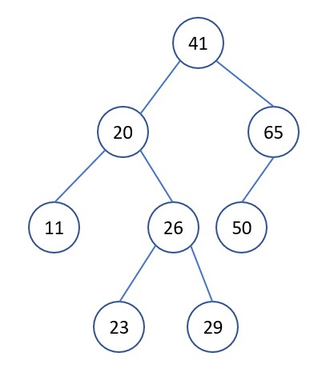
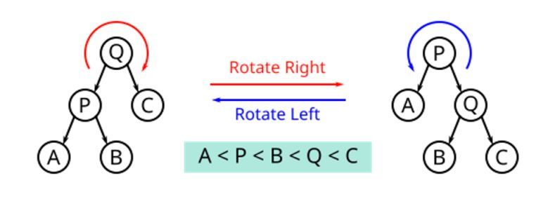
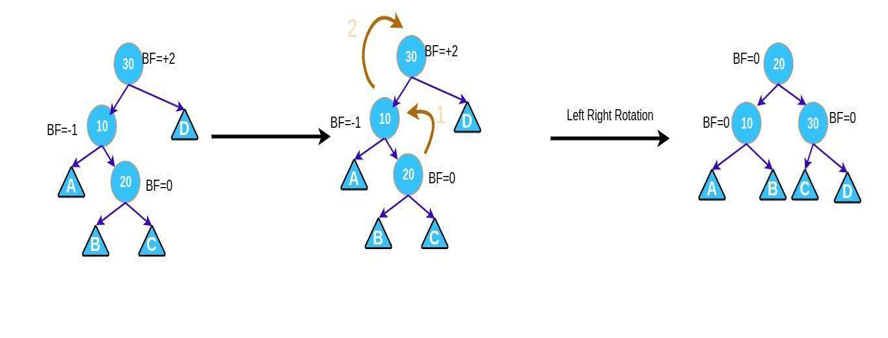

In the previous post, I talked about the **[binary search tree](/blog/2021-02-22-binarysearch-tree/index.md)**. With efficiency in search, insert, delete,... binary search tree can be done in logrithmic time (${\Theta(logn)}$) in the average case. In this article, I will talk about AVL tree, which is a type of binary search tree, ensuring that in all cases, the time complexity of the above operations is the same ${\Theta(logn)}$.

<!--truncate-->

## 1. AVL tree

An AVL tree is a balanced binary search tree in which the heights of the left and right subtrees differ by at most 1 ${(1)}$. In the process of performing operations on the tree that make the tree unbalanced, we need to rebalance the tree to ensure the nature of the tree ${(1)}$.

## 2. Tree height assessment

The height of the tree

<p style={{textAlign: "center"}}>

${h}$ = max{ left subtree height, right subtree height } + 1

</p>

The heights of the nodes are numbered as shown above.

With the property ${(1)}$, the worst case of an AVL tree occurs when the right subtree is 1 unit taller than the left subtree for all nodes (or vice versa).

For ${N{_h}}$ is the smallest number of nodes in a tree of height ${h}$.


With the diagram above, we have

<p style={{textAlign: "center"}}>

${N{_ {O(1)}} = O(1)}$ và ${N{_ h} = 1 + N{_ {h-1}} + N{_{h-2}}}$

</p>

### 2.1. First approach

The above expression reminds us of the fibonacci sequence, we have ${N{_h} > F{_h}}$ với ${F{_h}}$ is the ${h^{th}}$ fibonacci. We have ${F{_h} = \frac{\gamma^h}{\sqrt{5}}}$, with ${\gamma = 1.61803398875...}$, (golden ratio).

With ${N{_h} = n}$ (the number of nodes in the tree).

<p style={{textAlign: "center"}}>

${ n > \frac{\gamma^h}{\sqrt{5}} => h < log{_\gamma}n => h < 1.440log{_2}n }$.

</p>

### 2.2. Second approach

<p style={{textAlign: "center"}}>

${=> N{_ h} = 1 + N{_ {h-1}} + N{_{h-2}}}$

${=> N{_ h} > 1 + 2N{_{h-2}}}$

${=> N{_ h} > 2N{_{h-2}}}$

${=> h < 2log{_2}n}$

</p>

Therefore, ${h = O(logn)}$.

## 3. AVL tree operations

### 3.1. Node insertion, node deletion, search node

The above operations in an AVL tree are the same as in a binary search tree, with ${h = O(logn)}$. The difference in node insertion and deletion is that after performing those operations, we need to do an extra step of tree balancing to ensure the integrity of the tree ${(1)}$.

### 3.2. Tree balancing activities

The following example demonstrates the need for tree rebalancing

Suppose we have the following tree


We want to insert ${23}$ into the tree, perform the insertion as in a binary search tree. After inserting, we see the property ${(1)}$ violated. We need to rebalance the tree to get



#### 3.2.1. Balance factor

In a binary tree, the balance factor is defined as follows:

${BF(x)}$ = height of left subtree if ${x}$ ${-}$ height of right subtree of ${x}$.

Thus, in the AVL tree, we have ${BF(x) \in \\{-1, 0, 1\\} }$.

#### 3.2.2. Tree balancing operations

When the BF of a certain node has a value that is not in the above set of values, then we need to re-balancing the tree. We have two basic types of balancing operations of AVL trees: **right rotation** and **left rotation**



### 3.3. Tree balancing in specific cases

#### 3.3.1. Left left case

This case occurs when a node has BF = 2 and its left subtree has BF = 1. Then, we only need 1 **right rotation** at the node to be considered, then the tree is balanced.


#### 3.3.2. Left right case

This case occurs when a node has BF = 2 and its left subtree has BF = -1. Then, we need to do the following 2 steps in turn

- **Left rotation** left subtree.
- **Right rotation** the node to be considered.



#### 3.3.3. Right right case

This case occurs when a node has BF = -2 and its right subtree has BF = -1. Then, we only need 1 **left rotation** at the node to be considered, then the tree is balanced.


#### 3.3.4. Right left case

This case occurs when a node has BF = -2 and its left subtree has BF = 1. Then, we need to do the following 2 steps in turn

- **Right rotation** right subtree.
- **Left rotation** the node to be considered.


## 4. Python code for tree balancing activities

```python
# ---------------------------METHOD TO HELP BALANCE THE TREE---------------------------
#      y                               x
#     / \     Right Rotation          /  \
#    x   T3   - - - - - - - >        T1   y
#   / \       < - - - - - - -            / \
#  T1  T2     Left Rotation            T2  T3

# ---------------------------BALANCE THE TREE IN PARTICULAR CASES---------------------------
# -----Left Left Case
#          z                                      y
#         / \                                   /   \
#        y   T4      Right Rotate (z)          x      z
#       / \          - - - - - - - - ->      /  \    /  \
#      x   T3                               T1  T2  T3  T4
#     / \
#   T1   T2
# -----Left Right Case
#      z                               z                           x
#     / \                            /   \                        /  \
#    y   T4  Left Rotate (y)        x    T4  Right Rotate(z)    y      z
#   / \      - - - - - - - - ->    /  \      - - - - - - - ->  / \    / \
# T1   x                          y    T3                    T1  T2 T3  T4
#     / \                        / \
#   T2   T3                    T1   T2
# -----Right Right Case
#   z                                y
#  /  \                            /   \
# T1   y     Left Rotate(z)       z      x
#     /  \   - - - - - - - ->    / \    / \
#    T2   x                     T1  T2 T3  T4
#        / \
#      T3  T4
# -----Right Left Case
#    z                            z                            x
#   / \                          / \                          /  \
# T1   y   Right Rotate (y)    T1   x      Left Rotate(z)   z      y
#     / \  - - - - - - - - ->     /  \   - - - - - - - ->  / \    / \
#    x   T4                      T2   y                  T1  T2  T3  T4
#   / \                              /  \
# T2   T3                           T3   T4

class AVLNode:
    def __init__(self, val):
        self.left = None
        self.right = None
        self.val = val
        self.height = 1


class AVLTree:
    def insert(self, root, key):
        # perform bst
        if not root:
            return AVLNode(key)
        if root.val < key:
            root.right = self.insert(root.right, key)
        if root.val > key:
            root.left = self.insert(root.left, key)
        # update the height of the ancestor node
        root.height = 1 + max(self.get_height(root.left),
                              self.get_height(root.right))

        # get balance factor
        balance = self.get_balance(root)

        # perform balance
        # left left
        if balance > 1 and key < root.left.val:
            return self.right_rotate(root)
        # right right
        if balance < -1 and key > root.right.val:
            return self.left_rotate(root)
        # left right
        if balance > 1 and key > root.left.val:
            root.left = self.left_rotate(root.left)
            return self.right_rotate(root)
        # right left
        if balance < -1 and key < root.left.val:
            root.right = self.right_rotate(root.right)
            return self.left_rotate(root)

        return root

    def left_rotate(self, x):
        y = x.right
        T2 = y.left

        y.left = x
        x.right = T2

        x.height = 1 + max(self.get_height(x.left), self.get_height(x.right))
        y.height = 1 + max(self.get_height(y.left), self.get_height(y.right))

        return y

    def right_rotate(self, y):
        x = y.left
        T2 = x.right

        x.right = y
        y.left = T2

        x.height = 1 + max(self.get_height(x.left), self.get_height(x.right))
        y.height = 1 + max(self.get_height(y.left), self.get_height(y.right))

        return x

    def get_height(self, root):
        if not root:
            return 0

        return root.height

    def get_balance(self, root):
        if not root:
            return 0

        return self.get_height(root.left) - self.get_height(root.right)

    def inorder(self, root):
        if root is not None:
            self.inorder(root.left)
            print(root.val)
            self.inorder(root.right)


avl_tree = AVLTree()
root = None

root = avl_tree.insert(root, 20)
root = avl_tree.insert(root, 10)
root = avl_tree.insert(root, 30)
root = avl_tree.insert(root, 40)
root = avl_tree.insert(root, 50)
root = avl_tree.insert(root, 5)
root = avl_tree.insert(root, 15)
root = avl_tree.insert(root, 25)
root = avl_tree.insert(root, 55)

avl_tree.inorder(root)
```

## 5. AVL sorting algorithm

Given an array of ${n}$ elements, the AVL sorting algorithm is done through the following steps

- Perform inserts ${n}$ elements into AVL tree. Each inserted operation costs ${O(logn)}$ time (as in a binary search tree). We need to insert ${n}$ elements, so the time complexity of the process will be ${O(nlogn)}$.
- We perform inorder traversal (as in a binary search tree). This causes us to go through all the elements, so the time complexity of the process is ${O(n)}$.

Therefore, the total time complexity is ${O(n + nlogn) = O(nlogn)}$. However, because of the extra ${O(n)}$ makes this AVL sorting algorithm inefficient and less practical than the other **[sorting algorithms](/blog/2021-02-20-sorting-algorithms/index.md)** that I have listed.

## 6. Additional notes

Readers can find visualizations for AVL tree operations at **[USFCA website](https://www.cs.usfca.edu/~galles/visualization/AVLtree.html)**.

## 7. References

[AVL tree](https://en.wikipedia.org/wiki/AVL_tree)

[AVL Trees: Rotations, Insertion, Deletion with C++ Example](https://www.guru99.com/avl-tree.html)
