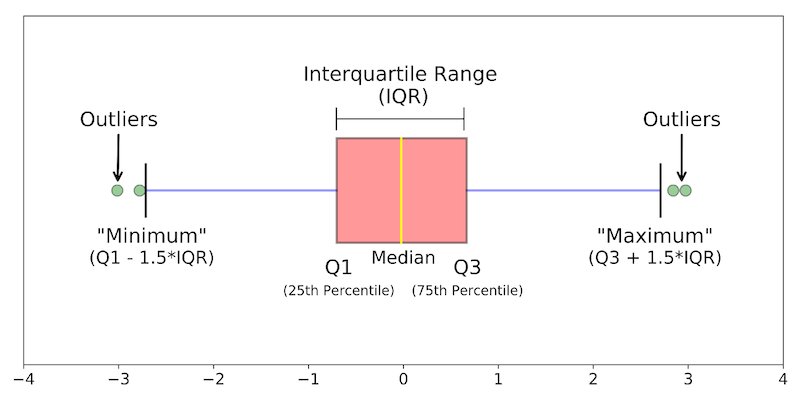
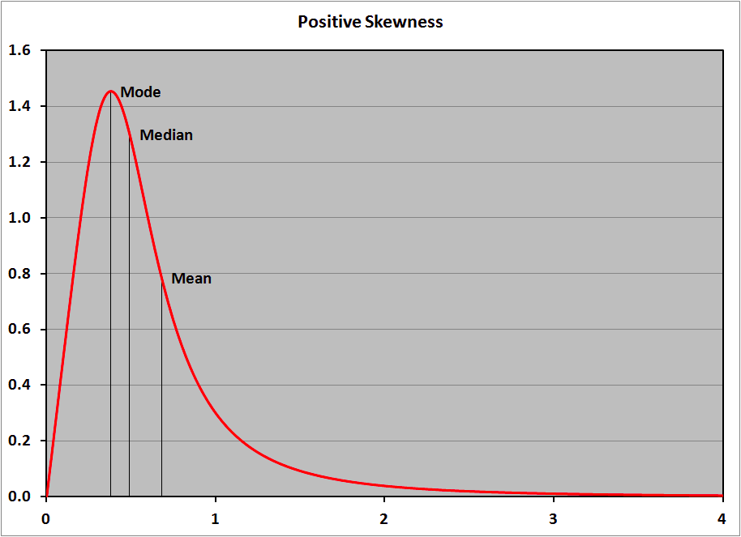
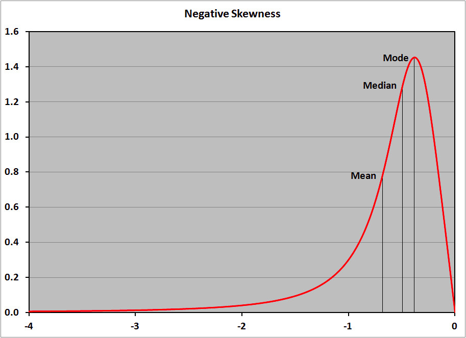

Bài viết này nhằm ôn lại một số khái niệm trong toán xác suất cơ bản, sẽ không có những phần toán rất phức tạp và dồn dập như trong lúc học trên trường lớp. Thay vào đó, nội dung sẽ tập trung vào các kiến thức xác suất phụ trợ cho trí tuệ nhận tạo hay là thống kê dữ liệu. <!--truncate-->Bài viết này tham chiếu rất nhiều đến một bài trong blog của anh Phạm Đình Khánh, cảm ơn anh Khánh với một series xác suất rất chi tiết.

### Đôi chút về đánh giá dữ liệu
Khi đánh giá dữ liệu, ta thường quan tâm đến các tiêu chí để đo đạc độ tập trung (measure of central tendency) cũng như độ phân tán (dispersion) của dữ liệu.

Về độ tập trung của dữ liệu, có 3 thông số cần quan tâm

- Kỳ vọng (mean): đánh giá giá trị trung bình của một biến ngẫu nhiên.
    - Nếu ${x}$ là một biến ngẫu nhiên rời rạc, giá trị kỳ vọng được tính như sau
    

    ${E(x) = \sum_{i=1}^{n}x_ip(x_i) }$

    
        

    Trong đó, ${p(x_i)}$ là xác suất khi mà biến ngẫu nhiên ${x}$ nhận giá trị ${x_i}$.

    - Nếu ${x}$ là một biến ngẫu nhiên liên tục
    

    ${E(x) = \int xp(x)dx }$

    

    Từ đó, ta có một số tính chất của kỳ vọng như sau
    

    ${E(ax + by) = aE(x) + bE(y) }$
    
    

    

    
    ${E(xy) = E(x)E(y)}$, nếu hai biến ${x}$ và ${y}$ độc lập
    
    

- Trung vị (median): là giá trị của phần tử nằm ở chính giữa một dãy giá trị được sắp xếp theo thứ tự. Trường hợp số phần tử là chẵn, giá trị trung vị bằng trung bình cộng 2 phần tử ở giữa.

- Mode: giá trị phần tử có tần số xuất hiện nhiều nhất trong dãy giá trị.

Ví dụ, ta có dãy giá trị của một biến ngẫu nhiên qua các sự kiện là ${\{1, 1, 2, 4, 6, 6, 6, 14\}}$ với các sự kiện có xác suất xảy ra như nhau

${Mean = \frac{1+1+2+4+6+6+6+14}{8} = 5}$, ${Median = \frac{4+6}{2} = 5}$, ${Mode = 6}$       

Nếu thêm một giá trị nữa vào dãy ${\{1, 1, 2, 4, 6, 6, 6, 14, 500\}}$

${Mean = \frac{1+1+2+4+6+6+6+14+500}{9} = 60}$, ${Median = 6}$, ${Mode = 6}$

Ta nhận thấy rằng, giá trị mean chịu ảnh hưởng nặng bởi các outliers hơn là median (các outliers sẽ được giải thích ở dưới).

Về độ phân tán của dữ liệu, ta quan tâm đến các đại lượng sau

- Phương sai: thể hiện mức độ biến động của đại lượng xung quanh giá trị kỳ vọng.

    - Nếu ${x}$ là một biến ngẫu nhiên rời rạc
    

    ${Var(x) = \sum_{i=1}^{n}(x_i - E(x))^2p(x_i) }$

    

    - Nếu ${x}$ là một biến ngẫu nhiên liên tục
    

    ${Var(x) = \int(x - E(x))^2p(x)dx }$

    

- Độ lệch chuẩn: bằng căn bậc hai của phương sai
    

    ${\sigma_x = \sqrt{Var(x)} }$

    

    Các outliers là những giá trị nằm ngoài khoảng ${[\mu - 3\sigma_x, \mu + 3\sigma_x]}$ với ${\mu = E(x)}$. Trong chọn lọc các đặc trưng tốt cho học máy, các outliers thường bị lọc bỏ bởi nó có nguy cơ là những điểm gây nhiễu cao.

Tìm ra các đặc trưng của tập dữ liệu, người ta còn hay quan tâm đến các thông số trên đồ thị box plot

Ở hình trên, median là giá trị trung vị, ${Q1}$ và ${Q3}$ lần lượt là các giá trị trung vị ${25\%}$ và ${75\%}$, độ trải giữa (${IQR)}$ là khoảng các giữa chúng. Các điểm nằm ngoài khoảng ${[Q1 - 1.5IQR, Q3 + 1.5IQR]}$ được coi là các mild outliers, nằm ngoài khoảng ${[Q1 - 3IQR, Q3 + 3IQR]}$ được coi là các extreme outliers. Các outliers thường được loại bỏ khỏi dữ liệu khi mà ta muốn phân tích thông tin gì đó từ dữ liệu.

Để đánh giá tương quan tuyến tính giữa 2 biến ngẫu nhiên, ta quan tâm đến đại lượng hệ số tương quan. Giá trị của hệ số tương quan thường trải từ khoảng ${[-1, 1]}$. Công thức tính hệ số tương quan như sau

${\rho_{xy} = \frac{cov(x, y)}{\sigma_x\sigma_y}}$, với ${cov(x, y) = E[(x - \mu_x)(y - \mu_y)] = \frac{\sum_{i = 1}^{n}(x_i - \mu_x)(y_i - \mu_y)}{n}}$, ${\sigma}$ và ${\mu}$ lần lượt là độ lệch chuẩn và kỳ vọng của biến ngẫu nhiên.

Ta có một vài nhận xét như sau
- Khi ${\rho_{xy} = 0}$, hai biến ngẫu nhiên hoàn toàn độc lập tuyến tính với nhau.
- Khi ${\rho_{xy} > 0}$, chúng đồng biến, biến đầu tiên tăng thì biến thứ hai cũng tăng.
- Khi ${\rho_{xy} < 0}$, chúng nghịch biến, biến đầu tiên tăng thì biến thứ hai giảm.
- Khi ${\rho_{xy}}$ bằng ${-1}$ hoặc ${1}$, hai biến hoàn toàn tương quan tuyến tính. 

### Các kiểu dữ liệu
Có nhiều loại kiểu dữ liệu mà một biến ngẫu nhiên có thể nhận, tùy vào bài toán nhất định, ta có thể giữ nguyên giá trị các biến trong tính toán, hoặc mã hóa nó.
- Kiểu dữ liệu định tính (quanlitative data): là các kiểu dữ liệu mang thông tin mô tả đặc trưng của sự vật, hiện tượng.
    - Các kiểu dữ liệu định tính không có thứ tự (nominal data): màu sắc, giới tính,... Với loại dữ liệu này, ta thường dùng mode để đánh giá chúng. Ví dụ như: đánh giá màu xe con nào xuất hiện nhiều nhất,...
    - Các kiểu dữ liệu định tính có thứ tự (ordinal data): các mức độ, các cấp học như tiểu học, trung học cơ sở, trung học phổ thông,... Với loại dữ liệu này, ta quan tâm nhiều hơn đến thông số median. Ví dụ như: đánh gía mức độ trung bình trong tập dữ liệu,...
- Kiểu dữ liệu định lượng (quantitative data): là các thông tin mô tả đối tượng dưới dạng con số. Với loại dữ liệu này, ta dùng các giá trị mean và median để đánh giá chúng.
    - Dữ liệu liên tục (continous data): chiều cao, cân nặng,...
    - Dữ liệu rời rạc (discrete data): số chiếc áo, số bánh xe,...
- Kiểu dữ liệu kèm theo yếu tố thời gian (temporal data): ví dụ như giá cổ phiếu, khi báo cáo cần phải đi kèm với thông tin là ngày nào, thời điểm nào,...
- Kiểu dữ liệu kèm theo yếu tố không gian (spartial data): ví dụ như vị trí địa lý trên bản đồ, giá trị tọa độ của một điểm trên trục tọa độ,...

### Các hàm xác suất
Các hàm xác suất các bạn có thể xem **[tại đây](https://phamdinhkhanh.github.io/deepai-book/ch_probability/appendix_probability.html#ham-mat-do-pdf-va-ham-khoi-xac-suat-pmf)**, cảm ơn anh Phạm Đình Khánh đã viết rất chi tiết về các hàm này.

### Các loại biểu đồ thống kê
Tùy theo mục đích thông tin ta cần trích xuất từ dữ liệu mà ta sẽ sử dụng các loại biểu đồ phù hợp cho bài toán
<table id="t01">
  <tr>
    <th>Mục đích</th>
    <th>Biểu đồ</th>
  </tr>
  <tr>
    <th colspan="2">Cần nhìn bức tranh tổng thể của dữ liệu</th>
  </tr>
  <tr>
    <td>Biểu diễn phân bố dữ liệu, với trục hoành là các khoảng giá trị biến ngẫu nhiên và trục tung là giá trị tần số xuất hiện của chúng</td>
    <td>
        

            Histogram plot
        
        

    </td>
  </tr>
  <tr>
    <td>
    Biểu diễn các giá trị quan trọng như min, max, trung vị 25%, 50%, 75%, độ trải giữa IQR,... Từ đó, ta đánh giá được các điểm chia cắt dữ liệu hay các điểm dữ liệu gây nhiễu,...</td>
    <td>
        

            Box plot 
        
        

    </td>
  </tr>
  <tr>
    <td>Biểu diễn dữ liệu theo thời gian</td>
    <td>
        

            Time series plot
        
        

    </td>
  </tr>
  <tr>
    <th colspan="2">Cần biểu diễn sự so sánh giữa các biến</th>
  </tr>
  <tr>
    <td>So sánh giá trị của nhiều biến</td>
    <td>
        

            Bar chart
        
        

    </td>
  </tr>
  <tr>
    <td>So sánh giá trị một biến thay đổi theo thời gian</td>
    <td>
        

            Line chart, giống với timeseriesplot
        

    </td>
  </tr>
  <tr>
    <td>So sánh nhiều nhóm</td>
    <td>
        

            Radar chart
        
        

    </td>
  </tr>
  <tr>
    <th colspan="2">Cần nhận biết sự tương quan giữa hai hoặc nhiều biến</th>
  </tr>
  <tr>
    <td>Tương quan giữa hai hoặc nhiều biến</td>
    <td>
        

            Scatter plot
        
        

    </td>
  </tr>
</table> 

### Độ lệch dương, độ lệch âm
- Độ lệch dương có giá trị trung bình (mean) lớn hơn giá trị trung vị (median) và phân bố có phía không đối xứng mở rộng đến nhiều các giá trị dương hơn.

- Độ lệch âm có giá trị trung bình (mean) nhỏ hơn giá trị trung vị (median) và phân bố có phía không đối xứng mở rộng đến nhiều các giá trị âm hơn.

Độ lệch kết hợp với độ nhọn đánh giá khả năng các biến cố rơi vào đuôi của phân phối xác suất tốt hơn.

### Quy luật số lớn
Phần này các bạn hãy tham khảo **[tại đây](https://phamdinhkhanh.github.io/deepai-book/ch_probability/appendix_probability.html#qui-luat-so-lon)** của anh Phạm Đình Khánh.

- Khoảng tin cậy (confidence interval)

Khi mình lấy mẫu từ một quần thể, các tham số của một quần thể có thể được đánh giá bằng mẫu đó. Thông thường, giá trị kỳ vọng của mẫu sẽ được ước lượng bằng giá trị kỳ vọng của quần thể, tuy nhiên, những lần lấy mẫu khác nhau thì có kỳ vọng khác nhau. Do vậy, ta đưa ra định nghĩa khoảng tin cậy dùng để biến cái tham số kỳ vọng được ước lượng trở thành một khoảng giá trị ước lượng, đảm bảo rằng kỳ vọng của quần thể sẽ nằm trong khoảng giá trị đó.

${k\%}$ mức tin cậy sẽ đảm bảo phủ được tham số kỳ vọng cần ước lượng của quần thể với xác suất là ${k\%}$.

Khoảng tin cậy càng nhỏ thì càng đảm bảo được độ chính xác của bộ ước lượng, để đạt được điều này, ta có thể giảm mức tin cậy hoặc tăng kích thước của mẫu lấy từ quần thể. Khoảng tin cậy được biểu diễn bởi ${(lower bound, upper bound)}$ với

${lower bound = \bar{x} - z\frac{\sigma}{\sqrt{n}}}$

${upper bound = \bar{x} + z\frac{\sigma}{\sqrt{n}}}$

Với ${\bar{x}}$ là giá trị kỳ vọng của mẫu được lấy, ${\sigma}$ là giá trị độ lệch chuẩn giả định của quần thể. ${n}$ là kích thước của mẫu và ${z}$ là hệ số tin cậy.

Với phân phối chuẩn
- ${z = 1.645}$ ứng với mức tin cậy ${90\%}$.
- ${z = 1.96}$ ứng với mức tin cậy ${95\%}$.
- ${z = 2.576}$ ứng với mức tin cậy ${99\%}$.

### Các phân phối xác suất
Các phân phối xác suất các bạn có thể xem **[tại đây](https://phamdinhkhanh.github.io/deepai-book/ch_probability/appendix_probability.html#phan-phoi-xac-suat)**.

### Xác suất đồng thời, xác suất biên, xác suất có điều kiện và định lỹ Bayes
Các bạn có thể tìm thấy thông tin mục này **[tại đây](https://phamdinhkhanh.github.io/deepai-book/ch_probability/appendix_probability.html#xac-suat-dong-thoi-join-distribution)**, một lần nữa cảm ơn anh Phạm Đình Khánh đã trình bày chi tiết về phần này.

### Tài liệu tham khảo

[https://phamdinhkhanh.github.io/deepai-book/ch_probability/appendix_probability.html#phan-phoi-xac-suat](https://phamdinhkhanh.github.io/deepai-book/ch_probability/appendix_probability.html#)
