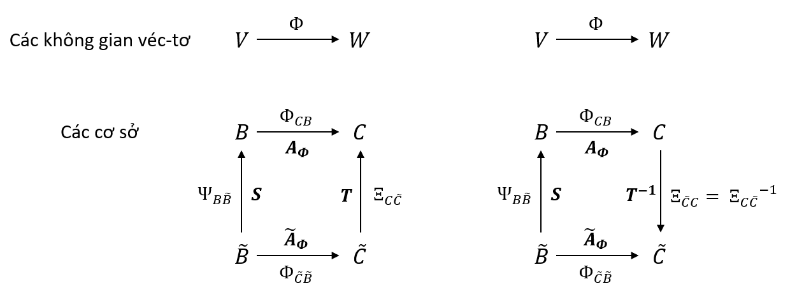

Tiếp đây sẽ là loạt bài viết về đại số tuyến tính mình đã học lại khi đọc quyển **[Mathematics for Machine Learning](https://mml-book.github.io/book/mml-book.pdf)** trong thời gian học về Machine Learning và AI. Đây là phần thứ nhất trong loạt bài này.

<!--truncate-->

### Giải hệ phương trình tuyến tính
Hệ phương trình tuyến tính là tập các phương trình tuyến tính với cùng những biến số, cấp 2 chúng ta đã giải chán chê phương trình này, thậm chí còn phải làm các hệ phương trình khó nhằn hơn chứa cả biến bậc 2, bậc 3,... Giờ đây, trở lại với đại số tuyến tính, ta có thể mô hình hệ phương trình tuyến tính bậc một với tích của ma trận và véc-tơ tương ứng.
Ví dụ ta có một hệ phương trình đơn giản sau

${
\begin{cases} x_{1} + 8x_{3} - 4x_{4} = 42 \\\\ x_{2} + 2x_{3} + 12x_{4} = 8 \end{cases}    
}$ 

Sẽ được viết dưới dạng tích ma trận và véc-tơ biến số như sau

${
\begin{bmatrix} 1 & 0 & 8 & -4 \\\\ 0 & 1 & 2 & 12 \end{bmatrix} * \begin{bmatrix} x_{1} \\\\ x_{2} \\\\ x_{3} \\\\ x_{4} \end{bmatrix} = \begin{bmatrix} 42 \\\\ 8 \end{bmatrix}
}$

${
\Leftrightarrow \begin{bmatrix} 1 \\\\ 0 \end{bmatrix} x_{1} + \begin{bmatrix} 0 \\\\ 1 \end{bmatrix} x_{2} + \begin{bmatrix} 8 \\\\ 2 \end{bmatrix} x_{3} + \begin{bmatrix} -4 \\\\ 12 \end{bmatrix} x_{4} = \begin{bmatrix} 42 \\\\ 8 \end{bmatrix} \\\;\\\;\\\;\\\;(1)
}$

#### Nghiệm chung và nghiệm riêng của phương trình
Nhìn vào biểu thức bên trên ${(1)}$, ta có
- Một nghiệm riêng của hệ phương trình là ${\begin{bmatrix} 42 & 8 & 0 & 0 \end{bmatrix}^T}$.
- Để có thể thu được tất cả nghiệm thỏa mãn, ta cần phải đi giải phương trình ${\boldsymbol{Ax} = \boldsymbol{0}}$ nữa. Ta tiến hành phân tích phương trình ${(1)}$ ra như sau

${
\begin{bmatrix} 1 \\\\ 0 \end{bmatrix} x_{1} + \begin{bmatrix} 0 \\\\ 1 \end{bmatrix} x_{2} + 8\begin{bmatrix} 1 \\\\ 0 \end{bmatrix} x_{3} + 2\begin{bmatrix} 0 \\\\ 1 \end{bmatrix} x_{3} + \begin{bmatrix} -4 \\\\ 12 \end{bmatrix} x_{4} = \boldsymbol{0} 
}$

Nhìn vào phương trình trên, ta có được một nghiệm cho ${\boldsymbol{Ax} = \boldsymbol{0}}$ là ${\lambda_{1}\begin{bmatrix} 8 & 2 & -1 & 0 \end{bmatrix}^T}$.
Tương tự như trên, ta tìm thêm được một nghiệm cho ${\boldsymbol{Ax} = \boldsymbol{0}}$ nữa là ${\lambda_{2}\begin{bmatrix} -4 & 12 & 0 & -1 \end{bmatrix}^T}$.
Phương trình ${\boldsymbol{Ax} = \boldsymbol{0}}$ chỉ có 2 nghiệm, tại sao lại như vậy thì bên dưới mình sẽ nói sau.
Như vậy, hệ phương trình có nghiệm chung là 

${
    \\{ x \in \Bbb R^4: x = \begin{bmatrix} 42 \\\\ 8 \\\\ 0 \\\\ 0 \end{bmatrix} + \lambda_{1}\begin{bmatrix} 8 \\\\ 2 \\\\ -1 \\\\ 0 \end{bmatrix} + \lambda_{2}\begin{bmatrix} -4 \\\\ 12 \\\\ 0 \\\\ -1 \end{bmatrix}, \lambda_{1}, \lambda_{2} \in \Bbb R \\}
}$

#### Biến đổi ma trận
##### Ví dụ
Mình sẽ đem một ví dụ cho phương pháp này

${
\begin{cases} 
-2x_{1} + 4x_{2} - 2x_{3} - x_{4} + 4x_{5} = -3 \\\\
4x_{1} - 8x_{2} + 3x_{3} - 3x_{4} + x_{5} = 2 \\\\
x_{1} - 2x_{2} + x_{3} - x_{4} + x_{5} = 0 \\\\
x_{1} - 2x_{2} - 3x_{4} + x_{5} = a \\\\
\end{cases}    
}$ 

Viết thành dạng

${
\left[
  \begin{matrix}
    -2 & 4 & -2 & -1 & 4 \\\\
    4 & -8 & 3 & -3 & 1 \\\\
    1 & -2 & 1 & -1 & 1 \\\\
    1 & -2 & 0 & -3 & 1 \\\\
  \end{matrix}
\left|
\begin{matrix}
    -3  \\\\
    2  \\\\
    0  \\\\
    a  \\\\
\end{matrix}
\right.
\right]
}$

${
\rightsquigarrow ... \rightsquigarrow
\left[
  \begin{matrix}
    1 & -2 & 1 & -1 & 1 \\\\
    0 & 0 & 1 & -1 & 3 \\\\
    0 & 0 & 0 & 1 & -2 \\\\
    0 & 0 & 0 & 0 & 0 \\\\
  \end{matrix}
\left|
\begin{matrix}
    0  \\\\
    -2  \\\\
    1  \\\\
    a+1  \\\\
\end{matrix}
\right.
\right]
}$

Do vậy, hệ phương trình được giải khi ${a = -1}$.
- Nghiệm riêng của phương trình là ${\begin{bmatrix} 2 & 0 & -1 & 1 & 0 \end{bmatrix}^T}$.
- Nghiệm của phương trình ${\boldsymbol{Ax} = \boldsymbol{0}}$ là ${\lambda_{1}\begin{bmatrix} 2 & 1 & 0 & 0 & 0 \end{bmatrix}^T}$ và ${\lambda_{2}\begin{bmatrix} -2 & 0 & 1 & -2 & -1 \end{bmatrix}^T}$.

Như vậy, nghiệm chung của phương trình là 

${
    \\{ x \in \Bbb R^5: x = \begin{bmatrix} 2 \\\\ 0 \\\\ -1 \\\\ 1 \\\\ 0 \end{bmatrix} + \lambda_{1}\begin{bmatrix} 2 \\\\ 1 \\\\ 0 \\\\ 0 \\\\ 0 \end{bmatrix} + \lambda_{2}\begin{bmatrix} -2 \\\\ 0 \\\\ 1 \\\\ -2 \\\\ -1 \end{bmatrix}, \lambda_{1}, \lambda_{2} \in \Bbb R \\}
}$

##### Ma trận bậc thang
Một ma trận ở dạng bậc thang nếu
- Những hàng chỉ chứa 0 sẽ ở đáy ma trận. Những hàng chứa ít nhất 1 số khác không sẽ nằm trên các hàng chứa toàn 0.
- Các phần tử pivot của mỗi hàng luôn ở phía bên phải của các phần tử pivot ở các hàng bên trên.

Các biến ứng với các phần tử pivot là các basic variables, các biến còn lại là free variables. Do vậy mà ở **Mục 1.1** phương trình ${\boldsymbol{Ax} = \boldsymbol{0}}$ chỉ có hai nghiệm, tại chỉ có 2 biến là free variables (tức là các biến ứng với các phần tử không là phần tử pivot).

Với hệ phương trình tuyến tính ${\boldsymbol{Ax} = \boldsymbol{b}}$, để tính toán một nghiệm riêng, ta biểu diễn các ${\boldsymbol{b} = \sum_{i = 1}^p \lambda_{i}\boldsymbol{p_{i}}}$ với ${\boldsymbol{p_{i}}}$ là các pivot columns, chúng ta thường bắt đầu ước lượng các giá trị ${\lambda_{i}}$ với các pivot columns từ phải sang trái.

Một ma trận ở dạng bậc thang tối giản nếu
- Nó là một ma trận bậc thang.
- Các phần tử pivot đều bằng 1.
- Phần tử pivot là phần tử duy nhất khác 0 tại pivot column đó.

Việc tính toán nghiệm ${\boldsymbol{Ax} = \boldsymbol{0}}$ sẽ dễ dàng hơn rất nhiều nếu ma trận biểu diễn hệ phương trình tuyến tính ở dạng bậc thang tối giản 

##### Phép khử Gaussian
Là một thuật toán biểu diễn các phép biến đổi triệt tiêu giữa các hàng để đưa ma trận biểu diễn hệ phương trình tuyến tính về dạng ma trận bậc thang tối giản.

Để tính toán nghiệm của ${\boldsymbol{Ax} = \boldsymbol{0}}$ trong ma trận bậc thang tối giản, ta biểu diễn các pivot column bằng tổng các cấp số của các pivot columns ở bên trái của chúng.

Ví dụ với ma trận bậc thang sau

${
\boldsymbol{A} = 
\begin{bmatrix} 
1 & 3 & 0 & -4 & 0 \\\\ 
0 & 0 & 1 & -3 & 0 \\\\
0 & 0 & 0 & 0 & 1 \\\\
0 & 0 & 0 & 0 & 0 \\\\
\end{bmatrix}
}$

Nghiệm của phương trình ${\boldsymbol{Ax} = \boldsymbol{0}}$ là

${
    \\{ x \in \Bbb R^5: x = \lambda_{1}\begin{bmatrix} 3 \\\\ -1 \\\\ 0 \\\\ 0 \\\\ 0 \end{bmatrix} + \lambda_{2}\begin{bmatrix} -4 \\\\ 0 \\\\ -3 \\\\ -1 \\\\ 0 \end{bmatrix}, \lambda_{1}, \lambda_{2} \in \Bbb R \\}
}$

#### The -1 trick
Với ma trận ${\boldsymbol{A}}$ ở trên, ta sẽ chêm các hàng gồm toàn ${0}$ và chỉ một số ${-1}$ vào giữa các hàng của ma trận bậc thang tối giản, để tạo nên ma trận mới có đường chéo chính gồm toàn ${-1}$ và ${1}$ như dưới đây.

${ 
\boldsymbol{A} \rightsquigarrow
\begin{bmatrix} 
1 & 3 & 0 & -4 & 0 \\\\ 
0 & -1 & 0 & 0 & 0 \\\\
0 & 0 & 1 & -3 & 0 \\\\
0 & 0 & 0 & -1 & 0 \\\\
0 & 0 & 0 & 0 & 1 \\\\
\end{bmatrix}
}$

Từ đó, các cột chứa giá trị ${-1}$ tại các vị trí trên đường chéo chính của ma trận sẽ là nghiệm của phương trình ${\boldsymbol{Ax} = \boldsymbol{0}}$.

#### Một số thuật toán để giải hệ phương trình này
Có một số thuật toán thông dụng để giải hệ phương trình tuyến tính phức tạp
- Sử dụng thuật toán hồi quy tuyến tính (linear regression), thuật toán này thường áp dụng vào các bài toán mà ta chỉ có thể tính xấp xỉ nghiệm của phương trình.
- Normal equation, thuật toán này tính chính xác nghiệm của hệ phương trình, nhưng số lượng tính toán rất nhiều nên không thể sử dụng với các trường hợp số lượng biến nhiều. Phương pháp này được thể hiện dưới đây

${
    \boldsymbol{Ax} = \boldsymbol{b} \Leftrightarrow \boldsymbol{A^TAx} = \boldsymbol{A^Tb} \Leftrightarrow \boldsymbol{x} = \boldsymbol{(A^TA)^{-1}A^Tb}
}$

Việc phải nhân ma trận và tính toán nghịch đảo khiến phương pháp này có độ phức tập là ${\Theta(n^3)}$.

### Không gian véc-tơ

#### Nhóm
Cho một tập ${\mathcal{G}}$ với phép toán ${\otimes: \mathcal{G} \times \mathcal{G} \to \mathcal{G}}$ được định nghĩa trên ${\mathcal{G}}$ thì ${\mathcal{G} := (\mathcal{G}, \otimes)}$ được gọi là một nhóm nếu thỏa mãn các tính chất
- Tính đóng gói của ${\mathcal{G}}$ trong phép ${\otimes}$: ${\forall x, y \in \mathcal{G}}$ thì ${x \otimes y \in \mathcal{G}}$.
- Tính kết hợp: ${\forall x, y, z \in \mathcal{G}}$ thì ${(x \otimes y) \otimes z = x \otimes (y \otimes z)}$.
- Tồn tại phần tử đơn vị: ${\exists e \in \mathcal{G}, \forall x \in \mathcal{G}}$ thỏa mãn ${x \otimes e = x}$ và ${e \otimes x = x}$.
- Tồn tại phần tử nghịch đảo: ${\forall x \in \mathcal{G}, \exists y \in \mathcal{G}}$ thỏa mãn ${x \otimes y = e}$ và ${y \otimes x = e}$.

Nếu nhóm có thêm tính chất giao hoán ${\forall x, y \in \mathcal{G}: x \otimes y = y \otimes x}$ thì nhóm đó được gọi là nhóm Abelian.

Một nhóm các ma trận khả nghịch ${A \in \Bbb R^{n \times n}}$ với phép toán nhân ma trận được gọi là một General Linear Group. Tuy nhiên, phép nhân ma trận không có tính chất giao hoán nên nhóm này không phải là một nhóm Abelian. 

#### Không gian véc-tơ
Một không gian véc-tơ thực ${V = (\mathcal{V}, + , \cdot)}$ là một tập ${V}$ với 2 phép toán

${
  +: \mathcal{V} \times \mathcal{V} \to \mathcal{V} }$

${
  \cdot: \Bbb R \times \mathcal{V} \to \mathcal{V}
}$

Thỏa mãn
- ${\mathcal{V}, +}$ là một nhóm Abelian.
- Tính chất phân phối ${\forall \lambda \in \Bbb R, x, y \in \mathcal{V}: \lambda \cdot(x + y) = \lambda \cdot x  + \lambda \cdot y}$ và ${\forall \lambda, \psi \in \Bbb R, x \in \mathcal{V}: (\lambda + \psi)\cdot x = \lambda \cdot x + \psi \cdot x}$
- Tính chất kết hơp ${\forall \lambda, \psi \in \Bbb R, x \in \mathcal{V}: \lambda \cdot(\psi \cdot x) = (\lambda \cdot \psi)\cdot x}$
- Tồn tại phần tử đơn vị ${\forall x \in \mathcal{V}: 1 \cdot x = x}$

#### Không gian véc-tơ con
Với ${V = (\mathcal{V}, + , \cdot)}$ là một không gian véc-tơ và ${\mathcal{U} \subseteq \mathcal{V}, \mathcal{U} \ne \emptyset}$ thì ${U = (\mathcal{U}, + , \cdot)}$ được gọi là không gian véc-tơ con của ${V}$ nếu ${U}$ là một không gian véc-tơ cùng với các phép toán ${+}$ và ${\cdot}$ ứng với ${\mathcal{U} \times \mathcal{U}}$ và ${\Bbb R \times \mathcal{U}}$. Kí hiệu ${U \subseteq V}$ thể hiện ${U}$ là một không gian véc-tơ con của ${V}$.

Nếu ${U}$ là một không gian véc-tơ con của ${V}$, ${U}$ sẽ thừa hưởng tất cả các tính chất của ${V}$. Để chứng minh ${U}$ là một không gian véc-tơ con của ${V}$, chúng ta vẫn phải chỉ ra được
- ${\mathcal{U} \ne \emptyset}$ hay ${0 \in \mathcal{U}}$.
- Tính đóng gói của ${U}$: ${\forall \lambda \in \Bbb R, \forall x \in \mathcal{U}: \lambda x \in \mathcal{U}}$ và ${\forall x, y \in \mathcal{U}: x + y \in \mathcal{U}}$.

### Phụ thuộc tuyến tính

#### Tổ hợp tuyến tính
Cho một không gian véc-tơ ${V}$ và một số hữu hạn các véc-tơ ${\boldsymbol{x_{1}}, \boldsymbol{x_{2}},..., \boldsymbol{x_{k}} \in V}$, mỗi ${\boldsymbol{v} \in V}$ được biểu diễn dưới dạng

${
  \boldsymbol{v} = \lambda_{1}\boldsymbol{x_{1}} + \lambda_{2}\boldsymbol{x_{2}} + ... + \lambda_{k}\boldsymbol{x_{k}} = \sum_{i=1}^{k} \lambda_{i}\boldsymbol{x_{i}} \in V
}$

với ${\lambda_{1}, \lambda_{2},..., \lambda_{k} \in \Bbb R}$, là một tổ hợp tuyến tính của các véc-tơ ${\boldsymbol{x_{1}}, \boldsymbol{x_{2}},..., \boldsymbol{x_{k}}}$.

Véc-tơ ${\boldsymbol{0}}$ có thể được viết dưới dạng ${\boldsymbol{0} = \sum_{i=1}^{k}0\boldsymbol{x_{i}}}$ nhưng chúng ta quan tâm nhiều hơn đến các tổ hợp tuyến tính không tầm thường hơn.

#### Phụ thuộc tuyến tính
Nếu có một tổ hợp tuyến tính không tầm thường thỏa mãn ${0 = \sum_{i=1}^{k} = \lambda_{i}\boldsymbol{x_{i}}}$ với ít nhất một giá trị ${\lambda_{i} \ne 0}$ thì các véc-tơ ${\boldsymbol{x_{1}}, \boldsymbol{x_{2}},..., \boldsymbol{x_{k}}}$ được gọi là ***phụ thuộc*** tuyến tính.

Nếu mà biểu thức trên chỉ tồn tại nghiệm tầm thường ${\lambda_{1} = \lambda_{2} = ... = \lambda_{k} = 0}$ thì các véc-tơ ${\boldsymbol{x_{1}}, \boldsymbol{x_{2}},..., \boldsymbol{x_{k}}}$ là ***độc lập*** tuyến tính.

Một số tính chất cho các véc-tơ kiểu này là
- ${k}$ véc-tơ trên hoặc là độc lập tuyến tính, hoặc là phụ thuộc tuyến tính, chứ không có loại khác.
- Nếu ít nhất một trong số các véc-tơ ${\boldsymbol{x_{1}}, \boldsymbol{x_{2}},..., \boldsymbol{x_{k}}}$ là véc-tơ ${\boldsymbol{0}}$ thì chúng sẽ phụ thuộc tuyến tính. Tính chất này cũng tương đương với việc có 2 véc-tơ giống nhau trong tập ${k}$ véc-tơ trên.
- Tập các véc-tơ trên là phụ thuộc tuyến tính nếu như một trong số các véc-tơ đó có thể được biểu diễn dưới dạng tổ hợp tuyến tính của các véc-tơ còn lại.
- Ta viết tất cả véc-tơ thành các cột của một ma trận ${\boldsymbol{A}}$, sau đó biểu diễn phép khử Gaussian, ta được các pivot columns sẽ độc lập tuyến tính với các véc-tơ ở bên trái của véc-tơ đó, còn các cột không phải pivot columns sẽ có thể được biểu diễn dưới dạng một tổ hợp tuyến tính của các pivot columns ở bên trái của nó. Nếu tất cả các cột đều là pivot columns thì tất cả các véc-tơ đó là độc lập tuyến tính, còn không thì chúng sẽ là phụ thuộc tuyến tính.

### Cơ sở và rank

#### Hệ sinh của một không gian véc-tơ
Cho một không gian véc-tơ ${V = (\mathcal{V}, + , \cdot)}$ và một tập các véc-tơ ${\mathcal{A} = \\{\boldsymbol{x_{1}}, \boldsymbol{x_{2}},..., \boldsymbol{x_{k}}\\} \subseteq \mathcal{V}}$ . Nếu mỗi véc-tơ ${\boldsymbol{v} \in \mathcal{V}}$ đều có thể biểu diễn là một tổ hợp tuyến tính của ${\boldsymbol{x_{1}}, \boldsymbol{x_{2}},..., \boldsymbol{x_{k}}}$, thì ${\mathcal{A}}$ được gọi là hệ sinh của ${V}$. Tập tất cả tổ hợp tuyến tính của ${\mathcal{A}}$ được gọi là một span của ${\mathcal{A}}$. Nếu ${\mathcal{A}}$ span không gian véc-tơ ${V}$, chúng ta viết ${V = span[\mathcal{A}]}$ hoặc ${V = span[\boldsymbol{x_{1}}, \boldsymbol{x_{2}},..., \boldsymbol{x_{k}}]}$.

#### Cơ sở của một không gian véc-tơ
Cho một không gian véc-tơ ${V = (\mathcal{V}, + , \cdot)}$ và hệ sinh ${\mathcal{A} \subseteq \mathcal{V}}$, ${\mathcal{A}}$ được gọi là hệ sinh nhỏ nhất nếu không tồn tại một hệ sinh nhỏ hơn nào khác mà ${\tilde{\mathcal{A}} \subsetneq \mathcal{A} \subseteq \mathcal{V}}$ span không gian véc-tơ ${V}$. Tất cả hệ sinh độc lập tuyến tính của không gian véc-tơ ${V}$ là nhỏ nhất và được gọi là cơ sở của ${V}$.

Với ${V = (\mathcal{V}, + , \cdot)}$ là một không gian véc-tơ và ${\mathcal{B} \subseteq \mathcal{V}}$ và ${\mathcal{B} \ne \emptyset}$. Tất cả mệnh đề sau là tương đương
- ${\mathcal{B}}$ là một cơ sở của ${V}$.
- ${\mathcal{B}}$ là hệ sinh nhỏ nhất.
- ${\mathcal{B}}$ là một tập gồm số véc-tơ độc lập tuyến tính lớn nhất của ${V}$.
- Tất cả ${\boldsymbol{v} \in \mathcal{V}}$ là một tổ hợp tuyến tính của các véc-tơ trong ${\mathcal{B}}$ và tất cả tổ hợp tuyến tính là duy nhất. Nếu ${\boldsymbol{x} = \sum_{i=1}^{k}\lambda_{i}b_{i} = \sum_{i=1}^{k}\psi_{i}b_{i}}$ thì ${\lambda_{i} = \psi_{i}}$.

Ta có ví dụ về hệ sinh chuẩn tắc của ${\Bbb R^{3}}$ là

${
    \mathcal{B} = \\{
\begin{bmatrix} 
1 \\\\ 
0 \\\\
0 \\\\
\end{bmatrix}, 
\begin{bmatrix} 
0 \\\\ 
1 \\\\
0 \\\\
\end{bmatrix}, 
\begin{bmatrix} 
0 \\\\ 
0 \\\\
1 \\\\
\end{bmatrix}
\\}
}$

Một số kết luận được rút ra như sau
- Tất cả cơ sở đều có số các phần tử bằng nhau. Số chiều của một không gian = số các hướng độc lập nhau trong không gian đó. Số chiều của một không gian véc-tơ sẽ là số véc-tơ trong hệ cơ sở của không gian véc-tơ đó dim(${V}$) = số véc-tơ trong cơ sở của nó.
- Nếu ${U \subseteq V}$ là một không gian véc-tơ con của ${V}$, thì dim(${U}$) ${\le}$ dim(${V}$), dim(${U}$) ${=}$ dim(${V}$) khi và chỉ khi ${U = V}$.
- Một cơ sở của không gian véc-tơ con ${U = span[\boldsymbol{x_{1}}, \boldsymbol{x_{2}},..., \boldsymbol{x_{k}}] \subseteq \Bbb R^{m}}$ có thể được tìm bằng cách sau
  - Viết các véc-tơ ${\boldsymbol{x_{1}}, \boldsymbol{x_{2}},..., \boldsymbol{x_{k}}}$ dưới dạng một cột của một ma trận ${\boldsymbol{A}}$.
  - Biến đổi ${\boldsymbol{A}}$ về dạng ma trận bậc thang tối giản.
  - Các véc-tơ liên kết với các pivot columns là cơ sở của không gian véc-tơ con ${U}$.

#### Rank của một ma trận
Hạng của một ma trận ${\boldsymbol{A}}$ ${=}$ số véc-tơ cột độc lập tuyến tính của ma trận ${\boldsymbol{A}}$ ${=}$ số véc-tơ hàng độc lập tuyến tính của ma trận ${\boldsymbol{A}}$ ${=}$ rank(${\boldsymbol{A}}$) ${=}$ rk(${\boldsymbol{A}}$).

Do vậy, ta có một số nhận xét sau
- rk(${\boldsymbol{A}}$) ${=}$ rk(${\boldsymbol{A^{T}}}$).
- Các véc-tơ cột của ${\boldsymbol{A \in \Bbb R^{m \times n}}}$ span một không gian véc-tơ ${U \subseteq \Bbb R^{m}}$ với dim(${U}$) ${=}$ rk(${\boldsymbol{A}}$).
- Các véc-tơ hàng của ${\boldsymbol{A \in \Bbb R^{m \times n}}}$ span một không gian véc-tơ ${W \subseteq \Bbb R^{n}}$ với dim(${W}$) ${=}$ rk(${\boldsymbol{A}}$).
- Với mọi ${\boldsymbol{A \in \Bbb R^{n \times n}}}$, ${\boldsymbol{A}}$ là ma trận khả nghịch khi và chỉ khi rk(${\boldsymbol{A}}$) ${= n}$.
- Hệ phương trình tuyến tính ${\boldsymbol{Ax} = \boldsymbol{b}}$ có nghiệm nếu rk(${\boldsymbol{A}}$) ${=}$ rk(${\boldsymbol{A|b}}$).
- Với ${\boldsymbol{A \in \Bbb R^{m \times n}}}$, không gian véc-tơ con của bộ nghiệm phương trình ${\boldsymbol{Ax} = \boldsymbol{0}}$ có dim ${= n - }$ rk(${\boldsymbol{A}}$).
- Một ma trận ${\boldsymbol{A \in \Bbb R^{m \times n}}}$ được gọi là ma trận hạng đầy đủ nếu rk(${\boldsymbol{A}}$) ${= min(m, n)}$.

### Ánh xạ tuyến tính
Hai không gian véc-tơ thực ${V, W}$, một ánh xạ ${\Phi: V \to W}$ bảo toàn cấu trúc các không gian véc-tơ nếu

${
\Phi(x+y) = \Phi(x) + \Phi(y) \\\\
\Phi(\lambda x) = \lambda \Phi(x)  
}$

Với tất cả ${x, y \in V}$ và ${\lambda \in \Bbb R}$.

Ánh xạ tuyến tính: Với các không gian véc-tơ ${V, W}$, một ánh xạ ${\Phi: V \to W}$ được gọi là một ánh xạ tuyến tính nếu ${\forall x, y \in V, \forall \lambda, \psi \in \Bbb R: \Phi(\lambda x+ \psi y) = \lambda \Phi(x) + \psi \Phi(y)}$. Ánh xạ tuyến tính có thể được biểu diễn dạng ma trận, về phần này mình sẽ nói ở dưới.

Hai không gian véc-tơ ${V}$ và ${W}$ có chiều hữu hạn được gọi là đẳng cấu khi và chỉ khi dim(${V}$) ${=}$ dim(${W}$). Do vậy, tồn tại một song ánh giữa 2 không gian véc-tơ cùng số chiều. Tức là, hai không gian véc-tơ có số chiều bằng nhau là hai thứ giống nhau, khi mà nó có thể được biến đổi sang nhau mà không mất mát thông tin gì.

Ta có một số tính chất của ánh xạ tuyến tính
- Nếu ánh xạ tuyến tính ${\Phi: V \to W}$ và ${\psi: W \to X}$, phép ánh xạ ${\psi \circ \Phi: V \to X}$ cũng là một ánh xạ tuyến tính.
- Nếu ${\Phi: V \to W}$ là một đẳng cấu thì ${\Phi^{-1}: W \to V}$ cũng là một đẳng cấu.
- Nếu ${\Phi: V \to W}$, ${\psi: V \to W}$ là ánh xạ tuyến tính thì ${\Phi + \psi, \lambda \Phi}$ với ${\lambda \in \Bbb R}$ cũng là các ánh xạ tuyến tính.

#### Biểu diễn ánh xạ tuyến tính dưới dạng ma trận
Xét một không gian véc-tơ ${V}$ với cơ sở là  ${B = (\boldsymbol{b_{1}}, \boldsymbol{b_{2}},..., \boldsymbol{b_{n}})}$. Với mọi véc-tơ ${\boldsymbol{x} \in V}$, ta có một tổ hợp tuyến tính duy nhất là 

${
\boldsymbol{x} = \lambda_{1} \boldsymbol{b_{1}} + \lambda_{2} \boldsymbol{b_{2}} +...+ \lambda_{n} \boldsymbol{b_{n}}
}$

Thì ${\lambda_{1}, \lambda_{2},..., \lambda_{n}}$ được gọi là tọa độ của ${\boldsymbol{x}}$ đối với cơ sở ${B}$.

${\boldsymbol{\lambda} = \begin{bmatrix} 
\lambda_{1} \\\\ 
\lambda_{2} \\\\
\vdots \\\\
\lambda_{n} \\\\
\end{bmatrix} }$ được gói là véc-tơ tọa độ của ${\boldsymbol{x}}$ đối với cơ sở ${B}$. Do vậy, với một véc-tơ với các cơ sở khác nhau thì sẽ có tọa độ là khác nhau.

Xét các không gian véc-tơ ${V}$ và ${W}$ với các cơ sở tương ứng là ${B = (\boldsymbol{b_{1}}, \boldsymbol{b_{2}},..., \boldsymbol{b_{n}})}$ và ${C = (\boldsymbol{c_{1}}, \boldsymbol{c_{2}},..., \boldsymbol{c_{m}})}$và một ánh xạ tuyến tính ${\Phi: V \to W}$. Với ${j \in \\{1, 2,..., n\\}}$

${
\Phi(\boldsymbol{b_{j}}) = \lambda_{1j}\boldsymbol{c_{1}} + \lambda_{1j}\boldsymbol{c_{2}} +...+ \lambda_{mj}\boldsymbol{c_{m}} = \sum_{i=1}^{m}\lambda_{ij}\boldsymbol{c_{i}}
}$

là một biểu diễn duy nhất của ${\Phi(\boldsymbol{b_{j}})}$ với cơ sở ${C}$. Chúng ta gọi ma trận ${\boldsymbol{A_{\Phi}}}$ kích thước ${m \times n}$ với ${\boldsymbol{A_{\Phi}(i, j)} = \lambda_{ij}}$ là ma trận biến đổi của ${\Phi}$ ứng với cơ sở ${B}$ của không gian véc-tơ ${V}$ và cơ sở ${C}$ của không gian véc-tơ ${W}$.

Tọa độ của ${\Phi(\boldsymbol{b_{j}})}$ ứng với cơ sở ${C}$ của ${W}$ là cột thứ ${j_{th}}$ của ma trận ${\boldsymbol{A_{\Phi}}}$.

Do đó, nếu ${\boldsymbol{\hat{x}}}$ là véc-tơ tọa độ của ${\boldsymbol{x} \in V}$ ứng với cơ sở ${B}$ và ${\boldsymbol{\hat{y}}}$ là véc-tơ tọa độ của ${\boldsymbol{y} = \Phi(\boldsymbol{x}) \in W}$ ứng với cơ sở ${C}$. Ta có

${
\boldsymbol{\hat{y}} = \boldsymbol{A_{\Phi}} \boldsymbol{\hat{x}}
}$

#### Chuyển đổi cơ sở
Một ánh xạ tuyến tính ${\Phi: V \to W}$, xét 2 cơ sở sau

${B = (\boldsymbol{b_{1}}, \boldsymbol{b_{2}},..., \boldsymbol{b_{n}})}$ và ${\tilde{B} = (\boldsymbol{\tilde{b_{1}}}, \boldsymbol{\tilde{b_{2}}},..., \boldsymbol{\tilde{b_{n}}})}$ của ${V}$.

${C = (\boldsymbol{c_{1}}, \boldsymbol{c_{2}},..., \boldsymbol{c_{n}})}$ và ${\tilde{C} = (\boldsymbol{\tilde{c_{1}}}, \boldsymbol{\tilde{c_{2}}},..., \boldsymbol{\tilde{c_{n}}})}$ của ${W}$.

${\boldsymbol{A_{\Phi}} \in \Bbb R^{m \times n}}$ là ma trận biến đổi của ánh xạ tuyến tính ${\Phi: V \to W}$ ứng với cơ sở ${B}$ và ${C}$.

${\boldsymbol{\tilde{A_{\Phi}}} \in \Bbb R^{m \times n}}$ là ma trận biến đổi của ánh xạ tuyến tính ${\Phi: V \to W}$ ứng với cơ sở ${\tilde{B}}$ và ${\tilde{C}}$.

Bằng việc chuyển đổi cơ sở và các biểu diễn của các véc-tơ, các ma trận biến đổi ứng với các cơ sở mới có thể ở dạng rất đơn giản và dễ dàng thực hiện các bước tính toán trung gian.

Với 2 ma trận biến đổi như ở phần trên, tương quan giữa chúng được biểu diễn như sau

${\boldsymbol{\tilde{A_{\Phi}}} = \boldsymbol{T^{-1}}\boldsymbol{A_{\phi}}\boldsymbol{S}}$

Với ${\boldsymbol{S} \in \Bbb R^{n \times n}}$ là ma trận biến đổi của phép ánh xạ đơn vị liên kết tọa độ của véc-tơ ứng với cơ sở ${\tilde{B}}$ lên tọa độ ứng với cơ sở ${B}$.
Với ${\boldsymbol{T} \in \Bbb R^{m \times m}}$ là ma trận biến đổi của phép ánh xạ đơn vị liên kết tọa độ của véc-tơ ứng với cơ sở ${\tilde{C}}$ lên tọa độ ứng với cơ sở ${C}$.
(Phần chứng minh chi tiết bạn có thể truy cập link sách mà mình để ở trên)

Như vậy, một phép biến đổi cơ sở trong ${V}$ (cơ sở ${B}$ được thay thế bằng cơ sở ${\tilde{B}}$) và ${W}$ (cơ sở ${C}$ được thay thế bằng cơ sở ${\tilde{C}}$), ma trận biến đổi ${\boldsymbol{A_{\Phi}}}$ của phép ánh xạ tuyến tính ${\Phi: V \to W}$ được thay thế bởi ma trận biến đổi tương đương ${\boldsymbol{\tilde{A_{\Phi}}}}$.

Nhìn vào hình trên, ta thấy được

${\Phi_{\tilde{B}\tilde{C}} = \Xi_{\tilde{C}C} \circ \Phi_{CB} \circ \psi_{B\tilde{B}} = \Xi_{C\tilde{C}}^{-1} \circ \Phi_{CB} \circ \psi_{B\tilde{B}}}$

Với ${\psi_{B\tilde{B}} = id_{V}}$ và ${\Xi_{\tilde{C}C} = id_{W}}$ là các ánh xạ đơn vị ánh xạ các véc-tơ lên chính chúng, nhưng mà ứng với các cơ sở khác nhau.

Sau đây, mình đưa ra 2 khái niệm sau về ma trận
- Tương đương: 2 ma trận ${\boldsymbol{A}, \boldsymbol{\tilde{A}} \in \Bbb R^{m \times n}}$ là tương đương nếu tồn tại hai ma trận khả ngịch ${\boldsymbol{S} \in \Bbb R^{n \times n}}$ và  ${\boldsymbol{T} \in \Bbb R^{m \times m}}$ thỏa mãn ${\boldsymbol{\tilde{A}} = \boldsymbol{T}^{-1}\boldsymbol{A}\boldsymbol{S}}$.
- Đồng dạng: 2 ma trận ${\boldsymbol{A}, \boldsymbol{\tilde{A}} \in \Bbb R^{n \times n}}$ là đồng dạng nếu tồn tại ma trận khả ngịch ${\boldsymbol{S} \in \Bbb R^{n \times n}}$ thỏa mãn ${\boldsymbol{\tilde{A}} = \boldsymbol{S}^{-1}\boldsymbol{A}\boldsymbol{S}}$.

Cuối cùng, xét các không gian véc-tơ ${V, W, X}$. Các ánh xạ tuyến tính ${\Phi: V \to W}$ với ma trận biến đổi là ${\boldsymbol{A_{\Phi}}}$ và ${\psi: W \to X}$ với ma trận biến đổi là ${\boldsymbol{A_{\psi}}}$, ánh xạ ${\psi \circ \Phi: V \to X}$ cũng là ánh xạ tuyến tính với ma trận biến đổi là ${\boldsymbol{A_{\psi \circ \Phi}} = \boldsymbol{A_{\psi}}\boldsymbol{A_{\Phi}}}$. Chứng minh như sau

${
\boldsymbol{A_{\Phi}}: B \to C; \boldsymbol{\tilde{A_{\Phi}}}: \tilde{B} \to \tilde{C}; \boldsymbol{S}: \tilde{B} \to B; \boldsymbol{T}: \tilde{C} \to C
}$

${
\Rightarrow \tilde{B} \to \tilde{C} = \tilde{B} \to B \to C \to \tilde{C}
}$

${
\Rightarrow \boldsymbol{\tilde{A_{\Phi}}} = \boldsymbol{T}^{-1}\boldsymbol{A_{\Phi}}\boldsymbol{S}
}$

Bởi vì

${
\boldsymbol{x} \longmapsto \boldsymbol{Sx} \longmapsto \boldsymbol{A_{\Phi}}(\boldsymbol{Sx}) \longmapsto \boldsymbol{T}^{-1}(\boldsymbol{A_{\Phi}}(\boldsymbol{Sx})) = \boldsymbol{\tilde{A_{\Phi}}}(\boldsymbol{x})
}$

#### Image và kernel
Cho ${\Phi: V \to W}$, chúng ta định nghĩa kernel/null space là

 

${Ker(\Phi) := \Phi^{-1}(\boldsymbol{0_{W}}) = \\{\boldsymbol{v} \in V: \Phi(\boldsymbol{v}) = \boldsymbol{0_{W}}\\}}$.

Và image/range là

 

${Im(\Phi) := \Phi(V) = \\{\boldsymbol{w} \in W | \exists \boldsymbol{v} \in V: \Phi(\boldsymbol{v}) = \boldsymbol{w}\\}}$.

Chúng ta gọi V và W lần lượt là các domain và codomain của ${\Phi}$.
Một vài tính chất được rút ra như sau
- Kernel không bao giờ là tập rỗng khi mà ta luôn có ${\Phi({\boldsymbol{0_{V}}}) = \boldsymbol{0_{W}}}$.
- ${Im(\Phi) \subseteq W }$ là một không gian véc-tơ con của ${W}$ và ${Ker(\Phi) \subseteq V}$ là một không gian véc-tơ con của ${V}$.
- ${\Phi}$ là một đơn ánh khi và chỉ khi ${Ker(\Phi) = \\{\boldsymbol{0}\\}}$.

Cho một ma trận ${\boldsymbol{A} \in \Bbb R^{m \times n}}$ là một ánh xạ tuyến tính ${\Phi: \Bbb R^{n} \to \Bbb R^{m}, \boldsymbol{x} \longmapsto \boldsymbol{Ax}}$. Với ${\boldsymbol{A} = [\boldsymbol{a_{1}}, \boldsymbol{a_{2}},..., \boldsymbol{a_{n}}]}$

 

${
Im(\Phi) = \\{\boldsymbol{Ax}: x \in \Bbb R^{n}\\} = \\{\sum_{i=1}^{n}x_{i}\boldsymbol{a_{i}}: x_{1},..., x_{n} \in \Bbb R\\} = span[\boldsymbol{a_{1}}, \boldsymbol{a_{2}},..., \boldsymbol{a_{n}}] \subseteq \Bbb R^{m}
}$.

Image ở đây sẽ là span của các cột trong ma trận ${A}$, và cũng được gọi là column space. Bởi vậy, column space là một không gian véc-tơ con của ${\Bbb R^{m}}$.
- rk(${A}$) ${=}$ dim(${Im(\Phi)}$).
- Kernel ${Ker(\Phi)}$ là nghiệm chung của hệ phương trình tuyến tính ${\boldsymbol{Ax} = \boldsymbol{0}}$ và bao gồm tất cả tổ hợp tuyến tính của các phần tử thuộc ${\Bbb R^{n}}$ mà cho ra kết quả ${\boldsymbol{0} \in \Bbb R^{m}}$.
- Kernel là một không gian véc-tơ con của ${\Bbb R^{n}}$ tại đó ${n}$ là chiều rộng của ma trận.
- Kernel tập trung vào các mối quan hệ của các véc-tơ cột.

Với các không gian véc-tơ ${V, W}$ và một ánh xạ tuyến tính ${\Phi: V \to W}$

 

dim(${Ker(\Phi)}$) + dim(${Im(\Phi)}$) = dim(${V}$)

- Nếu dim(${Im(\Phi)}$) < dim(${V}$) thì ${Ker(\Phi)}$ là một tập không tầm thường, nó sẽ gồm véc-tơ ${0_{V}}$ và các véc-tơ khác nữa.
- Nếu ${\boldsymbol{A_{\Phi}}}$ và dim(${Im(\Phi)}$) < dim(${V}$), thì ${\boldsymbol{A_{\Phi}x} = 0}$ có vô số nghiệm.
- Nếu dim(${V}$) = dim(${W}$) thì ${\Phi}$ là đơn ánh, toàn ánh, song ánh, ${Im(\Phi) \subseteq W}$.

### Không gian véc-tơ Affine

#### Không gian véc-tơ Affine con
Với V là một không gian véc-tơ, ${\boldsymbol{x_{0}} \in V}$ và ${U \subseteq V}$ là một không gian véc-tơ. Nếu tập con

 

${
L = \boldsymbol{x_{0}} + U := \\{\boldsymbol{x_{0}} + \boldsymbol{u}: \boldsymbol{u} \in U\\} = \\{\boldsymbol{v} \in V | \exists \boldsymbol{u} \in U: \boldsymbol{v} = \boldsymbol{x_{0}} + \boldsymbol{u}\\} \subseteq V
}$

được gọi là một không gian véc-tơ Affine con. ${U}$ được gọi là không gian hướng và ${\boldsymbol{x_{0}}}$ được gọi là support point.
- Định nghĩa của không gian véc-tơ Affine sẽ không chứa ${0}$ nếu ${\boldsymbol{x_{0}} \notin U}$. Vì thế mà không gian véc-tơ Affine không phải là một không gian véc-tơ con của ${V}$ với ${\boldsymbol{x_{0}} \notin U}$.

Cho 2 không gian véc-tơ Affine ${L = \boldsymbol{x_{0}} + U}$ và ${\tilde{L} = \boldsymbol{\tilde{x_{0}}} + \tilde{U}}$ của không gian véc-tơ ${V}$. ${L \in \tilde{L}}$ khi và chỉ khi ${U \in \tilde{U}}$ và ${\boldsymbol{x_{0}} - \boldsymbol{\tilde{x_{0}}} \in \tilde{U}}$.

Cho một không gian véc-tơ Affine ${k}$ chiều ${L = \boldsymbol{x_{0}} + U}$ của ${V}$. Nếu ${(\boldsymbol{b_{1}}, \boldsymbol{b_{2}},..., \boldsymbol{b_{k}})}$ là một cơ sở của ${U}$, thì mỗi ${\boldsymbol{x} \in L}$ có thể được biểu diễn duy nhất dưới dạng

 

${
\boldsymbol{x} = \boldsymbol{x_{0}} + \lambda_{1}\boldsymbol{b_{1}} + \lambda_{2}\boldsymbol{b_{2}} +...+ \lambda_{k}\boldsymbol{b_{k}}
}$

Biểu diễn này được gọi là phương trình tham số của ${L}$ với các véc-tơ hướng ${\boldsymbol{b_{1}}, \boldsymbol{b_{2}},..., \boldsymbol{b_{k}}}$ và các tham số ${\lambda_{1}, \lambda_{2},..., \lambda_{k}}$.

#### Ánh xạ Affine
Với các không gian véc-tơ ${V, W}$, một ánh xạ tuyến tính ${\Phi: V \to W}$ và ${\lambda \in W}$, các ánh xạ

 

${\phi: V \to W \\\\
\boldsymbol{x} \longmapsto \boldsymbol{\lambda} + \Phi(\boldsymbol{x})}$

là một ánh xạ Affine từ ${V}$ đến ${W}$. Véc-tơ ${\boldsymbol{\lambda}}$ được gọi là véc-tơ dịch của ${\phi}$.
- Mỗi ánh xạ Affine ${\phi: V \to W}$ là một sự kết hợp của một ánh xạ tuyến tính ${\Phi: V \to W}$ và một phép dịch ${\tau: W \to W}$ trong ${W}$, với ${\phi = \tau \circ \Phi}$. Ánh xạ ${\Phi}$ và ${\tau}$ là duy nhất.
- Sự kết hợp ${\phi^{'} \circ \phi}$ của ánh xạ Affine ${\phi: V \to W, \phi^{'}: W \to X}$ cũng là một ánh xạ Affine.
- Các ánh xạ Affine bảo toàn cấu trúc hình học. Nó cũng bảo toàn số chiều và tính chất song song.