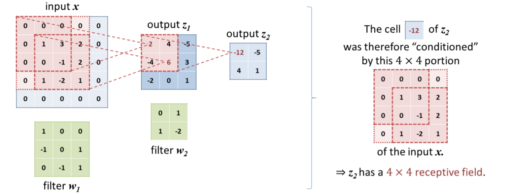
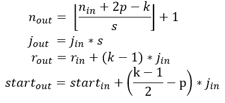

Trong bài viết này, mình muốn nói về receptive field, một khái niệm rất quan trọng trong các bài toán thị giác máy tính mà bạn nào học cũng cần phải biết để giải thích tại sao người ta lại muốn xây mạng sâu hơn. Cùng đi vào bài viết thôi.

<!--truncate-->

### Thế nào là receptive field?
Receptive field là kích thước của một vùng của đầu vào mà có ảnh hưởng lên một neuron tại một layer nào đó. Nó có thể được miêu tả bằng điểm trung tâm và kích thước. Tuy vậy thì không phải pixel nào trong receptive field đều có độ quan trọng như nhau đối với neuron mà nó ảnh hưởng tới. Các pixel gần trung tâm của receptive field sẽ đóng góp nhiều vai trò trong việc tính toán neuron tham chiều tới hơn là các pixel ở rìa receptive field.

### Cách tính toán receptive field
Giả sử, ta có ảnh đầu vào có kích thước chiều dài, chiều rộng là ${n = W = H}$.

Ta có hai cách để mô tả feature map ở các layer trong mạng, với kích thước cửa sổ tích chập là ${3 \times 3}$, padding là ${1 \times 1}$, bước nhảy là ${2 \times 2}$ như sau

Từ đó, với ${r}$ là kích thước receptive field tại lớp hiện tại, ${j}$ là khoảng cách giữa 2 điểm đặc trưng liền kề, ${start}$ là tọa độ điểm chính giữa của điểm đặc trưng trên cùng góc trái, ${k}$ là kích thước cửa sổ bộ lọc, ${p}$ là padding mà ta muốn chêm thêm để muốn bảo toàn kích thước đầu ra hay không, ${s}$ là bước nhảy cửa sổ tích chập. Ta có các công thức tính các thông số đầu ra khi cho một đầu vào qua cửa sổ tích chập như sau

Dưới đây là minh họa về áp dụng cách tính toán receptive field khi cho ảnh đầu vào qua một số cửa sổ tích chập đơn giản

### Một số nhận xét
Về cách tính toán receptive field ở trên, mình có một số nhận xét sau
- 2 lớp cửa sổ tích chập với kích thước ${3 \times 3}$ sẽ có receptive field tương đương với lớp cửa sổ tích chập kích thước ${5 \times 5}$.
- 3 lớp cửa sổ tích chập với kích thước ${3 \times 3}$ sẽ có receptive field tương đương với lớp cửa sổ tích chập kích thước ${7 \times 7}$.
- 5 lớp cửa sổ tích chập với kích thước ${3 \times 3}$ sẽ có receptive field tương đương với lớp cửa sổ tích chập kích thước ${11 \times 11}$.

Và tương tự như vậy, ta có thể thay thế các lớp cửa sổ tích chập kích thước lớn bằng nhiều cửa sổ tích chập có kích thước nhỏ hơn trong một mạng nơ-ron tích chập. Điều này có 2 lợi ích là 
- Tăng độ phi tuyến cho mạng, bởi vì khi chúng ta càng sử dụng nhiều lớp cửa sổ tích chập, ta càng sử dụng nhiều hơn các hàm kích hoạt cho các lớp đó.
- Giảm thiểu lượng biến số mô hình cần học. Ví dụ: ${N}$ bộ lọc tích chập ${5 \times 5 \times D}$ sẽ tạo ra ${5 \times 5 \times D \times N = 25 \times D \times N}$ biến số cần học, trong khi đó, ${2N}$ bộ lọc tích chập kích thước ${3 \times 3 \times D}$ sẽ tạo ra ${3 \times 3 \times D \times 2N = 18 \times D \times N}$ biến số. Điều này tượng tự với các trường hợp khác, càng nhiều cửa sổ tích chập nhỏ được dùng để thay thế các cửa sổ kích thước lớn hơn thì lượng biến số càng giảm xuống.

### Tài liệu tham khảo

[A guide to receptive field arithmetic for Convolutional Neural Networks](https://blog.mlreview.com/a-guide-to-receptive-field-arithmetic-for-convolutional-neural-networks-e0f514068807)