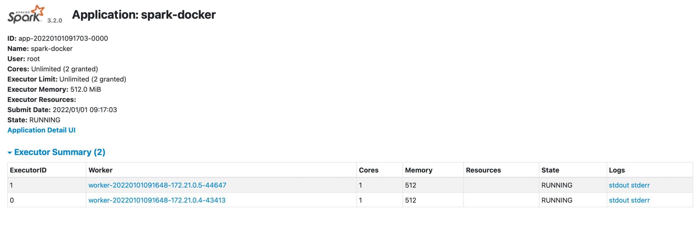

Lately, I've spent a lot of time teaching myself how to build Hadoop clusters, Spark, Hive integration, and more. This article will write about how you can build a Spark cluster for data processing using Docker, including 1 master node and 2 worker nodes, the cluster type is standalone cluster (maybe the upcoming articles I will do about Hadoop cluster and integrated resource manager is Yarn). Let's go to the article.

<!--truncate-->

## 1. Overview of a Spark cluster

Apache Spark is a data processing framework that can quickly perform processing tasks on very large data sets, and can also distribute tasks across multiple computers. It was design for fast computing and use RAM for caching and processing data.

It provides flexibility and scalability, created to improve the performance of MapReduce but at a much higher speed: 100 times faster than Hadoop when data is stored in memory and 10 times faster when accessed CD driver.

Spark does not have a file system of its own, but it can interact with many types of storage systems and can be used to integrate with Hadoop. Below is an overview of the structure of a Spark application.


Each time we submit a Spark application, it will create a driver program at the master node, which then create a SparkContext object. To be able to run in a cluster, SparkContext need to connect to a cluster resource manager, that could be Spark’s standalone cluster manager, Mesos or Yarn. Once the SparkContext get the connection, it will have specific RAM and CPU resources of the worker nodes in the cluster.

Each worker node will receive the code and tasks from the driver, compute and process the data.

The master node will be responsible for scheduling all the tasks and send those to the worker nodes so it’s ideal when we put it in the same network area with all the worker nodes to achieve low latency between requests

There are 2 Spark running modes

- **Running locally:** running all the tasks in the same machine which is your local machine, utilize the number of cores in that machine to perform parallelism
- **Running in a cluster:** Spark distribute the tasks to all the machine in the cluster. There are 2 deploy modes which are client mode and cluster mode, with 4 options of cluster resource manager, which are Spark standalone cluster manager, Apache Mesos, Hadoop Yarn, or Kubernetes.

## 2. Create a base image for the cluster

Because the images of the nodes in a cluster need to install the same software, we will build a base image for the whole cluster first, then the following images will import from this image and add the following images. other necessary dependencies.

```bash
ARG debian_buster_image_tag=8-jre-slim
FROM openjdk:${debian_buster_image_tag}

ARG shared_workspace=/opt/workspace

RUN mkdir -p ${shared_workspace} && \
    apt-get update -y && \
    apt-get install -y python3 && \
    ln -s /usr/bin/python3 /usr/bin/python && \
    rm -rf /var/lib/apt/lists/*

ENV SHARED_WORKSPACE=${shared_workspace}

VOLUME ${shared_workspace}
```

Here, since Spark requires java version 8 or 11, we will create an image running jdk 8, we will take the variable `shared_workspace` as the Jupyterlab working environment path (later). In addition, we will install `python3` for running Jupyterlab.

## 3. Create a spark base image

We come to create a spark base image with common packages for master node and worker node.

```bash
FROM spark-cluster-base

ARG spark_version=3.2.0
ARG hadoop_version=3.2

RUN apt-get update -y && \
    apt-get install -y curl && \
    curl https://archive.apache.org/dist/spark/spark-${spark_version}/spark-${spark_version}-bin-hadoop${hadoop_version}.tgz -o spark.tgz && \
    tar -xf spark.tgz && \
    mv spark-${spark_version}-bin-hadoop${hadoop_version} /usr/bin/ && \
    mkdir /usr/bin/spark-${spark_version}-bin-hadoop${hadoop_version}/logs && \
    rm spark.tgz

ENV SPARK_HOME /usr/bin/spark-${spark_version}-bin-hadoop${hadoop_version}
ENV SPARK_MASTER_HOST spark-master
ENV SPARK_MASTER_PORT 7077
ENV PYSPARK_PYTHON python3

WORKDIR ${SPARK_HOME}
```

First, we will import the image from the base image above (that is `spark-cluster-base`, this name will be assigned at build time), listing the compatible Spark and Hadoop versions. You can check version compatibility on Spark's homepage.


Then it will be to download and extract Spark, along with creating the necessary environment variables to support running the command line later. Here, `SPARK_MASTER_HOST` and `SPARK_MASTER_PORT` used by worker nodes to register with the corresponding master node address.

## 4. Create a master node image

Having a spark base image, we start creating the master node by importing that base image and adding the appropriate variables to the master node as the port of the web ui interface so we can interact with spark on the interface later.

```bash
FROM spark-base

ARG spark_master_web_ui=8080

EXPOSE ${spark_master_web_ui} ${SPARK_MASTER_PORT}
CMD bin/spark-class org.apache.spark.deploy.master.Master >> logs/spark-master.out
```

The above command is to run master node.

## 5. Create a worker node image

Next is to create worker node

```bash
FROM spark-base

ARG spark_worker_web_ui=8081

EXPOSE ${spark_worker_web_ui}
CMD bin/spark-class org.apache.spark.deploy.worker.Worker spark://${SPARK_MASTER_HOST}:${SPARK_MASTER_PORT} >> logs/spark-worker.out
```

The above command is to run the worker node and point to the address of the master node to register.

## 6. Create a Jupyterlab image for testing

Finally, to test the spark cluster working, we will install Jupyterlab and use pyspark to run the code.

```bash
FROM spark-cluster-base

ARG spark_version=3.2.0
ARG jupyterlab_version=3.2.5

RUN apt-get update -y && \
    apt-get install -y python3-pip && \
    pip3 install wget pyspark==${spark_version} jupyterlab==${jupyterlab_version}

EXPOSE 8888
WORKDIR ${SHARED_WORKSPACE}
CMD jupyter lab --ip=0.0.0.0 --port=8888 --no-browser --allow-root --NotebookApp.token=
```

Along with that is to list the command to run Jupyter on port 8888.

## 7. Combine images and create containers

After creating all the Dockerfiles, we proceed to build the appropriate images.


**Listing versions**

```bash
SPARK_VERSION="3.2.0"
HADOOP_VERSION="3.2"
JUPYTERLAB_VERSION="3.2.5"
```

**Build base image**

```bash
docker build \
  --platform=linux/arm64 \
  -f cluster_base/Dockerfile \
  -t spark-cluster-base .
```

**Build spark base image**

```bash
docker build \
  --build-arg spark_version="${SPARK_VERSION}" \
  --build-arg hadoop_version="${HADOOP_VERSION}" \
  -f spark_base/Dockerfile \
  -t spark-base .
```

**Build master node image**

```bash
docker build \
  -f master_node/Dockerfile \
  -t spark-master .
```

**Build worker node image**

```bash
docker build \
  -f worker_node/Dockerfile \
  -t spark-worker .
```

**Build Jupyterlab image**

```bash
docker build \
  --build-arg spark_version="${SPARK_VERSION}" \
  --build-arg jupyterlab_version="${JUPYTERLAB_VERSION}" \
  -f jupyter_lab/Dockerfile \
  -t spark-jupyterlab .
```

Finally, to create the necessary containers, we create a file `docker-compose.yml` with the following content

```bash
version: "3.6"
volumes:
  shared-workspace:
    name: "hadoop-distributed-file-system"
    driver: local
services:
  jupyterlab:
    image: spark-jupyterlab
    container_name: jupyterlab
    ports:
      - 8888:8888
    volumes:
      - shared-workspace:/opt/workspace
  spark-master:
    image: spark-master
    container_name: spark-master
    ports:
      - 8080:8080
      - 7077:7077
    volumes:
      - shared-workspace:/opt/workspace
  spark-worker-1:
    image: spark-worker
    container_name: spark-worker-1
    environment:
      - SPARK_WORKER_CORES=1
      - SPARK_WORKER_MEMORY=512m
    ports:
      - 8081:8081
    volumes:
      - shared-workspace:/opt/workspace
    depends_on:
      - spark-master
  spark-worker-2:
    image: spark-worker
    container_name: spark-worker-2
    environment:
      - SPARK_WORKER_CORES=1
      - SPARK_WORKER_MEMORY=512m
    ports:
      - 8082:8081
    volumes:
      - shared-workspace:/opt/workspace
    depends_on:
      - spark-master
```

Include the volume in which we will save data so that when deleting containers, data will not be lost, along with the necessary containers (services). To each container the appropriate environment variables are added, the ports to map to the host machine, and the order in which the containers are run. Here, the master node has to run first to get the hostname, so the worker node will depend on the master node container. After that, we run `docker-compose up`, so we have launched all the necessary containers.

## 8. Running Jupyterlab to check the cluster

After running `docker-compose up` and seeing in the terminal the logs showing that the master node and worker node have been successfully started, along with the successful register status of the nodes, we go to `localhost:8080` to access spark ui.


In the interface, we can see that there are 2 workers working as red circled areas.

Enter `localhost:8888` to access the Jupyterlab interface, execute the following code


Run the code, then go back to spark ui, we can see our application is running


Click on the application, we see our workers processing the job


