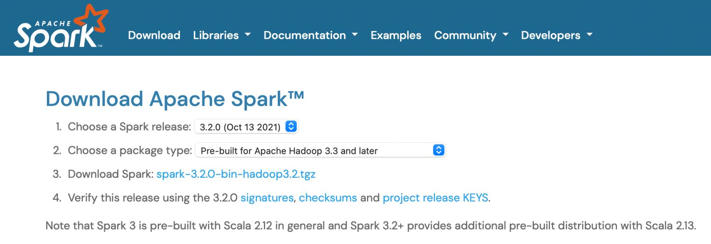
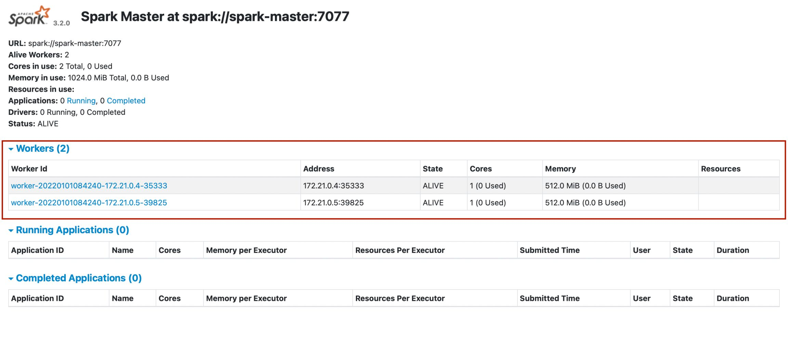
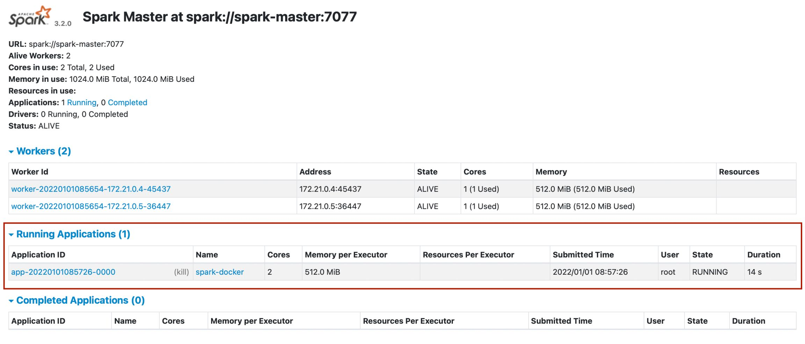

Thời gian vừa qua, mình đã dành nhiều thời gian tự học về cách xây dựng các cluster Hadoop, Spark, tích hợp Hive và một số thứ nữa. Bài viết này sẽ viết về cách bạn có thể xây dựng một Spark cluster cho việc xử lý dữ liệu bằng Docker, bao gồm 1 master node và 2 worker node, loại cluster là standalone cluster (có thể các bài viết sắp tới mình sẽ làm về Hadoop cluster và tích hợp resource manager là Yarn). Cùng đi vào bài viết nào.

<!--truncate-->

### 1. Tổng quan về cấu trúc và cách hoạt động của một Spark cluster

Spark là công cụ xử lý dữ liệu nhanh, mạnh mẽ cho phép bạn xử lý dữ giải quyết vấn đề dữ liệu lớn đối với cả dữ liệu có cấu trúc, bán cấu trúc và không có cấu trúc. Nó cung cấp tính linh hoạt và khả năng mở rộng, được tạo ra để cải thiện hiệu năng của MapReduce nhưng ở một tốc độ cao hơn nhiều: 100 lần nhanh hơn Hadoop khi dữ liệu được lưu trong bộ nhớ và 10 lần khi truy cập ổ đĩa. Nó được thiết kế cho các hiệu suất nhanh và sử dụng RAM để caching và xử lý dữ liệu. Spark không có một file system riêng, nhưng nó có thể tương tác với nhiều loại hệ thống lưu trữ, có thể sử dụng tích hợp với Hadoop. Dưới đây là tổng quan cấu trúc của một ứng dụng Spark.


Các ứng dụng Spark sinh ra một chương trình driver ở master node, và tạo ra 1 SparkContext. Để chạy trên 1 cluster, SparkContext cần kết nối đến một trong nhiều loại cluster managers (standalone cluster, Mesos hoặc YARN). Một khi được kết nối, Spark có được kết nối tới các worker nodes ở cluster. Những node đó thực hiện tiến trình làm các công việc tính toán và lưu trữ dữ liệu cho ứng dụng. Sau đó, nó gửi các code đến các executor. Cuối cùng, SparkContext sẽ gửi các tasks cho các executors để chạy.

Mỗi ứng dụng đều có các tiến trình executors riêng của nó, nằm ở đó suốt thời gian ứng dụng chạy và chạy các task ở nhiều threads, cô lập ứng dụng này với ứng dụng khác. Điều đó cũng có nghĩa là dữ liệu không thể được chia sẻ qua lại giữa các ứng dụng nếu mà không ghi dữ liệu ra một hệ thống lưu trữ ngoài.

Vì driver đặt lịch trình cho các task trên cluster, nó cần phải chạy gần với các worker node, sẽ là lý tưởng nếu nó chạy cùng một mạng LAN. Nếu bạn muốn gửi các request đến cluster từ xa, nó sẽ tốt hơn nếu như bạn tạo 1 RPC, chạy driver và submit các hoạt động từ phạm vi gần hơn là chạy driver ở khoảng cách xa các node worker.

### 2. Tạo một base image

Bởi vì các image các node trong 1 cluster cần cài đặt các phần mềm khá giống nhau nên chúng ta sẽ xây dựng một base image cho tổng thể cluster trước, sau đó thì các image sau sẽ import từ image này và thêm vào đó là các dependencies cần thiết khác.

```bash
ARG debian_buster_image_tag=8-jre-slim
FROM openjdk:${debian_buster_image_tag}

ARG shared_workspace=/opt/workspace

RUN mkdir -p ${shared_workspace} && \
    apt-get update -y && \
    apt-get install -y python3 && \
    ln -s /usr/bin/python3 /usr/bin/python && \
    rm -rf /var/lib/apt/lists/*

ENV SHARED_WORKSPACE=${shared_workspace}

VOLUME ${shared_workspace}
```

Ở đây, vì Spark yêu cầu java phiên bản 8 hoặc 11, nên chúng ta sẽ tạo một image chạy jdk 8, chúng ta sẽ lấy biến `shared_workspace` là đường dẫn môi trường làm việc của Jupyterlab (ở phần sau). Thêm vào đó, chúng ta sẽ cài `python3` cho việc chạy Jupyterlab.

### 3. Tạo một spark base image

Ta đến với tạo một spark base image với các package chung cho master node và workder node.

```bash
FROM spark-cluster-base

ARG spark_version=3.2.0
ARG hadoop_version=3.2

RUN apt-get update -y && \
    apt-get install -y curl && \
    curl https://archive.apache.org/dist/spark/spark-${spark_version}/spark-${spark_version}-bin-hadoop${hadoop_version}.tgz -o spark.tgz && \
    tar -xf spark.tgz && \
    mv spark-${spark_version}-bin-hadoop${hadoop_version} /usr/bin/ && \
    mkdir /usr/bin/spark-${spark_version}-bin-hadoop${hadoop_version}/logs && \
    rm spark.tgz

ENV SPARK_HOME /usr/bin/spark-${spark_version}-bin-hadoop${hadoop_version}
ENV SPARK_MASTER_HOST spark-master
ENV SPARK_MASTER_PORT 7077
ENV PYSPARK_PYTHON python3

WORKDIR ${SPARK_HOME}
```

Đầu tiên, ta sẽ import image từ base image bên trên (là `spark-cluster-base`, cái tên này sẽ được gán vào thời gian build image), liệt kê các phiên bản Spark và Hadoop tương thích với nhau. Các bạn có thể kiểm tra tương thích phiên bản trên trang chủ của Spark.



Sau đó sẽ là tải và giải nén Spark, cùng với đó là tạo các biến môi trường cần thiết để hỗ trợ chạy command line về sau. Ở đây, `SPARK_MASTER_HOST` và `SPARK_MASTER_PORT` được các worker node dùng để register với master node địa chỉ tương ứng.

### 4. Tạo một master node image

Có một spark base image, ta bắt đầu tạo master node bằng việc import base image đó và thêm các biến phù hợp với master node như là port của giao diện web ui để lát nữa có thể tương tác với spark trên giao diện.

```bash
FROM spark-base

ARG spark_master_web_ui=8080

EXPOSE ${spark_master_web_ui} ${SPARK_MASTER_PORT}
CMD bin/spark-class org.apache.spark.deploy.master.Master >> logs/spark-master.out
```

Command trên là để chạy master node.

### 5. Tạo một worker node image

Tiếp đến là tạo worker node

```bash
FROM spark-base

ARG spark_worker_web_ui=8081

EXPOSE ${spark_worker_web_ui}
CMD bin/spark-class org.apache.spark.deploy.worker.Worker spark://${SPARK_MASTER_HOST}:${SPARK_MASTER_PORT} >> logs/spark-worker.out
```

Command trên là để chạy worker node và trỏ tới địa chỉ của master node để register.

### 6. Tạo một Jupyterlab image cho việc kiểm thử

Cuối cùng, để kiểm tra hoạt động của spark cluster, ta sẽ cái Jupyterlab và dùng pyspark để chạy code.

```bash
FROM spark-cluster-base

ARG spark_version=3.2.0
ARG jupyterlab_version=3.2.5

RUN apt-get update -y && \
    apt-get install -y python3-pip && \
    pip3 install wget pyspark==${spark_version} jupyterlab==${jupyterlab_version}

EXPOSE 8888
WORKDIR ${SHARED_WORKSPACE}
CMD jupyter lab --ip=0.0.0.0 --port=8888 --no-browser --allow-root --NotebookApp.token=
```

Cùng với đó là liệt kê command chạy Jupyter ở port 8888.

### 7. Kết hợp các image và tạo các container

Sau khi tạo đầy đủ các Dockerfile, ta tiến hành build các image phù hợp.


**Liệt kê các phiên bản**

```bash
SPARK_VERSION="3.2.0"
HADOOP_VERSION="3.2"
JUPYTERLAB_VERSION="3.2.5"
```

**Build base image**

```bash
docker build \
  --platform=linux/arm64 \
  -f cluster_base/Dockerfile \
  -t spark-cluster-base .
```

**Build spark base image**

```bash
docker build \
  --build-arg spark_version="${SPARK_VERSION}" \
  --build-arg hadoop_version="${HADOOP_VERSION}" \
  -f spark_base/Dockerfile \
  -t spark-base .
```

**Build master node image**

```bash
docker build \
  -f master_node/Dockerfile \
  -t spark-master .
```

**Build worker node image**

```bash
docker build \
  -f worker_node/Dockerfile \
  -t spark-worker .
```

**Build Jupyterlab image**

```bash
docker build \
  --build-arg spark_version="${SPARK_VERSION}" \
  --build-arg jupyterlab_version="${JUPYTERLAB_VERSION}" \
  -f jupyter_lab/Dockerfile \
  -t spark-jupyterlab .
```

Cuối cùng, để tạo các container cần thiết, ta tạo một file `docker-compose.yml` với nội dung như sau

```bash
version: "3.6"
volumes:
  shared-workspace:
    name: "hadoop-distributed-file-system"
    driver: local
services:
  jupyterlab:
    image: spark-jupyterlab
    container_name: jupyterlab
    ports:
      - 8888:8888
    volumes:
      - shared-workspace:/opt/workspace
  spark-master:
    image: spark-master
    container_name: spark-master
    ports:
      - 8080:8080
      - 7077:7077
    volumes:
      - shared-workspace:/opt/workspace
  spark-worker-1:
    image: spark-worker
    container_name: spark-worker-1
    environment:
      - SPARK_WORKER_CORES=1
      - SPARK_WORKER_MEMORY=512m
    ports:
      - 8081:8081
    volumes:
      - shared-workspace:/opt/workspace
    depends_on:
      - spark-master
  spark-worker-2:
    image: spark-worker
    container_name: spark-worker-2
    environment:
      - SPARK_WORKER_CORES=1
      - SPARK_WORKER_MEMORY=512m
    ports:
      - 8082:8081
    volumes:
      - shared-workspace:/opt/workspace
    depends_on:
      - spark-master
```

Bao gồm volume mà ta sẽ lưu dữ liệu để khi xoá các container không bị mất dữ liệu, cùng với đó là các container (service) cần thiết. Ở mỗi container các biến môi trường phù hợp được thêm vào, các port để map ra máy host, và thứ tự chạy các container. Ở đây, master node phải chạy lên trước để lấy hostname nên worker node sẽ depend vào master node container. Sau đó, ta chạy `docker-compose up`, như thế là đã khởi chạy hết các container cần thiết rồi.

### 8. Chạy Jupyterlab để kiểm tra hoạt động của cluster

Sau khi đã chạy `docker-compose up` và thấy ở terminal các logs thể hiện đã khởi động thành công master node và worker node, cùng với trạng thái register thành công của các node, ta vào `localhost:8080` để xem spark ui.



Ở giao diện, ta thấy được có 2 worker đang hoạt động như vùng khoanh đỏ.

Vào `localhost:8888` để vào giao diện Jupyterlab, thực hiện code sau


Chạy code, rồi quay lại spark ui, ta thấy được ứng dụng của ta đang chạy



Ấn vào ứng dụng, ta thấy các worker của ta đang xử lý job

