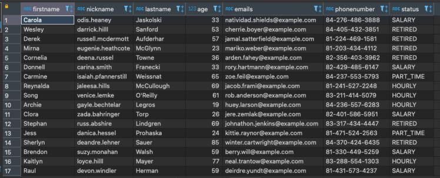

Hi guys, I'm back after a long time without writing anything. Today, I want to share about how to create a Spark Streaming pipeline that consumes data from Kafka, everything is built on Docker.

<!--truncate-->

## 1. Design overview

The model is containerized by Docker. Includes the following components

- Producer: is a Kafka Producer that produces fake data about an user information using Java Faker and produce messages onto Kafka.
- Kafka cluster: includes brokers to store data and Zookeeper to manage those brokers.
- Spark cluster: is a Spark cluster consisting of 3 nodes: 1 driver and 2 workers to consume data from Kafka.
- Schema Registry: provides a restful interface to store and retrieve schemas, helping Kafka producers and consumers work together according to standards. Since the two ends of producing and consuming messages from two Kafka ends are independent, the consumer does not need to know how the producer sends the message with the format, the Schema Registry acts as an intermediary for the two parties to register the message format with each other, avoiding system errors.
- Postgres: is the database to provide configurations for the Spark Streaming application and in this article is also the place to store the streaming data after processing by Spark.

## 2. Build necessary Docker images and containers

### 2.1. Create a Spark cluster

As in the **[previous article](/blog/2022-01-01-spark-cluster-docker/index.md)** I wrote about how to build a Spark cluster on Docker, in this article I take advantage of that cluster. However, there is a slight change, leaving out some things to fit this article. You can find the build image script **[here](https://github.com/lam1051999/spark_kafka_docker/tree/main/spark_cluster)**. So we have the necessary images for the Spark cluster. Here is the container configuration in docker-compose.yml

```yml
spark-master:
  image: spark-master
  container_name: spark-master
  ports:
    - 8080:8080
    - 7077:7077
    - 4040:4040
  volumes:
    - /Users/tranlammacbook/Documents/spark_streaming_kafka/spark_ex/target:/execution_files
spark-worker-1:
  image: spark-worker
  container_name: spark-worker-1
  environment:
    - SPARK_WORKER_CORES=1
    - SPARK_WORKER_MEMORY=1024m
  ports:
    - 18081:8081
  volumes:
    - /Users/tranlammacbook/Documents/spark_streaming_kafka/spark_ex/target:/execution_files
  depends_on:
    - spark-master
spark-worker-2:
  image: spark-worker
  container_name: spark-worker-2
  environment:
    - SPARK_WORKER_CORES=1
    - SPARK_WORKER_MEMORY=1024m
  ports:
    - 28081:8081
  volumes:
    - /Users/tranlammacbook/Documents/spark_streaming_kafka/spark_ex/target:/execution_files
  depends_on:
    - spark-master
```

### 2.2. Add Zookeeper, Kafka, Postgres, Schema Registry containers

Next will be on Zookeeper, Kafka, Postgres and Schema Registry containers

```yml
zookeeper:
  image: confluentinc/cp-zookeeper:3.3.1
  container_name: zookeeper
  ports:
    - "2181:2181"
  environment:
    ZOOKEEPER_CLIENT_PORT: 2181
    ZOOKEEPER_TICK_TIME: 2000
kafka:
  image: confluentinc/cp-kafka:3.3.1
  container_name: kafka
  depends_on:
    - zookeeper
  ports:
    - "29092:29092"
  environment:
    KAFKA_BROKER_ID: 1
    KAFKA_ZOOKEEPER_CONNECT: zookeeper:2181
    KAFKA_ADVERTISED_LISTENERS: PLAINTEXT://kafka:9092,PLAINTEXT_HOST://localhost:29092
    KAFKA_LISTENER_SECURITY_PROTOCOL_MAP: PLAINTEXT:PLAINTEXT,PLAINTEXT_HOST:PLAINTEXT
    KAFKA_INTER_BROKER_LISTENER_NAME: PLAINTEXT
    KAFKA_OFFSETS_TOPIC_REPLICATION_FACTOR: 1

db:
  image: postgres
  container_name: db-postgres
  volumes:
    - ./data/db:/var/lib/postgresql/data
  ports:
    - "5432:5432"
  environment:
    - POSTGRES_NAME=postgres
    - POSTGRES_USER=postgres
    - POSTGRES_PASSWORD=postgres

schema-registry:
  image: confluentinc/cp-schema-registry:3.3.1
  container_name: schema-registry
  depends_on:
    - zookeeper
    - kafka
  ports:
    - "8081:8081"
  environment:
    SCHEMA_REGISTRY_KAFKASTORE_CONNECTION_URL: zookeeper:2181
    SCHEMA_REGISTRY_HOST_NAME: schema-registry
```

To sum up, we have a complete docker-compose.yml file like **[this](https://github.com/lam1051999/spark_kafka_docker/blob/main/spark_ex/docker-compose.yml)**. Then we start the containers with

```bash
docker-compose up -d
```

Note, this starts all containers at once, some Kafka and Schema Registry instances will fail because it depends on Zookeeper. Wait for the Zookeeper container to finish up and then restart the Kafka container and the Schema Registry (you can also check the Zookeeper service by implementing some healthcheck techniques).

## 3. Create a Kafka Producer that produce fake data using Java Faker

Next, we create a Kafka Producer to fire dummy data in Java. First, we need to create a schema on the Schema Registry. Because the Schema Registry provides a restful interface, we can easily interact with it by calling GET, POST,... The schema we use in this article will have the following form.

```json
{
  "namespace": "com.cloudurable.phonebook",
  "type": "record",
  "name": "Employee",
  "doc": "Represents an Employee at a company",
  "fields": [
    { "name": "id", "type": "string", "doc": "The person id" },
    { "name": "firstName", "type": "string", "doc": "The persons given name" },
    { "name": "nickName", "type": ["null", "string"], "default": null },
    { "name": "lastName", "type": "string" },
    { "name": "age", "type": "int", "default": -1 },
    { "name": "emails", "type": "string", "doc": "The person email" },
    {
      "name": "phoneNumber",
      "type": {
        "type": "record",
        "name": "PhoneNumber",
        "fields": [
          { "name": "areaCode", "type": "string" },
          { "name": "countryCode", "type": "string", "default": "" },
          { "name": "prefix", "type": "string" },
          { "name": "number", "type": "string" }
        ]
      }
    },
    { "name": "status", "type": "string" }
  ]
}
```

First, to POST this schema to the Schema Registry, we must convert this schema to escaped json, visit **[this website](https://www.freeformatter.com/json-escape.html)**. Then use the POST method to push the schema as follows

```bash
curl -X POST -H "Content-Type: application/vnd.schemaregistry.v1+json" \
  --data '{"schema": "{\"namespace\": \"com.cloudurable.phonebook\",\"type\": \"record\",\"name\": \"Employee\",\"doc\" : \"Represents an Employee at a company\",\"fields\": [{\"name\": \"id\", \"type\": \"string\", \"doc\": \"The person id\"},{\"name\": \"firstName\", \"type\": \"string\", \"doc\": \"The persons given name\"},{\"name\": \"nickName\", \"type\": [\"null\", \"string\"], \"default\" : null},{\"name\": \"lastName\", \"type\": \"string\"},{\"name\": \"age\",  \"type\": \"int\", \"default\": -1},{\"name\": \"emails\", \"type\": \"string\", \"doc\": \"The person email\"},{\"name\": \"phoneNumber\",  \"type\":{ \"type\": \"record\",   \"name\": \"PhoneNumber\",\"fields\": [{\"name\": \"areaCode\", \"type\": \"string\"},{\"name\": \"countryCode\", \"type\": \"string\", \"default\" : \"\"},{\"name\": \"prefix\", \"type\": \"string\"},{\"name\": \"number\", \"type\": \"string\"}]}},{\"name\": \"status\", \"type\": \"string\"}]}"}' \
  http://localhost:8081/subjects/personinformation-value/versions
```

After that, GET back to check if the schema is up or not

```bash
curl -X GET http://localhost:8081/subjects/personinformation-value/versions/ // check all versions
curl -X GET http://localhost:8081/subjects/personinformation-value/versions/1 // check schema version 1
```

Now that Kafka is up, the schema is on the Schema Registry, the rest is to push the message to that topic. Write a class as follows (see full code **[here](https://github.com/lam1051999/spark_kafka_docker/tree/main/KafkaClient)**), and run, then the data will be uploaded to Kafka with the above chema.

```java
package kafkaclient;

import com.github.javafaker.Faker;
import io.confluent.kafka.serializers.KafkaAvroSerializerConfig;
import org.apache.avro.Schema;
import org.apache.avro.generic.GenericData;
import org.apache.avro.generic.GenericRecord;
import org.apache.kafka.clients.producer.KafkaProducer;
import org.apache.kafka.clients.producer.Producer;
import io.confluent.kafka.serializers.KafkaAvroSerializer;
import org.apache.kafka.clients.producer.ProducerConfig;
import org.apache.kafka.clients.producer.ProducerRecord;
import org.apache.kafka.common.serialization.StringSerializer;

import java.io.File;
import java.io.IOException;
import java.util.ArrayList;
import java.util.Properties;

public class KafkaProducerExample {
    private final static String TOPIC = "personinformation";
    private final static String BOOTSTRAP_SERVERS = "localhost:29092";
    private final static String SCHEMA_REGISTRY_URL = "http://localhost:8081";
    private final static String LOCAL_SCHEMA_PATH = "src/main/resources/person.avsc";
    private final static Schema schema;

    private final static int nPersons = 1000;

    static {
        try {
            schema = new Schema.Parser().parse(new File(LOCAL_SCHEMA_PATH));
        } catch (IOException e) {
            throw new RuntimeException(e);
        }
    }

    private static Producer<String, GenericRecord> createProducer(){
        Properties props = new Properties();
        props.put(ProducerConfig.BOOTSTRAP_SERVERS_CONFIG, BOOTSTRAP_SERVERS);
        props.put(ProducerConfig.KEY_SERIALIZER_CLASS_CONFIG, StringSerializer.class.getName());
        props.put(ProducerConfig.VALUE_SERIALIZER_CLASS_CONFIG, KafkaAvroSerializer.class.getName());
        props.put(KafkaAvroSerializerConfig.SCHEMA_REGISTRY_URL_CONFIG, SCHEMA_REGISTRY_URL);

        return new KafkaProducer<>(props);
    }

    static void runProducer() {
        final Producer<String, GenericRecord> producer = createProducer();
        Faker faker = new Faker();

        for (int i = 0; i < nPersons; i ++){
            String id = faker.idNumber().valid();
            String firstName = faker.name().firstName();
            String nickName = faker.name().username();
            String lastName = faker.name().lastName();
            int age = faker.number().numberBetween(18, 90);
            String emails = faker.internet().safeEmailAddress();
            String areaCode = String.valueOf(faker.number().numberBetween(200, 500));
            String countryCode = String.valueOf(faker.number().numberBetween(80, 85));
            String prefix = String.valueOf(faker.number().numberBetween(400, 600));
            String number = String.valueOf(faker.number().numberBetween(1234, 6789));

            GenericRecord phoneNumber = new GenericData.Record(schema.getField("phoneNumber").schema());
            phoneNumber.put("areaCode", areaCode);
            phoneNumber.put("countryCode", countryCode);
            phoneNumber.put("prefix", prefix);
            phoneNumber.put("number", number);

            StatusEnum status = StatusEnum.getRandomStatus();

            GenericRecord personInfo = new GenericData.Record(schema);
            personInfo.put("id", id);
            personInfo.put("firstName", firstName);
            personInfo.put("nickName", nickName);
            personInfo.put("lastName", lastName);
            personInfo.put("age", age);
            personInfo.put("emails", emails);
            personInfo.put("phoneNumber", phoneNumber);
            personInfo.put("status", status.toString());

            ProducerRecord<String, GenericRecord> data = new ProducerRecord<String, GenericRecord>(TOPIC, String.format("%s %s %s", firstName, lastName, nickName), personInfo);
            producer.send(data);
            System.out.println("Send successfully!!!");
            try {
                Thread.sleep(2000);
            }catch (Exception e){
                e.printStackTrace();
            }
        }
    }

    public static void main(String[] args) {
        try {
            runProducer();
        }catch (Exception e){
            e.printStackTrace();
        }
    }
}
```

Above, every 2 seconds we will push 1 message to Kafka, pushing a total of 1000 messages.

## 4. Submit Spark job

### 4.1. Configure the Postgres database

Before we can run the job, we need to configure Postgres with the following tables

- Configuration for Spark applications

```sql
CREATE TABLE spark_launcher_config (
    id serial primary  key,
    "desc" varchar(1000) NULL,
    app_name varchar(255) NULL,
    properties text,
    created timestamp without time zone DEFAULT (now() at time zone 'Asia/Ho_Chi_Minh'),
    modified timestamp without time zone DEFAULT (now() at time zone 'Asia/Ho_Chi_Minh')
)

INSERT INTO public.spark_launcher_config
    (id, "desc", app_name, properties, created, modified)
    VALUES(2, 'kafka_ingest', 'ingest_avro_from_kafka', '{
    "appname": "ingest_avro_from_kafka",
    "master": "spark://spark-master:7077",
    "duration": "10",
    "groupId": "ingest_avro_from_kafka",
    "zookeeper.hosts": "zookeeper:2181",
    "checkpoint": "./spark_checkpoint/ingest_avro_from_kafka",
    "zookeeper.timeout": "40000",
    "spark.sql.shuffle.partitions": "10",
    "spark.sql.sources.partitionOverwriteMode": "dynamic",
    "spark.sql.hive.verifyPartitionPath": "true",
    "spark.streaming.kafka.maxRatePerPartition": 10000,
    "_kafka_.bootstrap.servers": "kafka:9092",
    "_kafka_.group.id": "ingest_avro_from_kafka",
    "_kafka_.auto.offset.reset": "earliest",
    "_kafka_.max.poll.interval.ms": 5000000,
    "_kafka_.max.poll.records": 10000,
    "_kafka_.schema.registry.url": "http://schema-registry:8081",
    "_kafka_.auto.commit": "false",
    "_kafka_.session.timeout.ms": "50000",
    "_kafka_.heartbeat.interval.ms": "25000",
    "_kafka_.request.timeout.ms": "50000"
    }', '2022-04-12 09:35:27.511', '2022-04-12 09:35:27.511');
```

- Topic consumption configuration table

```sql
CREATE TABLE spark_ingest_config (
    id serial primary key,
    app_name varchar(255) not null unique,
    type varchar(255)  NULL,
    "order" int NULL,
    topic varchar(255) not null unique,
    status int not null DEFAULT 0,
    fields text,
    temp_view_first varchar(255)  NULL,
    sql_parser text,
    prd_id varchar(255)  NULL,
    keys varchar(255)  NULL,
    path_hdfs varchar(255) NOT NULL,
    table_dest varchar(255) NOT NULL,
    impala_driver varchar(255) null DEFAULT '',
    impala_url varchar(255) null DEFAULT '',
    kafka_msg_type kkmt DEFAULT 'avro_flat',
    json_schema text,
    repartition_des int not null DEFAULT 1,
    msg_type mst DEFAULT 'NOT_DEFINE',
    created timestamp without time zone DEFAULT (now() at time zone 'Asia/Ho_Chi_Minh'),
    modified timestamp without time zone DEFAULT (now() at time zone 'Asia/Ho_Chi_Minh')
)

INSERT INTO public.spark_ingest_config
(id, app_name, "type", "order", topic, status, fields, temp_view_first, sql_parser, prd_id, keys, path_hdfs, table_dest, impala_driver, impala_url, kafka_msg_type, json_schema, repartition_des, msg_type, created, modified)
VALUES(1, 'ingest_avro_from_kafka', 'insert', 0, 'personinformation', 1, 'firstName,
nickName,
lastName,
age,
emails,
phoneNumber,
status', 'ingest_avro_from_kafka_personinformation', 'select
	cast(firstName as STRING) as firstName,
	cast(nickName as STRING) as nickName,
	cast(lastName as STRING) as lastName,
	cast(age as INT) as age,
	cast(emails as STRING) as emails,
	cast(concat(phoneNumber.countryCode, "-", phoneNumber.areaCode, "-", phoneNumber.prefix, "-", phoneNumber.number) as STRING) as phoneNumber,
	cast(status as STRING) as status
from ingest_avro_from_kafka_personinformation', '', '', '', 'personinformation', '', '', 'avro_flat'::public."kkmt", '', 1, 'NOT_DEFINE'::public."mst", '2022-04-06 19:59:41.745', '2022-04-06 19:59:41.745');
```

- Streaming data table

```sql
create table personinformation (
	firstName varchar(250) not null,
	nickName varchar(250) not null,
	lastName varchar(250) not null,
	age integer not null,
	emails varchar(250) not null,
	phoneNumber varchar(250) not null,
	status varchar(10) not null
);
```

### 4.2. Spark application configuration

The full Spark Streaming Code you can find **[here](https://github.com/lam1051999/spark_kafka_docker/tree/main/spark_ex)**. Compile the project by running

```bash
sh run.sh
```

When all containers are running stable, Kafka has the data, we access the shell of the Spark master container

```bash
docker exec -it spark-master bash
```

After entering the shell, you continue to run the command below to submit the Spark job

```bash
$SPARK_HOME/bin/spark-submit --jars $(echo /execution_files/dependency/*.jar | tr ' ' ',') --class com.tranlam.App /execution_files/spark_ex-1.0-SNAPSHOT.jar --app-name ingest_avro_from_kafka --jdbc-url "jdbc:postgresql://db:5432/postgres?user=postgres&password=postgres"
```

So there is already a Spark job that consumes Kafka data. Visit **[http://localhost:4040/streaming](http://localhost:4040/streaming)** to see the batches running


In Postgres, query the table `personinformation` we get the data as desired



Above is the steps for building a basic Spark streaming pipeline to stream data from Kafka. Another thing to note is that instead of committing the offset of the consumptions to a Kafka topic like in above code, you can manually commit it to a path in Zookeeper for more proactive control.

The code of the whole article you read can be found at: **[https://github.com/lam1051999/spark_kafka_docker](https://github.com/lam1051999/spark_kafka_docker)**
