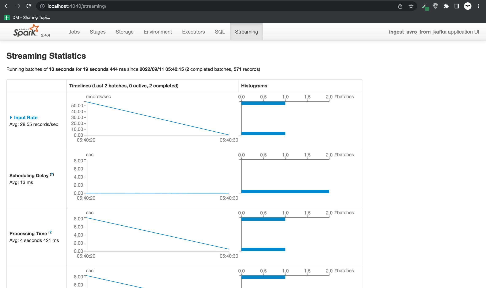

<!--truncate-->

Chào các bạn, mình đã trở lại sau một thời gian khá lâu chưa viết gì. Quãng thời gian vừa qua thực sự là quãng thời gian mình học hỏi được rất nhiều từ khi làm tại công ty mới. Mình được động vào rất nhiều phần công việc khác nhau, như là code Spark, Spark Streaming, xây dựng datamart cho nghiệp vụ, hay là code API cung cấp dữ liệu sau tổng hợp cho các phòng ban,... Hôm nay, mình muốn chia sẻ về cách tạo 1 luồng Spark Streaming tiêu thụ dữ liệu từ Kafka, tất cả mọi thứ được dựng trên Docker.

### 1. Tổng quan mô hình
Mô hình được containerize bởi Docker. Bao gồm các thành phần sau
* Producer: là một Kafka Producer sản xuất dữ liệu fake về thông tin một cá thể bằng Java Faker và bắn các message lên Kafka.
* Kafka cluster: bao gồm các broker để lưu trữ dữ liệu và Zookeeper để quản lý các broker đó.
* Spark cluster: là một cụm Spark gồm 3 nodes: 1 driver và 2 worker để tiêu thụ dữ liệu từ Kafka.
* Schema Registry: cung cấp restful interface để lưu trữ và lấy các schema, giúp cho Kafka producer và consumer hoạt động với nhau theo quy chuẩn. Khi mà 2 đầu sản xuất và tiêu thụ message từ 2 đầu Kafka là độc lập, bên đầu tiêu thụ không cần biết bên sản xuất bắn message với format thế nào, thì Schema Registry như là trung gian để 2 bên đăng kí format message với nhau, tránh lỗi hệ thống.
* Postgres: là database để cung cấp các cấu hình cho app Spark Streaming và ở bài viết này cũng là nơi để đẩy dữ liệu streaming xuống. 

### 2. Dựng các container cần thiết trên Docker

#### 2.1. Tạo Spark cluster
Như trong **[bài viết trước](/blog/2022-01-01-spark-cluster-docker/index.md)** mình có viết về cách dựng cụm Spark trên Docker, ở bài này mình tận dụng luôn cụm đó. Tuy nhiên, có một chút thay đổi, lược bỏ đi một số thứ để phù hợp với bài viết này. Các bạn có thể tìm được script build image **[tại đây](https://github.com/lam1051999/spark_kafka_docker/tree/main/spark_cluster)**. Thế là ta đã có các image cần thiết cho Spark cluster. Sau đây là phần cấu hình các container trong docker-compose.yml

```yml
  spark-master:
    image: spark-master
    container_name: spark-master
    ports:
      - 8080:8080
      - 7077:7077
      - 4040:4040
    volumes:
      - /Users/tranlammacbook/Documents/spark_streaming_kafka/spark_ex/target:/execution_files
  spark-worker-1:
    image: spark-worker
    container_name: spark-worker-1
    environment:
      - SPARK_WORKER_CORES=1
      - SPARK_WORKER_MEMORY=1024m
    ports:
      - 18081:8081
    volumes:
      - /Users/tranlammacbook/Documents/spark_streaming_kafka/spark_ex/target:/execution_files
    depends_on:
      - spark-master
  spark-worker-2:
    image: spark-worker
    container_name: spark-worker-2
    environment:
      - SPARK_WORKER_CORES=1
      - SPARK_WORKER_MEMORY=1024m
    ports:
      - 28081:8081
    volumes:
      - /Users/tranlammacbook/Documents/spark_streaming_kafka/spark_ex/target:/execution_files
    depends_on:
      - spark-master
```

#### 2.2. Thêm các container Zookeeper, Kafka, Postgres, Schema Registry
Tiếp theo sẽ là lên các container Zookeeper, Kafka, Postgres và Schema Registry
```yml
  zookeeper:
    image: confluentinc/cp-zookeeper:3.3.1
    container_name: zookeeper
    ports:
      - "2181:2181"
    environment:
      ZOOKEEPER_CLIENT_PORT: 2181
      ZOOKEEPER_TICK_TIME: 2000
  kafka:
    image: confluentinc/cp-kafka:3.3.1
    container_name: kafka
    depends_on:
      - zookeeper
    ports:
      - "29092:29092"
    environment:
      KAFKA_BROKER_ID: 1
      KAFKA_ZOOKEEPER_CONNECT: zookeeper:2181
      KAFKA_ADVERTISED_LISTENERS: PLAINTEXT://kafka:9092,PLAINTEXT_HOST://localhost:29092
      KAFKA_LISTENER_SECURITY_PROTOCOL_MAP: PLAINTEXT:PLAINTEXT,PLAINTEXT_HOST:PLAINTEXT
      KAFKA_INTER_BROKER_LISTENER_NAME: PLAINTEXT
      KAFKA_OFFSETS_TOPIC_REPLICATION_FACTOR: 1

  db:
    image: postgres
    container_name: db-postgres
    volumes:
      - ./data/db:/var/lib/postgresql/data
    ports:
      - "5432:5432"
    environment:
      - POSTGRES_NAME=postgres
      - POSTGRES_USER=postgres
      - POSTGRES_PASSWORD=postgres

  schema-registry:
    image: confluentinc/cp-schema-registry:3.3.1
    container_name: schema-registry
    depends_on:
      - zookeeper
      - kafka
    ports:
      - "8081:8081"
    environment:
      SCHEMA_REGISTRY_KAFKASTORE_CONNECTION_URL: zookeeper:2181
      SCHEMA_REGISTRY_HOST_NAME: schema-registry
```

Tổng hợp lại, ta có một file docker-compose.yml hoàn chỉnh như **[ở đây](https://github.com/lam1051999/spark_kafka_docker/blob/main/spark_ex/docker-compose.yml)**.
Sau đó, ta thực hiện khởi động các container bằng
```docker
docker-compose up -d
```
Lưu ý, việc này khởi động tất cả các container cùng một lúc, một số trường hợp Kafka và Schema Registry sẽ bị lỗi vì nó phụ thuộc vào Zookeeper. Hãy chờ container Zookeeper lên xong rồi restart lại container Kafka và Schema Registry.

### 3. Tạo một Kafka Producer bắn dữ liệu giả bằng Java Faker
Tiếp đến, ta tạo một Kafka Producer để bắn dữ liệu giả bằng Java. Trước tiên, ta cần tạo 1 schema trên Schema Registry. Vì Schema Registry cung cấp một restful interface nên ta có thể dễ dàng tương tác với nó bằng các lời gọi GET, POST,... Schema ta sử dụng trong bài viết này sẽ có dạng như sau
```json
{"namespace": "com.cloudurable.phonebook",
  "type": "record",
  "name": "Employee",
  "doc" : "Represents an Employee at a company",
  "fields": [
    {"name": "id", "type": "string", "doc": "The person id"},
    {"name": "firstName", "type": "string", "doc": "The persons given name"},
    {"name": "nickName", "type": ["null", "string"], "default" : null},
    {"name": "lastName", "type": "string"},
    {"name": "age",  "type": "int", "default": -1},
    {"name": "emails", "type": "string", "doc": "The person email"},
    {"name": "phoneNumber",  "type":
      { "type": "record",   "name": "PhoneNumber",
        "fields": [
          {"name": "areaCode", "type": "string"},
          {"name": "countryCode", "type": "string", "default" : ""},
          {"name": "prefix", "type": "string"},
          {"name": "number", "type": "string"}
        ]
      }
    },
    {"name": "status", "type": "string"}
  ]
}
```
Trước hết, để POST schema này lên Schema Registry, ta phải chuyển schema này về dạng escaped json, truy cập **[trang web này](https://www.freeformatter.com/json-escape.html)** để chuyển.
Sau đó, dùng POST method để push schema lên như sau
```http
curl -X POST -H "Content-Type: application/vnd.schemaregistry.v1+json" \
  --data '{"schema": "{\"namespace\": \"com.cloudurable.phonebook\",\"type\": \"record\",\"name\": \"Employee\",\"doc\" : \"Represents an Employee at a company\",\"fields\": [{\"name\": \"id\", \"type\": \"string\", \"doc\": \"The person id\"},{\"name\": \"firstName\", \"type\": \"string\", \"doc\": \"The persons given name\"},{\"name\": \"nickName\", \"type\": [\"null\", \"string\"], \"default\" : null},{\"name\": \"lastName\", \"type\": \"string\"},{\"name\": \"age\",  \"type\": \"int\", \"default\": -1},{\"name\": \"emails\", \"type\": \"string\", \"doc\": \"The person email\"},{\"name\": \"phoneNumber\",  \"type\":{ \"type\": \"record\",   \"name\": \"PhoneNumber\",\"fields\": [{\"name\": \"areaCode\", \"type\": \"string\"},{\"name\": \"countryCode\", \"type\": \"string\", \"default\" : \"\"},{\"name\": \"prefix\", \"type\": \"string\"},{\"name\": \"number\", \"type\": \"string\"}]}},{\"name\": \"status\", \"type\": \"string\"}]}"}' \
  http://localhost:8081/subjects/personinformation-value/versions
```
Sau đó, GET về để check xem schema đã lên hay chưa
```http
curl -X GET http://localhost:8081/subjects/personinformation-value/versions/ // xem các version
curl -X GET http://localhost:8081/subjects/personinformation-value/versions/1 // xem schema version 1
```
Khi này, Kafka đã lên, schema đã có trên Schema Registry, việc còn lại là đẩy message lên topic đó. Viết một class như sau (xem đầy đủ code **[tại đây](https://github.com/lam1051999/spark_kafka_docker/tree/main/KafkaClient)**), và chạy thì dữ liệu đã lên Kafka với chema ở trên rồi.
```java
package kafkaclient;

import com.github.javafaker.Faker;
import io.confluent.kafka.serializers.KafkaAvroSerializerConfig;
import org.apache.avro.Schema;
import org.apache.avro.generic.GenericData;
import org.apache.avro.generic.GenericRecord;
import org.apache.kafka.clients.producer.KafkaProducer;
import org.apache.kafka.clients.producer.Producer;
import io.confluent.kafka.serializers.KafkaAvroSerializer;
import org.apache.kafka.clients.producer.ProducerConfig;
import org.apache.kafka.clients.producer.ProducerRecord;
import org.apache.kafka.common.serialization.StringSerializer;

import java.io.File;
import java.io.IOException;
import java.util.ArrayList;
import java.util.Properties;

public class KafkaProducerExample {
    private final static String TOPIC = "personinformation";
    private final static String BOOTSTRAP_SERVERS = "localhost:29092";
    private final static String SCHEMA_REGISTRY_URL = "http://localhost:8081";
    private final static String LOCAL_SCHEMA_PATH = "src/main/resources/person.avsc";
    private final static Schema schema;

    private final static int nPersons = 1000;

    static {
        try {
            schema = new Schema.Parser().parse(new File(LOCAL_SCHEMA_PATH));
        } catch (IOException e) {
            throw new RuntimeException(e);
        }
    }

    private static Producer<String, GenericRecord> createProducer(){
        Properties props = new Properties();
        props.put(ProducerConfig.BOOTSTRAP_SERVERS_CONFIG, BOOTSTRAP_SERVERS);
        props.put(ProducerConfig.KEY_SERIALIZER_CLASS_CONFIG, StringSerializer.class.getName());
        props.put(ProducerConfig.VALUE_SERIALIZER_CLASS_CONFIG, KafkaAvroSerializer.class.getName());
        props.put(KafkaAvroSerializerConfig.SCHEMA_REGISTRY_URL_CONFIG, SCHEMA_REGISTRY_URL);

        return new KafkaProducer<>(props);
    }

    static void runProducer() {
        final Producer<String, GenericRecord> producer = createProducer();
        Faker faker = new Faker();

        for (int i = 0; i < nPersons; i ++){
            String id = faker.idNumber().valid();
            String firstName = faker.name().firstName();
            String nickName = faker.name().username();
            String lastName = faker.name().lastName();
            int age = faker.number().numberBetween(18, 90);
//            ArrayList<String> emails = new ArrayList<String>();
//            int nEmails = 3;
//            for(int k = 0; k < nEmails; k++){
//                emails.add(faker.internet().safeEmailAddress());
//            }
            String emails = faker.internet().safeEmailAddress();
            String areaCode = String.valueOf(faker.number().numberBetween(200, 500));
            String countryCode = String.valueOf(faker.number().numberBetween(80, 85));
            String prefix = String.valueOf(faker.number().numberBetween(400, 600));
            String number = String.valueOf(faker.number().numberBetween(1234, 6789));

            GenericRecord phoneNumber = new GenericData.Record(schema.getField("phoneNumber").schema());
            phoneNumber.put("areaCode", areaCode);
            phoneNumber.put("countryCode", countryCode);
            phoneNumber.put("prefix", prefix);
            phoneNumber.put("number", number);

            StatusEnum status = StatusEnum.getRandomStatus();

            GenericRecord personInfo = new GenericData.Record(schema);
            personInfo.put("id", id);
            personInfo.put("firstName", firstName);
            personInfo.put("nickName", nickName);
            personInfo.put("lastName", lastName);
            personInfo.put("age", age);
            personInfo.put("emails", emails);
            personInfo.put("phoneNumber", phoneNumber);
            personInfo.put("status", status.toString());

            ProducerRecord<String, GenericRecord> data = new ProducerRecord<String, GenericRecord>(TOPIC, String.format("%s %s %s", firstName, lastName, nickName), personInfo);
            producer.send(data);
            System.out.println("Send successfully!!!");
            try {
                Thread.sleep(2000);
            }catch (Exception e){
                e.printStackTrace();
            }
        }
    }

    public static void main(String[] args) {
        try {
            runProducer();
        }catch (Exception e){
            e.printStackTrace();
        }
    }
}
```
Ở trên, mỗi 2 giây ta sẽ đẩy 1 message lên Kafka, đẩy tổng cộng 1000 message.

### 4. Submit job Spark
#### 4.1. Cấu hình Postgres
Trước khi có thể chạy job, ta cần cấu hình Postgres với các bảng sau
* Bảng cấu hình app Spark chạy
```postgres
CREATE TABLE spark_launcher_config (
    id serial primary  key,
    "desc" varchar(1000) NULL,
    app_name varchar(255) NULL,
    properties text,
    created timestamp without time zone DEFAULT (now() at time zone 'Asia/Ho_Chi_Minh'),
    modified timestamp without time zone DEFAULT (now() at time zone 'Asia/Ho_Chi_Minh')
)

INSERT INTO public.spark_launcher_config
    (id, "desc", app_name, properties, created, modified)
    VALUES(2, 'kafka_ingest', 'ingest_avro_from_kafka', '{
    "appname": "ingest_avro_from_kafka",
    "master": "spark://spark-master:7077",
    "duration": "10",
    "groupId": "ingest_avro_from_kafka",
    "zookeeper.hosts": "zookeeper:2181",
    "checkpoint": "./spark_checkpoint/ingest_avro_from_kafka",
    "zookeeper.timeout": "40000",
    "spark.sql.shuffle.partitions": "10",
    "spark.sql.sources.partitionOverwriteMode": "dynamic",
    "spark.sql.hive.verifyPartitionPath": "true",
    "spark.streaming.kafka.maxRatePerPartition": 10000,
    "_kafka_.bootstrap.servers": "kafka:9092",
    "_kafka_.group.id": "ingest_avro_from_kafka",
    "_kafka_.auto.offset.reset": "earliest",
    "_kafka_.max.poll.interval.ms": 5000000,
    "_kafka_.max.poll.records": 10000,
    "_kafka_.schema.registry.url": "http://schema-registry:8081",
    "_kafka_.auto.commit": "false",
    "_kafka_.session.timeout.ms": "50000",
    "_kafka_.heartbeat.interval.ms": "25000",
    "_kafka_.request.timeout.ms": "50000"
    }', '2022-04-12 09:35:27.511', '2022-04-12 09:35:27.511');
```
* Bảng cấu hình tiêu thụ topic
```postgres
CREATE TABLE spark_ingest_config (
    id serial primary key,
    app_name varchar(255) not null unique,
    type varchar(255)  NULL,
    "order" int NULL,
    topic varchar(255) not null unique,
    status int not null DEFAULT 0,
    fields text,
    temp_view_first varchar(255)  NULL,
    sql_parser text,
    prd_id varchar(255)  NULL,
    keys varchar(255)  NULL,
    path_hdfs varchar(255) NOT NULL,
    table_dest varchar(255) NOT NULL,
    impala_driver varchar(255) null DEFAULT '',
    impala_url varchar(255) null DEFAULT '',
    kafka_msg_type kkmt DEFAULT 'avro_flat',
    json_schema text,
    repartition_des int not null DEFAULT 1,
    msg_type mst DEFAULT 'NOT_DEFINE',
    created timestamp without time zone DEFAULT (now() at time zone 'Asia/Ho_Chi_Minh'),
    modified timestamp without time zone DEFAULT (now() at time zone 'Asia/Ho_Chi_Minh')
)

INSERT INTO public.spark_ingest_config
(id, app_name, "type", "order", topic, status, fields, temp_view_first, sql_parser, prd_id, keys, path_hdfs, table_dest, impala_driver, impala_url, kafka_msg_type, json_schema, repartition_des, msg_type, created, modified)
VALUES(1, 'ingest_avro_from_kafka', 'insert', 0, 'personinformation', 1, 'firstName,
nickName,
lastName,
age,
emails,
phoneNumber,
status', 'ingest_avro_from_kafka_personinformation', 'select 
	cast(firstName as STRING) as firstName,
	cast(nickName as STRING) as nickName,
	cast(lastName as STRING) as lastName,
	cast(age as INT) as age,
	cast(emails as STRING) as emails,
	cast(concat(phoneNumber.countryCode, "-", phoneNumber.areaCode, "-", phoneNumber.prefix, "-", phoneNumber.number) as STRING) as phoneNumber,
	cast(status as STRING) as status
from ingest_avro_from_kafka_personinformation', '', '', '', 'personinformation', '', '', 'avro_flat'::public."kkmt", '', 1, 'NOT_DEFINE'::public."mst", '2022-04-06 19:59:41.745', '2022-04-06 19:59:41.745');
```
* Bảng lưu dữ liệu streaming
```postgres
create table personinformation (
	firstName varchar(250) not null,
	nickName varchar(250) not null,
	lastName varchar(250) not null,
	age integer not null,
	emails varchar(250) not null,
	phoneNumber varchar(250) not null,
	status varchar(10) not null
);
```
#### 4.2. Cấu hình Spark
Code Spark Streaming đầy đủ bạn có thể tìm thấy **[tại đây](https://github.com/lam1051999/spark_kafka_docker/tree/main/spark_ex)**. Các bạn compile project bằng việc chạy
```sh
sh run.sh
```
Khi mọi container đã chạy ổn định, Kafka đã có dữ liệu, ta truy cập vào shell của container Spark master
```sh
docker exec -it spark-master bash
```
Sau khi đã vào shell, bạn tiếp tục chạy lệnh dưới đây để submit job Spark
```sh
$SPARK_HOME/bin/spark-submit --jars $(echo /execution_files/dependency/*.jar | tr ' ' ',') --class com.tranlam.App /execution_files/spark_ex-1.0-SNAPSHOT.jar --app-name ingest_avro_from_kafka --jdbc-url "jdbc:postgresql://db:5432/postgres?user=postgres&password=postgres"
```
Như vậy là đã có 1 job Spark tiêu thụ dữ liệu Kafka rồi. Sau đó bạn truy cập **[http://localhost:4040/streaming](http://localhost:4040/streaming)** để xem các batch đang chạy



Vào Postgres query bảng ```personinformation``` ta thấy có dữ liệu như mong muốn


Trên đây là tất cả nội dung để dựng một luồng streaming cơ bản từ Kafka. Còn một điều lưu ý nữa là thay vì bạn commit offset của các lần tiêu thụ lên 1 topic của Kafka như trong code Spark, bạn có thể commit nó một cách thủ công vào một đường dẫn ở Zookeeper để chủ động hơn trong việc kiểm soát.
Code của cả bài viết bạn đọc có thể tìm thấy ở đây: **[https://github.com/lam1051999/spark_kafka_docker](https://github.com/lam1051999/spark_kafka_docker)**