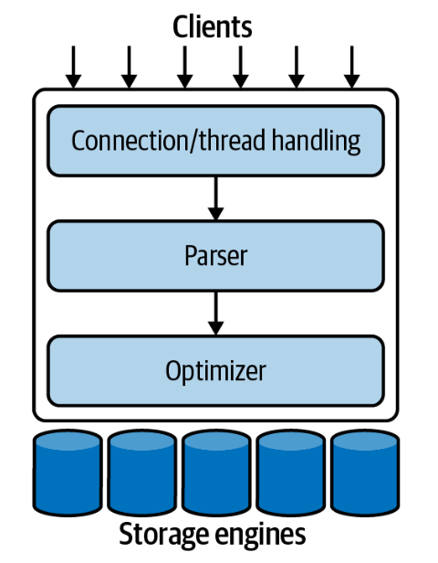
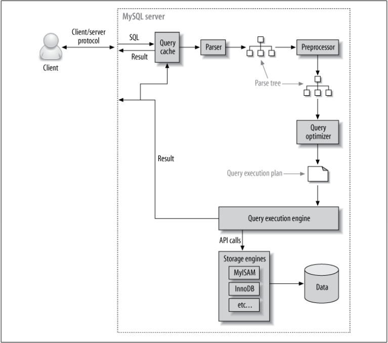

Hello everyone, recently, I did some research in MySQL because I think whoever doing data engineering should go in-depth with a certain relational database. Once you get a deep understanding of one RDBMS, you can easily learn the other RDBMS since they have many similarities. For the next few blogs, I will have a series about MySQL, and this is the first article.

<!--truncate-->

## 1. MySQL architecture components

MySQL is widely used not only in small applications but also in large enterprises, thanks to the features of its flexible architecture.

The top layer is the Clients layer, this layer is usually not unique to MySQL. They are services like connection handling, authentication, security, etc.

The second layer is the layer that contains the code for query analysis, optimization and contains built-in functions that interact with the database such as dates, times, math, encryption, etc. All features are compatible with many storage engines like stored procedures, triggers, views, etc.

The third layer is storage engines, which are responsible for storing and retrieving data in MySQL. Each storage engine has its own good and bad sides. The MySQL server interacts with them by the storage engine API, which contains many low-level functions, operations such as starting a transaction, finding records with the corresponding primary key. Storage engines only respond to requests from the server, while parsing queries are made at the second layer.

## 2. Connection and security management

With the default configuration, each connection from the client will occupy one thread, and queries will run in that thread. The server will have a cache of threads ready to use, so they won't need to be created and destroyed every time there is a new connection from the client.

When the client connects, the server will need to authenticate that connection based on the host, username, and password. After connecting, the server will check whether the client has permissions to specific database resources (eg, SELECT permission on which table on which database,…).

## 3. MySQL optimizer

When running, MySQL will

- Looking in the query cache to check if the query's results can be found, it will return the results immediately, otherwise it performs the next steps. The memory size of the query cache is assigned in the variable `query_cache_size`, if this variable is updated, MySQL will clear all cached queries one by one and re-initialize the query cache (this can be time consuming).
- Parse the queries into a tree containing the query's information. The query can be completely rewritten, the order in which the tables are read will be different, how the index should be selected, etc. We can interfere with that analysis by using hints to determine the order. What will it be like to run? At this time, the parser will build a parse tree for the query, besides, it also checks the syntax of the query.
- The preprocessor will check some other constraints such as this table, column or database exist or not, the user's authority to query to which resources.
- Then, the parse tree will be passed through an optimizer to convert it into a query execution plan. A MySQL query can be run in many ways, the optimizer will try to optimize the cost as much as possible (unit is 4KB data page), this cost can be seen by running `SHOW STATUS LIKE 'Last_query_cost';`. The optimizer doesn't really care which storage engines are used, but the choice of storage engine has a big impact on how well the server optimizes the queries because the server needs information from storage engines such as the statistics of the tables, the cost of performing the operations, how the index is supported or the computing power of the storage engines to run more optimally. The optimizer may not be able to choose the best plan to run because the statistics from the storage engines are not absolute, the cost metric may not be equivalent to the cost of running the query, MySQL will try to reduce the cost but not the speed of the query, or user-defined functions will not be evaluated by the optimizer.
- The Query execution plan is a tree that contains each step to generate the results for the query, the server will perform those steps many times until there are no more records to retrieve. Query execution engine communicates with storage engines by storage engine APIs to perform operations according to the query execution plan.
- MySQL storage engines are a management system with each database being a subpath in that filesystem's data path. When creating a table, the table information is stored in the .frm file (for example, the table `users` is stored in the .frm file named `user.frm`).
- Next, the query will be run and return the results to the client. MySQL also stores the results of the query in the query cache.

Finally, re-caching the results of frequently used queries can improve performance. Previously, MySQL had a query cache in its architecture, as a bottleneck in highly concurrent read and write environments, this query cache in new versions has been deprecated, instead, we often use other data cache methods such as Redis, ...

The above is an overview of the MySQL architecture and the process of running a query. See you in the next posts.
