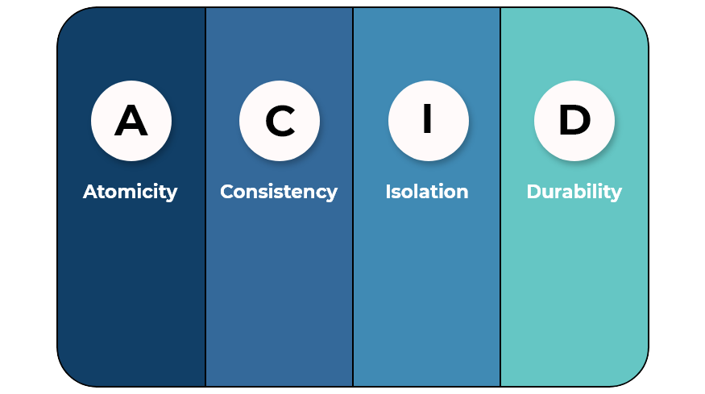
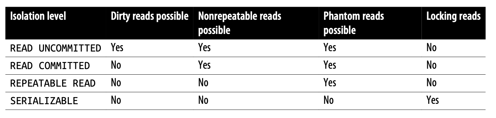
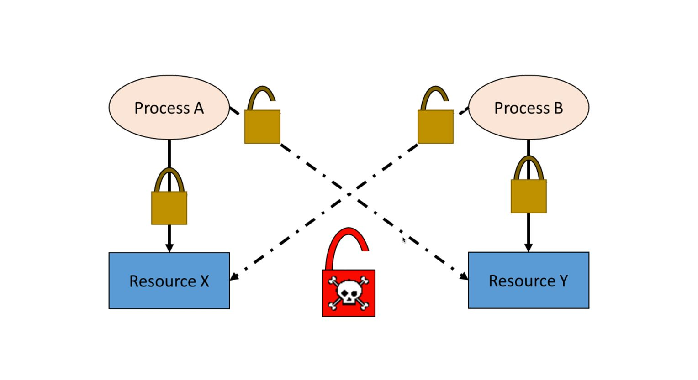
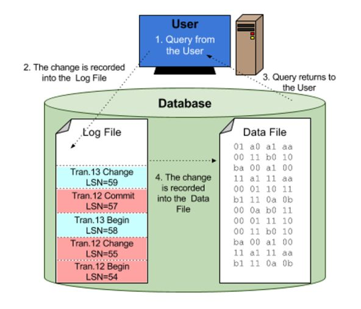

Bài viết tiếp theo trong series MySQL về transaction. Một hoạt động rất phổ biến trong MySQL nói riêng và các cơ sở dữ liệu quan hệ nói chung. Cùng đi vào bài viết nào.

<!--truncate-->

### 1. Transaction là gì?
Transaction là một tập các câu lệnh SQL kết hợp với nhau như là một đơn vị công việc. Nếu như database chạy thành công toàn bộ lệnh SQL trong nhóm đó, nó được coi là thành công. Nếu như một trong số lệnh SQL gặp lỗi, tất cả các lệnh SQL đã chạy hoặc chưa chạy sẽ không ảnh hưởng gì tới database. Ví dụ các một tập câu lệnh SQL gói trong một transaction sau

```mysql
    1  START  TRANSACTION;
    2  SELECT balance FROM checking WHERE customer_id = 10233276;
    3  UPDATE checking SET balance = balance - 200.00 WHERE customer_id = 10233276;
    4  UPDATE savings SET balance = balance - 200.00 WHERE customer_id = 10233276;
    5  COMMIT;
```

Transaction được bắt đầu bởi START TRANSACTION và thường được đóng bởi COMMIT (xác nhận thực hiện transaction) hoặc ROLLBACK (trở lại trạng thái trước khi transaction). Nếu như câu lệnh thứ 4 bị lỗi, câu lệnh thứ 3 sẽ được rollback và không có gì xảy ra ảnh hưởng tới dữ liệu cũ.

### 2. 4 tính chất bảo toàn dữ liệu trong cơ sở dữ liệu quan hệ



Mỗi một hệ thống cần thoả mãn 4 tính chất ACID để đảm bảo an toàn về dữ liệu
- Atomicity

Transaction cần hoạt động như một đơn vị công việc. Hoặc là tất cả câu lệnh SQL trong transaction được áp dụng hoặc là không có câu lệnh nào được áp dụng.
- Consistency

Database cần có tính nhất quán, chỉ được chuyển từ trạng thái nhất quán này đến trạng thái nhất quán khác. Ví dụ ở bên trên, nếu lỗi xảy ra sau khi chạy xong câu thứ 3, tài khoản checking sẽ không bị mất đi 200 tiền khi transaction chưa commit. Tổng tiền ở hai tài khoản trước và sau vẫn giữ nguyên.
- Isolation

Kết quả của transaction này sẽ vô hình đối với các transaction khác khi transaction này chưa kết thúc, chưa commit. Ví dụ khi transaction 1 đang chạy giữa câu 3 và câu 4 bên trên, một transaction khác tính toán tóm lược lại số dư các tài khoản sẽ vẫn nhìn thấy 200 tiền ở trong tài khoản checking. Khi một transaction chưa commit, không có sự thay đổi nào sẽ ảnh hưởng lên database.
- Durability

Một khi commit, các thay đổi bởi transaction sẽ tồn tại lâu dài, các sự thay đổi đó cần được ghi chép lại đảm bảo việc dữ liệu không bị mất nếu hệ thống bị lỗi.

### 3. 4 isolation level trong môi trường có nhiều đọc ghi đồng thời
Có 4 isolation level liên quan tới transaction
- READ UNCOMMITTED

Ở chế độ này, các transactions có thể nhìn thấy kết quả của các transactions chưa commit khác. Chế độ này hiệu năng không nhanh hơn quá nhiều chế độ khác nhưng dễ gây nhiều vấn đề khi đọc dữ liệu sai.
- READ COMMITTED

Chế độ mặc định của hầu hết các database (nhưng không phải MySQL), nó sẽ làm mất đi một số đặc tính trong tính Isolation của ACID, transaction này sẽ có thể nhìn thấy các sự thay đổi bởi các transactions khác được commit sau khi transaction này bắt đầu, tuy nhiên sự thay đổi của transaction này vẫn vô hình cho đến khi nó được commit. Điều này có thể gây ra việc hai câu lệnh đọc giống nhau trong một transaction có thể trả về các dữ liệu khác nhau.
- REPEATABLE READ 

Chế độ này là mặc định của MySQL. Nó đảm bảo rằng trong cùng một transaction, các câu lệnh đọc giống nhau sẽ trả về cùng một kết quả giống nhau. Nhưng cũng sẽ có một vấn đề nhỏ xảy ra là nếu ta select một khoảng giá trị, một transaction khác chèn bản ghi mới vào khoảng giá trị đó, ta sẽ nhìn thấy bản ghi mới đó. Các storage engines như InnDB, XtraDB giải quyết vấn đề này bằng việc tạo ra nhiều phiên bản quản lý việc đọc ghi đồng thời.
- SERIALIZABLE

Chế độ này giải quyết vấn đề đọc một khoảng giá trị bên trên bằng việc chạy các transactions theo một thứ tự. Chế độ này sẽ khoá tất cả row mà nó đọc, rất nhiều timeout và việc khoá xảy ra thường xuyên, tính đọc ghi đồng thời sẽ bị giảm xuống.



### 4. Deadlock trong transaction
Deadlock xảy ra khi hai hoặc nhiều các transactions khoá cũng các tài nguyên, tạo ra một vòng tròn phụ thuộc
```mysql
-- Transaction 1 
    START TRANSACTION;
    UPDATE StockPrice SET close = 45.50 WHERE stock_id = 4 and date = ‘2020-05-01’;
    UPDATE StockPrice SET close = 19.80 WHERE stock_id = 3 and date = ‘2020-05-02’;
    COMMIT;
-- Transaction 2 
    START TRANSACTION;
    UPDATE StockPrice SET high = 20.12 WHERE stock_id = 3 and date = ‘2020-05-02’;
    UPDATE StockPrice SET high = 47.20 WHERE stock_id = 4 and date = ‘2020-05-01’;
    COMMIT;
```
Sau khi 2 transaction này chạy xong lệnh đầu tiên, khi chạy lệnh thứ 2. Các bản ghi với id tương ứng của transaction này đang bị khoá bởi transaction khác, cũng như transaction khác bị khoá bởi transaction này. InnoDB sẽ trả về lỗi nếu phát hiện một vòng tròn phụ thuộc. Cách mà InnoDB xử lý deadlock là nó sẽ rollback transaction có ít row bị lock nhất.



### 5. Transaction logging
Transaction logging khiến việc thực hiện transaction thêm hiệu quả hơn. Thay vì cập nhật thẳng vào bảng ở disk mỗi khi có sự thay đổi nào đó, nó cập nhật vào bảng copy của dữ liệu trong bộ nhớ (in-memory). Sau đó các transaction log sẽ được ghi xuống disk với mode append, hoạt động này rất nhanh vì chỉ yêu cầu I/O tuần tự trong disk, hiệu quả về chi phí hơn, một thời gian sau các thay đổi này mới được áp dụng vào dữ liệu thực ở disk. Bởi vì log này được ghi trên disk nên nó sẽ tồn tại lâu, nếu hệ thống lỗi sau khi ghi transaction log xuống disk nhưng trước khi cập nhật thay đổi vào dữ liệu chính, storage engine vẫn có thể phục hồi các thay đổi đó được.



### 6. Autocommit
Mặc định các câu lệnh INSERT, UPDATE, DELETE được gói trong các transaction tạm và được commit ngay khi nó chạy, đây là chế độ AUTOCOMMIT. Để bật chế độ này chạy câu SET AUTOCOMMIT = 1; ngược lại thì SET AUTOCOMMIT = 0. Một số câu lệnh đặc biệt có thể làm transaction commit khi nằm trong một transaction đang mở, ví dụ như các câu lệnh DDL.
Ta có thể cài đặt isolation level cho MySQL bằng việc chạy câu lệnh SET TRANSACTION ISOLATION LEVEL, sau khi chạy thì isolation level này sẽ có hiệu dụng trong các transaction tiếp theo. Ta có thể cài đặt trong file cấu hình cho cả server, hoặc là chỉ set trong phiên làm việc của ta 
```mysql
SET SESSION TRANSACTION ISOLATION LEVEL READ COMMITTED;
```
Ta không nên xử lý các bảng có khác storage engine trong cùng một transaction, vì có một số storage engine sẽ không hỗ trợ việc rollback dữ liệu (MyISAM storage engine), nếu có một số lỗi xảy ra trong quá trình thực hiện transaction, sẽ chỉ có một số bảng được rollback lại khiến làm mất đi tính Consistency.
