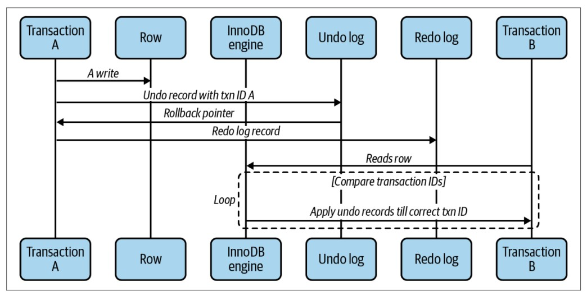

Usually storage engines do not use a simple row lock mechanism, to achieve good performance in a highly concurrent read and write environment, storage engines implement row locking with a certain complexity, the method is often used, is multiversion concurrency control (MVCC).

<!--truncate-->

## 1. Introduction to MVCC

MVCC is used in many types of relational databases, it helps us to lock as little data as possible when doing many transactions at once, it can allow us to not be locked when reading data and only lock the necessary rows when writing data.

## 2. MVCC in InnoDB

MVCC works by taking snapshots of data at some point in time, so a transaction can see the same data no matter how fast or long it takes. However, it also causes different transactions to see different data views of the same table at the same time.

InnoDB will assign a transaction id to a transaction every time it starts reading some data. The changes of a record in that transaction will be written to the undo log for data revert, and the rollback pointer of that transaction will point to the location of that undo log. When another session starts reading the mutated record above, InnoDB compares the transaction id of the record with the data view that new session read. If the record is in a state that is invisible to other transactions (e.g. a transaction that changes that record has not been committed), the undo log will be applied on the data view until the record becomes available again, readable by other transactions.

All undo logs recorded are copied to the redo log because they are used for data recovery in the event of a system failure. The size of the undo log and redo log also affects the ability to perform read and write in environments with high concurrent read and write.

While the benefit is that we are never locked when reading, the storage engine needs to store more data with each record, do more control work, and perform more operations.

## 3. Isolation level with MVCC

MVCC is only available with REPEATABLE READ and READ COMMITTED modes. MVCC is not compatible with READ UNCOMMITTED because queries will not read records whose version does not match the transaction's version. MVCC is not compatible with SERIALIZABLE because of its read locking (For isolation level modes, you can find them **[here](/blog/2022-10-06-mysql-transaction/index.md#3-4-isolation-level-trong-môi-trường-có-nhiều-đọc-ghi-đồng-thời)**).
