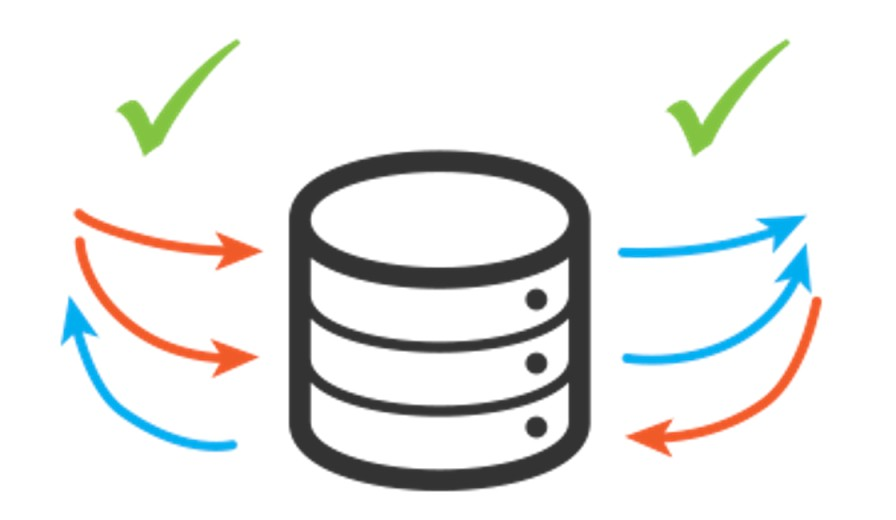

Thường những storage engine đều không sử dụng cơ chế row lock đơn giản, để đạt được hiệu năng tốt trong môi trường đọc ghi đồng thời cao, các storage engine triển khai row lock với độ phức tạp nhất định, phương pháp thường được sử dụng đó chính là multiversion concurrency control (MVCC). 

<!--truncate-->

### 1. Giới thiệu về MVCC
MVCC được sử dụng trong rất nhiều loại cơ sở dữ liệu quan hệ, nó giúp chúng ta lock ít dữ liệu nhất có thể khi thực hiện nhiều transaction một lúc, nó có thể cho phép chúng ta không bị lock khi đọc dữ liệu và chỉ lock những row cần thiết khi ghi dữ liệu.

### 2. MVCC trong InnoDB
MVCC hoạt động bằng cách snapshot lại dữ liệu tại một thời điểm nào đó, nên một transaction có thể nhìn thấy dữ liệu như nhau cho dù chúng chạy nhanh hay rất lâu. Tuy nhiên, nó cũng gây ra các transaction khác nhau có thể nhìn thấy các view dữ liệu khác nhau của cùng một bảng trong cùng một thời điểm.

InnoDB sẽ gán một transaction id cho một transaction mỗi khi nó bắt đầu đọc một dữ liệu nào đó. Các thay đổi của một bản ghi trong transaction đó sẽ được ghi vào undo log để phục vụ cho việc revert dữ liệu, và rollback pointer của transaction đó sẽ trỏ vào vị trí của bản ghi undo log đó. Khi một phiên khác bắt đầu đọc bản ghi bị thay đổi ở trên, InnoDB sẽ so sánh transaction id của bản ghi với view dữ liệu mà phiên đó đọc. Nếu bản ghi đang trong trạng thái vô hình với các transaction khác (ví dụ như transaction thay đổi bản ghi đó chưa được commit), undo log sẽ được áp dụng trên view dữ liệu cho đến khi bản ghi đó trở về trạng thái có thể đọc được bởi các transaction khác.

Tất cả undo log được ghi đều được chép lại vào redo log bởi vì chúng phục vụ cho quá trình phục hồi dữ liệu khi hệ thống lỗi. Kích thước của undo log và redo log cũng ảnh hướng tới khả năng thực hiện đọc ghi trong môi trường có độ đọc ghi đồng thời cao.

Tuy lợi ích là ta không bao giờ bị lock khi đọc nhưng storage engine cần phải lưu trữ thêm nhiều dữ liệu hơn với mỗi bản ghi, làm nhiều công việc kiểm soát, và thực hiện nhiều hoạt động hơn.

### 3. Isolation level với MVCC
MVCC chỉ khả dụng với các chế độ REPEATABLE READ và READ COMMITTED. MVCC không tương thích với READ UNCOMMITTED vì các truy vấn sẽ không đọc các bản ghi mà phiên bản của nó không trùng với phiên bản của transaction. MVCC không tương thích với SERIALIZABLE bởi vì việc khoá khi đọc của chế độ này (Các chế độ isolation level các bạn có thể tìm thấy **[tại đây](/blog/2022-10-06-mysql-transaction/index.md#3-4-isolation-level-trong-môi-trường-có-nhiều-đọc-ghi-đồng-thời)**)