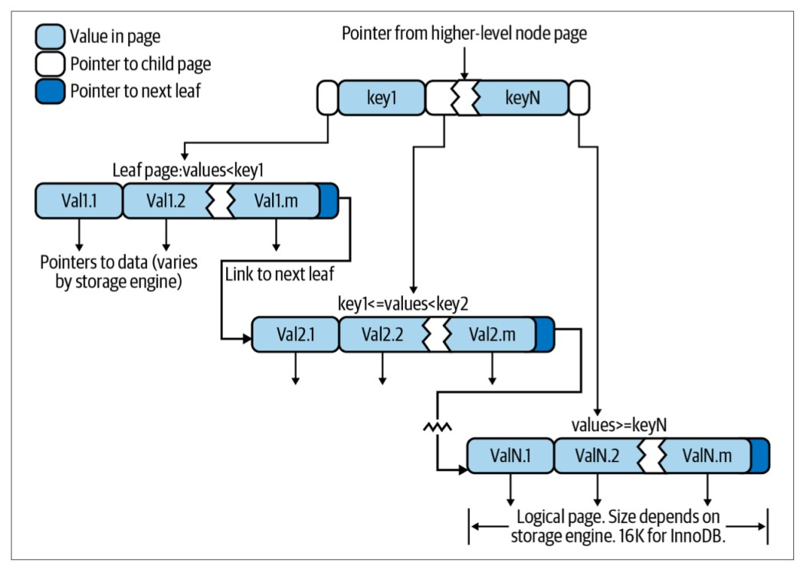

Indexing là phương pháp giúp truy vấn nhanh hơn, là một phần rất quan trọng trong việc cải thiện hiệu năng. Đối với các bảng dữ liệu lớn, việc đánh index chính xác giúp tăng tốc độ nhanh hơn gấp nhiều lần, tuy nhiên, việc này thường không được tính toán sát sao trong quy trình thiết kế bảng. Bài viết này nói về các loại index và cách đánh index sao cho hợp lý.


<!--truncate-->

### 1. Các loại index
Có rất nhiều loại index thiết kế cho nhiều mục đích khác nhau. Nên nhớ rằng, index được triển khai ở storage engine, không phải ở tầng server, do vậy, chúng hoạt động khác nhau ở các storage engine khác nhau. Các loại index ở bài viết này chủ yếu về index trong InnoDB.

#### 1.1. B-tree index
B-tree index dùng cây cân bằng để lưu trữ dữ liệu của nó, hầu như tất cả storage engine của MySQL đều hỗ trợ kiểu index này (hoặc là biến thể của nó), ví dụ, NDB Cluster storage engine sử dụng cấu trúc dữ liệu T-tree cho indexing, InnoDB sử dụng B+ tree,... 
Trong B-tree, tất cả giá trị đều được sắp xếp, và các lá (leaf) đều có khoảng cách bằng nhau tới gốc (root) của cây. Dưới đây hình là mô tả cấu trúc dữ liệu B-tree. 



B-tree cung cấp cho ta khả năng tìm kiếm, truy cập dữ liệu tuần tự, chèn và xoá với độ phức tạp logarithmic ${O(log(n))}$. Ở root node sẽ có con trỏ trỏ đến các node con, khi ta truy vấn, storage engine sẽ biết nhánh node con phù hợp để duyệt bằng các nhìn vào các giá trị trong node pages, chứa thông tin ngưỡng trên và ngưỡng dưới giá trị các node con trong page đó. Ở tầng leaf page, các con trỏ trỏ đến dữ liệu thay vì trỏ tới các page khác.

Ở hình trên, chúng ta chỉ nhìn thấy 1 node page và các leaf page. Thực tế B-tree có rất nhiều tầng node page giữa root node và leaf nodes, độ lớn của cây dựa vào độ lớn của bảng được đánh index.

##### 1.1.1. Adaptive hash index
Khi các giá trị index được truy cập với tần số cao, InnoDB sẽ dựng một bộ hash index cho chúng ở memory trên nền của B-tree index, giúp chúng ta có thể tìm kiếm giá trị hash này rất nhanh và hiệu quả. Chế độ này là tự động bởi InnoDB, tuy nhiên, bạn vẫn có thể vô hiệu hoá adaptive hash index nếu muốn.

##### 1.1.2. Các loại truy vấn có thể dùng B-tree index
B-tree index hoạt động hiệu quả với các loại truy vấn chính xác giá trị, một khoảng giá trị, hay một tiền tố giá trị. Các truy vấn này là tốt nhất khi chúng ta dùng chúng trên cột trái nhất trong tập cột được đánh index.

```mysql
CREATE TABLE People (
     last_name varchar(50) not null,
     first_name varchar(50) not null,
     dob date not null,
     KEY `idx_full_col` (last_name, first_name, dob)
) ENGINE=InnoDB;
```

- Khớp chính xác giá trị: khi các cột trong index được query khớp đúng giá trị nào đó, ví dụ ```WHERE last_name = 'lam' AND first_name = 'tran' AND dob = '1999-05-10'```. Truy vấn loại này sẽ trả về kết quả rất nhanh.
- Khớp cột trái nhất: Ví dụ nếu ta truy vấn tìm người có ```last_name = 'lam'```.
- Khớp phần đầu của cột trái nhất: Ví dụ khi ta tìm người có last_name bắt đầu bằng chữ 'L'.
- Khớp một khoảng giá trị: Khi ta cần lấy tập người có last_name ở giữa 'anh' và 'lam'.
- Khớp cột trái nhất và một khoảng giá trị cột tiếp theo: Ví dụ khi ta cần thông tin những người last_name là 'lam' và first_name bắt đầu bằng chứ 't'.

##### 1.1.3. Một số nhược điểm của B-tree index
- Nó sẽ không thực sự có ích khi điều kiện truy vấn không bắt đầu bằng cột trái nhất, cũng như không tốt khi truy vấn tìm những người có last_name kết thúc bằng chữ cụ thể.
- Các truy vấn bỏ quãng một số cột cũng không tận dụng hết được lợi ích index. Ví dụ khi tìm những người có ```last_name = 'lam' AND dob = '1999-05-10'``` mà không có điều kiện trên first_name.
- Index kiểu này sẽ không tận dụng phần các cột đằng sau cột khớp khoảng giá trị. Ví dụ, truy vấn người ```last_name = 'lam' AND first_name LIKE 't%' AND dob = '1999-05-10'``` sẽ chỉ áp dụng index trên 2 cột last_name và first_name. Với những cột ít dữ liệu phân biệt, ta có thể overcome cái này bằng việc liệt kê tất cả giá trị thay vì truy cập khoảng giá trị.

Như vậy, thứ tự của các cột trong index thực sự rất quan trọng, bạn cần xem xét mục tiêu truy vấn của ứng dụng trước khi đánh index cho các cột.

#### 1.2. Full-text index
Full-text index tìm kiếm các từ khoá trong chuỗi chữ thay vì so sánh trực tiếp cả giá trị của trường đó. Nó hỗ trợ cho việc tìm kiếm hơn là việc suy xét dữ liệu khớp với kiểu nào. Khi một cột được đánh full-text index, ta vẫn có thể đánh B-tree index trên cột đó được.

```mysql
CREATE TABLE tutorial (
    id INT UNSIGNED AUTO_INCREMENT NOT NULL PRIMARY KEY, 
    title VARCHAR(200), 
    description TEXT, 
    FULLTEXT `idx_full_text` (title,description)
) ENGINE=InnoDB;
```
Full-text index được dùng bằng cú pháp ```MATCH() AGAINST()``` với tham số của ```MATCH()``` là các cột để tìm kiếm, cách nhau bằng dấu phảy, tham số của ```AGAINST()``` là chuỗi để tìm kiếm cùng loại tìm kiếm để thực hiện.  

##### 1.2.1. Các loại full-text index
- Natural language search: chế độ này sẽ diễn giải chuỗi chữ tìm kiếm dưới dạng một cụm từ trong ngôn ngữ tự nhiên của con người.
- Boolean search: diễn giải chuỗi chữ tìm kiếm sử dụng quy tắc ngôn ngữ truy vấn đặc biệt. Chuỗi chứ đó chứa tất cả các từ cần tìm kiếm, nó cũng có thể chứa các operator đặc biệt cho các tìm kiếm nâng cao, như một từ cần phải được xuất hiện trong chuỗi, hay từ được đánh trọng số nặng hơn hay nhẹ hơn. Các stop words sẽ bị bỏ qua trong chế độ này.
- Query expansion: là một biến thể của natural language search. Các từ trong các rows liên quan nhất được trả về sẽ được thêm vào chuỗi chữ tìm kiếm, và việc tìm kiếm sẽ được lặp lại. Truy vấn sẽ trả về các rows trong lần tìm kiếm thứ hai.

### 2. Lợi ích việc đánh index


### 3. Chiến thuật đánh index