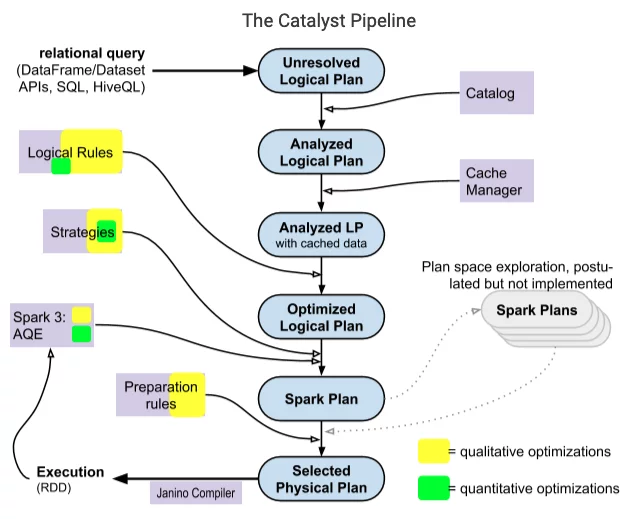

Spark catalyst optimizer nằm trong phần core của Spark SQL với mục đích tối ưu các truy vấn có cấu trúc được thể hiện dưới dạng SQL hoặc qua các API DataFrame/Dataset, giảm thiểu thời gian và chi phí chạy của ứng dụng. Khi sử dụng Spark, thường mọi người xem catalyst optimizer như là một black box, khi chúng ta mặc nhiên cho rằng nó hoạt động một cách thần bí mà không thực sự quan tâm bên trong nó xảy ra những gì. Ở bài viết này, mình sẽ đi vào tìm hiểu bên trong logic của nó thực sự thế nào, các thành phần, và cách mà Spark extension tham gia để thay đổi các plan của catalyst.


<!--truncate-->

### 1. Tree và Node
Các thành phần chính trong Catalyst được biểu diễn dưới dạng cây và các node, được kế thừa từ class ```TreeNode```, hoặc các class con của nó. Class ```TreeNode``` này có tập các node con ứng với thuộc tính ```children```, kiểu dữ liệu ```Seq[BaseType]```, do vậy, một ```TreeNode``` có thể có 0 hoặc nhiều các node con. Các object này là immutable và được thao tác bằng những functional transformation, khiến cho việc debug optimizer trở nên dễ dàng hơn và các hoạt động song song trở nên dễ đoán hơn.     
Hai class quan trọng là ```LogicalPlan``` và ```SparkPlan``` đều là subclass của ```QueryPlan```, class kế thừa trực tiếp từ ```TreeNode```. Trong sơ đồ Catalyst bên trên, 3 thành phần đầu là các logical plans, các node trong logical plan thường là các toán tử đại số như join, and, or,... 2 thành phần đằng sau là các spark plan (physical plan), các node thường là các toán tử low-level như ```ShuffledHashJoinExec```, ```SortMergeJoinExec```,... Các leaf node sẽ đọc dữ liệu từ các source, storage, memory,... còn root node của cây là toán tử ngoài cùng và trả về kết quả của việc tính toán.

### 2. Các hoạt động của Catalyst trong Spark SQL



:::note
Coming soon
:::

#### 2.1. Parsing và Analyzing

#### 2.2. Logical optimizations

#### 2.3. Physical planning

##### 2.3.1. Quantitative optimizations

##### 2.3.2. The Cost-Based Optimizer

#### 2.4. Code generation

#### 2.5. Tính năng Adaptive query execution trong Spark 3

### 3. Spark extension