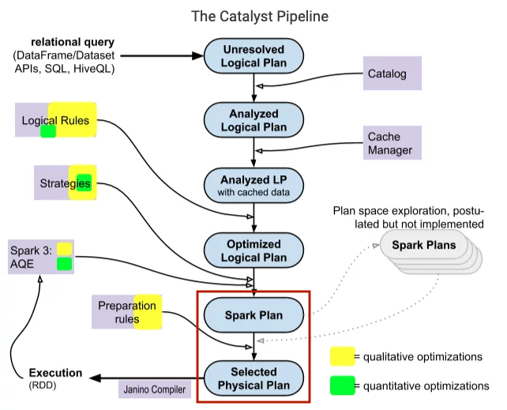

Spark catalyst optimizer nằm trong phần core của Spark SQL với mục đích tối ưu các truy vấn có cấu trúc được thể hiện dưới dạng SQL hoặc qua các API DataFrame/Dataset, giảm thiểu thời gian và chi phí chạy của ứng dụng. Khi sử dụng Spark, thường mọi người xem catalyst optimizer như là một black box, khi chúng ta mặc nhiên cho rằng nó hoạt động một cách thần bí mà không thực sự quan tâm bên trong nó xảy ra những gì. Ở bài viết này, mình sẽ đi vào tìm hiểu bên trong logic của nó thực sự thế nào, các thành phần, và cách mà Spark session extension tham gia để thay đổi các plan của catalyst.


<!--truncate-->

### 1. Tree và Node
Các thành phần chính trong Catalyst được biểu diễn dưới dạng cây và các node, được kế thừa từ class ```TreeNode```, hoặc các class con của nó. Class ```TreeNode``` này có tập các node con ứng với thuộc tính ```children```, kiểu dữ liệu ```Seq[BaseType]```, do vậy, một ```TreeNode``` có thể có 0 hoặc nhiều các node con. Các object này là immutable và được thao tác bằng những functional transformation, khiến cho việc debug optimizer trở nên dễ dàng hơn và các hoạt động song song trở nên dễ đoán hơn.     
Hai class quan trọng là ```LogicalPlan``` và ```SparkPlan``` đều là subclass của ```QueryPlan```, class kế thừa trực tiếp từ ```TreeNode```. Trong sơ đồ Catalyst bên trên, 3 thành phần đầu là các logical plans, các node trong logical plan thường là các toán tử đại số như join, and, or,... 2 thành phần đằng sau là các spark plan (physical plan), các node thường là các toán tử low-level như ```ShuffledHashJoinExec```, ```SortMergeJoinExec```, ```BroadcastHashJoinExec```, ```FileSourceScanExec```,... Các leaf node sẽ đọc dữ liệu từ các source, storage, memory,... còn root node của cây là toán tử ngoài cùng và trả về kết quả của việc tính toán.

### 2. Rules
Để thao tác trên TreeNode ta sử dụng các Rule, các Rule thực chất chứa các hàm biến đổi từ cây này sang cây khác. Thường các hàm này được viết sử dụng pattern matching trong scala để tìm các matching tương ứng trong subtree của nó và thay thế bằng các cấu trúc khác.
Các cây cung cấp các hàm transform có thể áp dụng pattern matching này để biến đổi cây như ```transform```, ```transformDown```, ```transformUp```,...

```scala
package org.apache.spark.sql.catalyst.trees

/**
   * Returns a copy of this node where `rule` has been recursively applied to the tree.
   * When `rule` does not apply to a given node it is left unchanged.
   * Users should not expect a specific directionality. If a specific directionality is needed,
   * transformDown or transformUp should be used.
   *
   * @param rule the function used to transform this nodes children
*/
def transform(rule: PartialFunction[BaseType, BaseType]): BaseType = {
    transformDown(rule)
}

/**
   * Returns a copy of this node where `rule` has been recursively applied to the tree.
   * When `rule` does not apply to a given node it is left unchanged.
   * Users should not expect a specific directionality. If a specific directionality is needed,
   * transformDown or transformUp should be used.
   *
   * @param rule   the function used to transform this nodes children
   * @param cond   a Lambda expression to prune tree traversals. If `cond.apply` returns false
   *               on a TreeNode T, skips processing T and its subtree; otherwise, processes
   *               T and its subtree recursively.
   * @param ruleId is a unique Id for `rule` to prune unnecessary tree traversals. When it is
   *               UnknownRuleId, no pruning happens. Otherwise, if `rule` (with id `ruleId`)
   *               has been marked as in effective on a TreeNode T, skips processing T and its
   *               subtree. Do not pass it if the rule is not purely functional and reads a
   *               varying initial state for different invocations.
*/
def transformWithPruning(cond: TreePatternBits => Boolean,
ruleId: RuleId = UnknownRuleId)(rule: PartialFunction[BaseType, BaseType])
: BaseType = {
    transformDownWithPruning(cond, ruleId)(rule)
}

/**
   * Returns a copy of this node where `rule` has been recursively applied to it and all of its
   * children (pre-order). When `rule` does not apply to a given node it is left unchanged.
   *
   * @param rule the function used to transform this nodes children
*/
def transformDown(rule: PartialFunction[BaseType, BaseType]): BaseType = {
    transformDownWithPruning(AlwaysProcess.fn, UnknownRuleId)(rule)
}

def transformDownWithPruning(cond: TreePatternBits => Boolean,
    ruleId: RuleId = UnknownRuleId)(rule: PartialFunction[BaseType, BaseType])
  : BaseType = {
    /* More code */    
}

def transformUp(rule: PartialFunction[BaseType, BaseType]): BaseType = {
    transformUpWithPruning(AlwaysProcess.fn, UnknownRuleId)(rule)
}

def transformUpWithPruning(cond: TreePatternBits => Boolean,
    ruleId: RuleId = UnknownRuleId)(rule: PartialFunction[BaseType, BaseType])
  : BaseType = {
    /* More code */    
}

/* ... */
```

Dưới đây là ví dụ đơn giản về sử dụng transform và parttern matching để biến đổi một Treenode sang Treenode khác
```scala
package com.tranlam

import org.apache.spark.sql.catalyst.expressions.{Add, BinaryOperator, Expression, IntegerLiteral, Literal, Multiply, Subtract, UnaryMinus}
import org.apache.spark.SparkConf
import org.apache.spark.sql.SparkSession

object TestTransform {
  def main(args: Array[String]): Unit = {
    val sparkConf = new SparkConf().setAppName("test_transform").setMaster("local[*]")
    val spark = SparkSession.builder().config(sparkConf).getOrCreate()
    val firstExpr: Expression = UnaryMinus(Multiply(Subtract(Literal(11), Literal(2)), Subtract(Literal(9), Literal(5))))
    val transformed: Expression = firstExpr transformDown {
      case BinaryOperator(l, r) => Add(l, r)
      case IntegerLiteral(i) if i > 5 => Literal(1)
      case IntegerLiteral(i) if i < 5 => Literal(0)
    }
    println(firstExpr) // -((11 - 2) * (9 - 5))
    println(transformed) // -((1 + 0) + (1 + 5))
    spark.sql(s"SELECT ${firstExpr.sql}").show()
    spark.sql(s"SELECT ${transformed.sql}").show()
  }
}
```

Trong ví dụ trên, hàm transformDown được sử dụng, nó đi qua các node của 1 cây và sử dụng parttern matching để trả về kết quả khác. Nếu như node đó là dạng binary operator như Multiply, Subtract, nó sẽ biến đổi thành phép cộng Add. Nếu node là hằng số nguyên lớn hơn 5, nó sẽ biến đổi về 1, hằng số bé hơn 5 sẽ biến đổi thành 0, hằng số bằng 5 thì giữ nguyên giá trị.

### 3. Các hoạt động của Catalyst trong Spark SQL
Spark Catalyst sử dụng các phép biến đổi cây trong 4 phase chính: (1) phân tích logical plan để duyệt các relation trong plan đó, (2) logical plan optimization, (3) physical planning, (4) code generation để compile các query thành Java bytecode. 

#### 3.1. Parsing và Analyzing


Ở phase này, các Catalyst rule và Catalog object sẽ được Spark SQL sử dụng để kiểm tra xem các relation trong câu query của chúng ta có tồn tại hay không, các thuộc tính của relation như cột, tên cột cũng được kiểm tra nó có chuẩn hay không, syntax đã đúng chưa và resolve các relation đó.

Ví dụ, nhìn vào plan câu query dưới đây, đầu tiên Spark SQL sẽ biến đổi query về một parsed tree được gọi là "unresolved logical plan" với các thuộc tính và datatypes chưa xác định, chưa được gán với một table (hoặc alias) cụ thể nào. Sau đó nó sẽ
- Tìm kiếm relation theo tên từ Catalog object.
- Mapping các thuộc tính như cột của input với các relation đã tìm được.
- Quyết định xem các thuộc tính nào sẽ trỏ tới cùng giá trị để gán cho nó một unique ID (phục vụ mục đích về sau để tối ưu các expressions như ```col = col```).
- Cast các expression về datatype cụ thể (ví dụ, chúng ta sẽ không biết datatype trả về của ```col * 2``` cho tới khi col được resolved và được xác định datatype).

```sql
SELECT * FROM test.describe_abc;

== Parsed Logical Plan ==
'Project [*]
+- 'UnresolvedRelation [test, describe_abc], [], false

== Analyzed Logical Plan ==
id: int, name: string
Project [id#5833, name#5834]
+- SubqueryAlias spark_catalog.test.describe_abc
   +- Relation test.describe_abc[id#5833,name#5834] parquet

== Optimized Logical Plan ==
Relation test.describe_abc[id#5833,name#5834] parquet

== Physical Plan ==
*(1) ColumnarToRow
+- FileScan parquet test.describe_abc[id#5833,name#5834] Batched: true, DataFilters: [], Format: Parquet, Location: InMemoryFileIndex(1 paths)[hdfs://bigdataha/user/hive/warehouse/test.db/describe_abc], PartitionFilters: [], PushedFilters: [], ReadSchema: struct<id:int,name:string>
```

#### 3.2. Logical plan optimizations


Catalyst áp dụng các standard optimization rule cho logical plan được được phân tích ở bước trên, với các dữ liệu được cache. Ở đây, cost-based optimization được sử dụng để sinh ra nhiều plans, và sau đó tính toán cost cho từng plan. Phần này bao gồm các rule như 
- Constant folding: loại bỏ các expression tính toán một giá trị mà có ta có thể xác định trước khi code chạy, ví dụ như ```y = x * 2 * 2```, compiler sẽ không sinh ra 2 multiply instruction mà nó sẽ thay thế trước các giá trị có thể được tính toán ```y = x * 4```.
- Predicate pushdown: push down các phần của query tới nơi dữ liệu được lưu trữ, filter lượng lớn dữ liệu, cải thiện network traffic.
- Projection: chọn đúng các cột được select, số cột được lấy từ storage tới Spark ít hơn, phục vụ đọc các columnar storage nhanh hơn và chỉ đọc các cột cần thiết.
- Boolean expression simplification: ví dụ, A and (A or B) = A(A+B) = A.A + A.B = A + A.B = A.(1+B) = A.
- Và nhiều các rule khác... 

Catalyst optimizer của Spark sẽ bao gồm các batch of rule, một số rule có thể tồn tại trong nhiều batch. Thường các batch rule này sẽ được chạy 1 lần trên plan đó, tuy nhiên, có một số batch sẽ chạy lặp đi lặp lại cho đến một số lần duyệt nhất định.

#### 3.3. Physical planning



Spark SQL nhận vào logical plan và sinh ra một hoặc nhiều physical plan, sau đó nó sẽ chọn physical plan phù hợp dựa vào các cost model. Các cost model thường dựa vào các chỉ số thống kê của các relation, định lượng các thống kê chảy vào một node trong TreeNode như
- Kích thước dữ liệu chảy vào node.
- Lượng bản ghi từng bảng.
- Các chỉ số thống kê liên quan tới cột như: lượng giá trị phân biệt, giá trị lớn nhất giá trị nhỏ nhất, giá trị độ dài trung bình và lớn nhất của cột, histogram các giá trị của cột,...

Một số hướng tiếp cận của Spark SQL cho phần cost model này
- Size-only approach: chỉ sử dụng thống kê về kích thước vật lý của dữ liệu chảy vào node, có thể thêm chỉ số số bản ghi trong một số trường hợp.
- Cost-based approach: thống kê các thông tin liên quan đến mức cột cho các node Aggregate, Filter, Join, Project (lưu ý, cost-based approach chỉ được áp dụng cho các node loại này, với những node loại khác, nó sẽ trở về sử dụng size-only approach), cải thiện kích thước và lượng bản ghi cho các node đó.

Cost-based approach được chọn nếu ta set ```spark.sql.cbo.enabled=true```. Bên cạnh đó, các thống kê về bảng và cột cũng cần được thu thập để Spark có thể dựa vào đó tính toán, bằng việc chạy các lệnh **[ANALYZE](https://spark.apache.org/docs/latest/sql-ref-syntax-aux-analyze-table.html)**

#### 3.4. Code generation


Sau khi đã lựa chọn được physical plan phù hợp để chạy, Catalyst sẽ compile một cây các plans hỗ trợ codegen thành một hàm Java duy nhất, về Java bytecode để chạy trên driver và các executor. Phần codegen này cải thiện tốc độ chạy rất nhiều khi mà Spark SQL thường hoạt động trên các in-memory dataset, việc xử lý dữ liệu thường gắn chặt với CPU. Catalyst dựa vào một tính năng của Scala là quasiquotes để thực hiện đơn giản hoá phần codegen này (quasiquotes cho phép xây dựng các abstract syntax tree (ASTs), sau đó sẽ input vào Scala compiler để tạo ra bytecode).

### 4. Spark session extension
Spark extension là phần 

### 5. Tài liệu tham khảo

[Deep Dive into Spark SQL's Catalyst Optimizer](https://www.databricks.com/blog/2015/04/13/deep-dive-into-spark-sqls-catalyst-optimizer.html)

[Spark Catalyst Pipeline: A Deep Dive Into Spark’s Optimizer](https://www.unraveldata.com/resources/catalyst-analyst-a-deep-dive-into-sparks-optimizer/)

[Adaptive Query Execution: Speeding Up Spark SQL at Runtime](https://www.databricks.com/blog/2020/05/29/adaptive-query-execution-speeding-up-spark-sql-at-runtime.html)