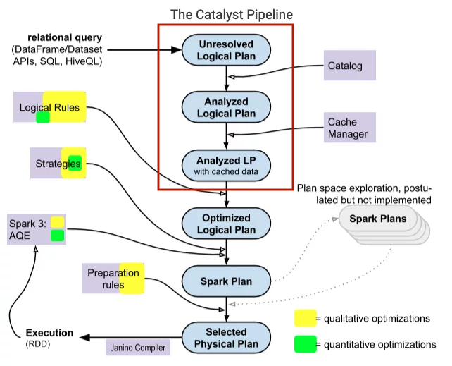
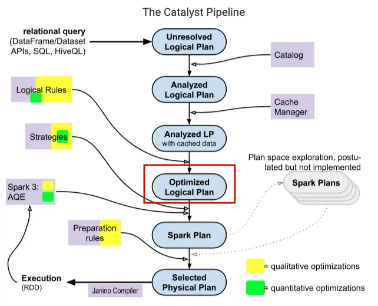
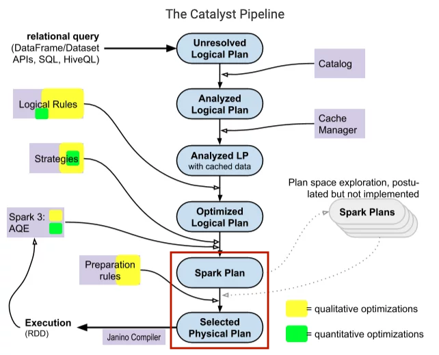

Spark catalyst optimizer is located at the core of Spark SQL with the purpose of optimizing structured queries expressed in SQL or through DataFrame/Dataset APIs, minimizing application running time and costs. When using Spark, often people see the catalyst optimizer as a black box, when we assume that it works mysteriously without really caring what happens inside it. In this article, I will go in depth of its logic, its components, and how the Spark session extension participates to change the Catalyst's plans.


<!--truncate-->

### 1. TreeNode

The main components in Catalyst are represented as tree nodes, which are inherited from class `TreeNode`, or its subclasses. Class `TreeNode` has a set of child nodes with the attribute `children`, datatype `Seq[BaseType]`, therefore, one `TreeNode` can have 0 or more child nodes. These objects are immutable and manipulated using functional transformations, making the debug optimizer easier and parallel operations more predictable.

The two important classes are `LogicalPlan` and `SparkPlan` are both subclasses of `QueryPlan`, the class inherits directly from `TreeNode`. In the above Catalyst diagram, the first 3 components are logical plans, the nodes in the logical plan are usually logical operators such as `CreateTableCommand`, `Filter`, `Project`,... the two components behind are spark plans (physical plans), nodes are usually low-level operators like `ShuffledHashJoinExec`, `SortMergeJoinExec`, `BroadcastHashJoinExec`, `FileSourceScanExec`,...

Leaf nodes will read data from sources, storage, memory ,... and the root node of the tree is the outermost operator and returns the result of the calculation.

### 2. Rules

To manipulate the TreeNode we use rules, rules are actually components that transforms the tree, from one tree to another. In the rule, we implement the logic that transforms the TreeNode, which often uses the pattern matching in Scala to find the corresponding matches in its subtree and replace it with other constructs. Trees provide transformation functions that can apply this pattern matching to transform trees like `transform`, `transformDown`, `transformUp`,...

```scala
package org.apache.spark.sql.catalyst.trees

/**
   * Returns a copy of this node where `rule` has been recursively applied to the tree.
   * When `rule` does not apply to a given node it is left unchanged.
   * Users should not expect a specific directionality. If a specific directionality is needed,
   * transformDown or transformUp should be used.
   *
   * @param rule the function used to transform this nodes children
*/
def transform(rule: PartialFunction[BaseType, BaseType]): BaseType = {
    transformDown(rule)
}

/**
   * Returns a copy of this node where `rule` has been recursively applied to the tree.
   * When `rule` does not apply to a given node it is left unchanged.
   * Users should not expect a specific directionality. If a specific directionality is needed,
   * transformDown or transformUp should be used.
   *
   * @param rule   the function used to transform this nodes children
   * @param cond   a Lambda expression to prune tree traversals. If `cond.apply` returns false
   *               on a TreeNode T, skips processing T and its subtree; otherwise, processes
   *               T and its subtree recursively.
   * @param ruleId is a unique Id for `rule` to prune unnecessary tree traversals. When it is
   *               UnknownRuleId, no pruning happens. Otherwise, if `rule` (with id `ruleId`)
   *               has been marked as in effective on a TreeNode T, skips processing T and its
   *               subtree. Do not pass it if the rule is not purely functional and reads a
   *               varying initial state for different invocations.
*/
def transformWithPruning(cond: TreePatternBits => Boolean,
ruleId: RuleId = UnknownRuleId)(rule: PartialFunction[BaseType, BaseType])
: BaseType = {
    transformDownWithPruning(cond, ruleId)(rule)
}

/**
   * Returns a copy of this node where `rule` has been recursively applied to it and all of its
   * children (pre-order). When `rule` does not apply to a given node it is left unchanged.
   *
   * @param rule the function used to transform this nodes children
*/
def transformDown(rule: PartialFunction[BaseType, BaseType]): BaseType = {
    transformDownWithPruning(AlwaysProcess.fn, UnknownRuleId)(rule)
}

def transformDownWithPruning(cond: TreePatternBits => Boolean,
    ruleId: RuleId = UnknownRuleId)(rule: PartialFunction[BaseType, BaseType])
  : BaseType = {
    /* More code */
}

def transformUp(rule: PartialFunction[BaseType, BaseType]): BaseType = {
    transformUpWithPruning(AlwaysProcess.fn, UnknownRuleId)(rule)
}

def transformUpWithPruning(cond: TreePatternBits => Boolean,
    ruleId: RuleId = UnknownRuleId)(rule: PartialFunction[BaseType, BaseType])
  : BaseType = {
    /* More code */
}

/* ... */
```

Here is a simple example of using transform and partn matching to transform one Treenode to another

```scala
package com.tranlam

import org.apache.spark.sql.catalyst.expressions.{Add, BinaryOperator, Expression, IntegerLiteral, Literal, Multiply, Subtract, UnaryMinus}
import org.apache.spark.SparkConf
import org.apache.spark.sql.SparkSession

object TestTransform {
  def main(args: Array[String]): Unit = {
    val sparkConf = new SparkConf().setAppName("test_transform").setMaster("local[*]")
    val spark = SparkSession.builder().config(sparkConf).getOrCreate()
    val firstExpr: Expression = UnaryMinus(Multiply(Subtract(Literal(11), Literal(2)), Subtract(Literal(9), Literal(5))))
    val transformed: Expression = firstExpr transformDown {
      case BinaryOperator(l, r) => Add(l, r)
      case IntegerLiteral(i) if i > 5 => Literal(1)
      case IntegerLiteral(i) if i < 5 => Literal(0)
    }
    println(firstExpr) // -((11 - 2) * (9 - 5))
    println(transformed) // -((1 + 0) + (1 + 5))
    spark.sql(s"SELECT ${firstExpr.sql}").show()
    spark.sql(s"SELECT ${transformed.sql}").show()
  }
}
```

In the above example, the transformDown function is used, which traverses the nodes of a tree and uses pattern matching to return a different result. If the node is a binary operator like Multiply, Subtract, it will convert to Add. If node is an integer constant greater than 5, it will change to 1, constant less than 5 will change to 0, a constant of 5 will keep the same value.

### 3. Catalyst Operations in Spark SQL

Spark Catalyst uses tree transformations in four main phases: (1) logical plan analysis to traverse the relations in that plan, (2) logical plan optimization, (3) physical planning, (4) code generation to compile the query into Java bytecode.

#### 3.1. Parsing and Analyzing



In this phase, Catalyst rules and Catalog objects will be used by Spark SQL to check if the relations in our query exist or not, relation properties such as columns, column names are also checked, the syntax of the query is examined and then resolve those relations.

For example, looking at the query plan below, Spark SQL will first transform the query into a parsed tree called an "unresolved logical plan" with undefined attributes and datatypes, not yet assigned to a specific table (or alias). Then it will

- Search for relation by name from Catalog object.
- Mapping properties as columns of input with found relations.
- Decide which properties should point to the same value to assign it a unique ID (for the purpose of later optimizing expressions like `col = col`).
- Cast expressions of a specific datatype (for example, we won't know the return datatype of `col * 2` until col is resolved and the datatype is determined).

```sql
SELECT * FROM test.describe_abc;

== Parsed Logical Plan ==
'Project [*]
+- 'UnresolvedRelation [test, describe_abc], [], false

== Analyzed Logical Plan ==
id: int, name: string
Project [id#5833, name#5834]
+- SubqueryAlias spark_catalog.test.describe_abc
   +- Relation test.describe_abc[id#5833,name#5834] parquet

== Optimized Logical Plan ==
Relation test.describe_abc[id#5833,name#5834] parquet

== Physical Plan ==
*(1) ColumnarToRow
+- FileScan parquet test.describe_abc[id#5833,name#5834] Batched: true, DataFilters: [], Format: Parquet, Location: InMemoryFileIndex(1 paths)[hdfs://bigdataha/user/hive/warehouse/test.db/describe_abc], PartitionFilters: [], PushedFilters: [], ReadSchema: struct<id:int,name:string>
```

#### 3.2. Logical plan optimizations



Catalyst applies standard optimization rules to the logical plan analyzed in the previous step, with cached data. This section includes rules like

- Constant folding: removes expressions that compute a value that we can define before the code runs, for example, with the expression `y = x * 2 * 2`, compiler will not generate 2 multiply instructions, it will first replace the constants before the values ​​can be computed `y = x * 4`.
- Predicate pushdown: push down parts of the query to where the data is stored, filter large amounts of data, improve network traffic.
- Projection: read only selected columns, less columns will be passed from the storage to Spark, significantly efficient with columnar file format such as Parquet.
- Boolean expression simplification: eg. A and (A or B) = A(A+B) = A.A + A.B = A + A.B = A.(1+B) = A
- Many other rules,…

Spark's Catalyst optimizer will include batches of rules, some of which can exist in multiple batches. Usually these batch rules will be run once on that plan, however, there are some batches that will run repeatedly until a certain number of passes.

#### 3.3. Physical planning



Spark SQL takes a logical plan and generates one or more physical plans, then it chooses the appropriate physical plan based on the cost models. Cost models typically rely on relational statistics, quantifying statistics flowing into a node in a TreeNode such as

- Size of data flowing into node.
- Number of records per table.
- Statistical indexes related to columns such as: number of distinct values and nulls, minimum and maximum value, average and maximum length of the values, an equi-height histogram of the values,...

Some Spark SQL approaches to this cost model

- Size-only approach: only uses statistics about the physical size of the data flowing into the node, also take the number of records index in some cases.
- Cost-based approach: statistics related to column level information for Aggregate, Filter, Join, Project nodes (note, cost-based approach is only applicable to nodes of this type, with other types of nodes, it will revert to using the size-only approach), improving the size and number of records for those nodes.

The cost-based approach is chosen if we set `spark.sql.cbo.enabled=true`. Besides, table and column statistics also need to be collected so that Spark can calculate based on it, by running **[ANALYZE](https://spark.apache.org/docs/latest/sql-ref-syntax-aux-analyze-table.html)**

#### 3.4. Code generation


After selecting the right physical plan to run, Catalyst will compile a tree of plans that support codegen into a single Java function, to Java bytecode to run on drivers and executors. This codegen greatly improves running speed when Spark SQL often works on in-memory datasets, data processing is often tied to the CPU. Catalyst relies on a Scala feature, quasiquotes, to simplify this part of the codegen (quasiquotes allow building abstract syntax trees (ASTs), which then input the Scala compiler to generate bytecode).

### 4. Spark session extension

Spark session extension is an extension of Spark that allows us to customize parts of the Catalyst optimizer so that it works in each of our contexts.

#### 4.1. Custom parser rule

As shown above, initially our query will have to go through the parsing set to check the validity of the query. Spark provides an interface that we can implement at this stage `ParserInterface`

```scala
package org.apache.spark.sql.catalyst.parser

@DeveloperApi
trait ParserInterface {
  @throws[ParseException]("Text cannot be parsed to a LogicalPlan")
  def parsePlan(sqlText: String): LogicalPlan

  @throws[ParseException]("Text cannot be parsed to an Expression")
  def parseExpression(sqlText: String): Expression

  @throws[ParseException]("Text cannot be parsed to a TableIdentifier")
  def parseTableIdentifier(sqlText: String): TableIdentifier

  @throws[ParseException]("Text cannot be parsed to a FunctionIdentifier")
  def parseFunctionIdentifier(sqlText: String): FunctionIdentifier

  @throws[ParseException]("Text cannot be parsed to a multi-part identifier")
  def parseMultipartIdentifier(sqlText: String): Seq[String]

  @throws[ParseException]("Text cannot be parsed to a schema")
  def parseTableSchema(sqlText: String): StructType

  @throws[ParseException]("Text cannot be parsed to a DataType")
  def parseDataType(sqlText: String): DataType

  @throws[ParseException]("Text cannot be parsed to a LogicalPlan")
  def parseQuery(sqlText: String): LogicalPlan
}
```

We will implement that interface and inject this rule into Spark job as follows

```scala
case class CustomerParserRule(sparkSession: SparkSession, delegateParser: ParserInterface) extends ParserInterface {
  /* Overwrite those methods here */
}

val customerParserRuleFunc: SparkSessionExtensions => Unit = (extensionBuilder: SparkSessionExtensions) => {
  extensionBuilder.injectParser(CustomerParserRule)
}
```

#### 4.2. Custom analyzer rule

Analyzer rule includes several types of rules such as resolution rule, check rule. These rules are injected through functions

- `injectResolutionRule`: inject our rules for the resolution phase.
- `injectPostHocResolutionRule`: run our rules after the resolution phase.
- `injectCheckRule`: add rules to check some logic of logical plans, for example, we want to check business logic, or check which rules have finished running,...

To inject resolution rule, we extend an abstract class of Spark `Rule[LogicalPlan]`

```scala
case class CustomAnalyzerResolutionRule(sparkSession: SparkSession) extends Rule[LogicalPlan] {
  override def apply(plan: LogicalPlan): LogicalPlan = {
    /* Code for resolution rule */
  }
}

val customAnalyzerResolutionRuleFunc: SparkSessionExtensions => Unit = (extensionBuilder: SparkSessionExtensions) => {
  extensionBuilder.injectResolutionRule(CustomAnalyzerResolutionRule)
}
```

To inject check rule, we inherit the class `Function1[LogicalPlan, Unit]`

```scala
case class CustomAnalyzerCheckRule(sparkSession: SparkSession) extends (LogicalPlan => Unit) {
  override def apply(plan: LogicalPlan): Unit = {
    /* Code for check rule */
  }
}

val customAnalyzerCheckRuleFunc: SparkSessionExtensions => Unit = (extensionBuilder: SparkSessionExtensions) => {
  extensionBuilder.injectCheckRule(CustomAnalyzerCheckRule)
}
```

#### 4.3. Custom optimization

To customize the logical plan optimization phase, we will inherit the abstract class `Rule[LogicalPlan]`

```scala
case class CustomOptimizer(sparkSession: SparkSession) extends Rule[LogicalPlan] {
  override def apply(plan: LogicalPlan): LogicalPlan = {
    /* Code for custom logical optimier */
  }
}

val customOptimizerFunc: SparkSessionExtensions => Unit = (extensionBuilder: SparkSessionExtensions) => {
  extensionBuilder.injectOptimizerRule(CustomOptimizer)
}
```

#### 4.4. Custom physical planning

To configure the running strategy for Spark Catalyst optimizer, we inherit the abstract class `SparkStrategy` and implement the method `apply` of that class

```scala
case class CustomStrategy(sparkSession: SparkSession) extends SparkStrategy {
  override def apply(plan: LogicalPlan): Seq[SparkPlan] = {
    /* Code for custom spark strategy/physical planning */
  }
}

val customStrategyFunc: SparkSessionExtensions => Unit = (extensionBuilder: SparkSessionExtensions) => {
  extensionBuilder.injectPlannerStrategy(CustomStrategy)
}
```

#### 4.5. Example code to configuree logical plan optimization phase in Catalyst optimizer

In this section, I will make an example of changing logical plan optimization phase with Spark extension. A simple extension with code as below

```scala
/* class CustomProjectFilterExtension ======================================= */
package extensions
import org.apache.spark.sql.SparkSession
import org.apache.spark.sql.catalyst.plans.logical._
import org.apache.spark.sql.catalyst.rules.Rule
// create an extension that
case class CustomProjectFilterExtension(spark: SparkSession) extends Rule[LogicalPlan] {
  override def apply(plan: LogicalPlan): LogicalPlan = {
    val fixedPlan = plan transformDown {
      case Project(expression, Filter(condition, child)) =>
          Filter(condition, child)
    }
    fixedPlan
  }
}

/* class AllExtensions ======================================= */
package extensions
import org.apache.spark.sql.SparkSessionExtensions
// inject the extension to SparkSessionExtensions
class AllExtensions extends (SparkSessionExtensions => Unit) {
  override def apply(ext: SparkSessionExtensions): Unit = {
    ext.injectOptimizerRule(CustomProjectFilterExtension)
  }
}
```

The above class `CustomProjectFilterExtension` transforms Filter (row filter), Project (select column while scanning file) operators to only Filter. Then, even though we have selected the column, it still scans all the columns of the file in the storage.

Compile project

```bash
# compile jar file
mvn clean package && mvn dependency:copy-dependencies
```

##### 4.5.1. When not applying extension

We initialize `spark-shell` without passing extension

```bash
# initialize spark-shell
$SPARK_330/bin/spark-shell --jars $(echo /Users/tranlammacbook/Documents/spark_streaming_kafka/spark_ex/target/dependency/*.jar | tr ' ' ','),/Users/tranlammacbook/Documents/spark_streaming_kafka/spark_ex/target/custom-extension-1.0-SNAPSHOT.jar

# check spark.sql.extensions
scala> spark.conf.get("spark.sql.extensions")
res0: String = null

# explain a query that contains Filter and Project operators
scala> spark.sql("SELECT hotel, is_canceled FROM (SELECT * FROM test.hotel_bookings WHERE hotel='Resort Hotel') a").explain(extended = true)

== Parsed Logical Plan ==
'Project ['hotel, 'is_canceled]
+- 'SubqueryAlias a
   +- 'Project [*]
      +- 'Filter ('hotel = Resort Hotel)
         +- 'UnresolvedRelation [test, hotel_bookings], [], false

== Analyzed Logical Plan ==
hotel: string, is_canceled: bigint
Project [hotel#0, is_canceled#1L]
+- SubqueryAlias a
   +- Project [hotel#0, is_canceled#1L, lead_time#2L, arrival_date_year#3L, arrival_date_month#4, arrival_date_week_number#5L, arrival_date_day_of_month#6L, stays_in_weekend_nights#7L, stays_in_week_nights#8L, adults#9L, children#10, babies#11L, meal#12, country#13, market_segment#14, distribution_channel#15, is_repeated_guest#16L, previous_cancellations#17L, previous_bookings_not_canceled#18L, reserved_room_type#19, assigned_room_type#20, booking_changes#21L, deposit_type#22, agent#23, ... 8 more fields]
      +- Filter (hotel#0 = Resort Hotel)
         +- SubqueryAlias spark_catalog.test.hotel_bookings
            +- Relation test.hotel_bookings[hotel#0,is_canceled#1L,lead_time#2L,arrival_date_year#3L,arrival_date_month#4,arrival_date_week_number#5L,arrival_date_day_of_month#6L,stays_in_weekend_nights#7L,stays_in_week_nights#8L,adults#9L,children#10,babies#11L,meal#12,country#13,market_segment#14,distribution_channel#15,is_repeated_guest#16L,previous_cancellations#17L,previous_bookings_not_canceled#18L,reserved_room_type#19,assigned_room_type#20,booking_changes#21L,deposit_type#22,agent#23,... 8 more fields] parquet

== Optimized Logical Plan ==
Project [hotel#0, is_canceled#1L]
+- Filter (isnotnull(hotel#0) AND (hotel#0 = Resort Hotel))
   +- Relation test.hotel_bookings[hotel#0,is_canceled#1L,lead_time#2L,arrival_date_year#3L,arrival_date_month#4,arrival_date_week_number#5L,arrival_date_day_of_month#6L,stays_in_weekend_nights#7L,stays_in_week_nights#8L,adults#9L,children#10,babies#11L,meal#12,country#13,market_segment#14,distribution_channel#15,is_repeated_guest#16L,previous_cancellations#17L,previous_bookings_not_canceled#18L,reserved_room_type#19,assigned_room_type#20,booking_changes#21L,deposit_type#22,agent#23,... 8 more fields] parquet

== Physical Plan ==
*(1) Filter (isnotnull(hotel#0) AND (hotel#0 = Resort Hotel))
+- *(1) ColumnarToRow
   +- FileScan parquet test.hotel_bookings[hotel#0,is_canceled#1L] Batched: true, DataFilters: [isnotnull(hotel#0), (hotel#0 = Resort Hotel)], Format: Parquet, Location: InMemoryFileIndex(1 paths)[file:/Users/tranlammacbook/Documents/spark_streaming_kafka/spark_ex/sp..., PartitionFilters: [], PushedFilters: [IsNotNull(hotel), EqualTo(hotel,Resort Hotel)], ReadSchema: struct<hotel:string,is_canceled:bigint>
```

We see that `Optimized Logical Plan` there are both Project and Filter operations, because we filter `WHERE hotel='Resort Hotel'` and project `SELECT hotel, is_canceled`. Therefore, in the physical plan, it only scans 2 columns `FileScan parquet test.hotel_bookings[hotel#0,is_canceled#1L]`.

##### 4.5.2. When applying extension

```bash
# initialize spark-shell with extension
$SPARK_330/bin/spark-shell --jars $(echo /Users/tranlammacbook/Documents/spark_streaming_kafka/spark_ex/target/dependency/*.jar | tr ' ' ','),/Users/tranlammacbook/Documents/spark_streaming_kafka/spark_ex/target/custom-extension-1.0-SNAPSHOT.jar --conf spark.sql.extensions=extensions.AllExtensions

# check spark.sql.extensions
scala> spark.conf.get("spark.sql.extensions")
res0: String = extensions.AllExtensions

# explain a query that contains Filter and Project operators
scala> spark.sql("SELECT hotel, is_canceled FROM (SELECT * FROM test.hotel_bookings WHERE hotel='Resort Hotel') a").explain(extended = true)

== Parsed Logical Plan ==
'Project ['hotel, 'is_canceled]
+- 'SubqueryAlias a
   +- 'Project [*]
      +- 'Filter ('hotel = Resort Hotel)
         +- 'UnresolvedRelation [test, hotel_bookings], [], false

== Analyzed Logical Plan ==
hotel: string, is_canceled: bigint
Project [hotel#0, is_canceled#1L]
+- SubqueryAlias a
   +- Project [hotel#0, is_canceled#1L, lead_time#2L, arrival_date_year#3L, arrival_date_month#4, arrival_date_week_number#5L, arrival_date_day_of_month#6L, stays_in_weekend_nights#7L, stays_in_week_nights#8L, adults#9L, children#10, babies#11L, meal#12, country#13, market_segment#14, distribution_channel#15, is_repeated_guest#16L, previous_cancellations#17L, previous_bookings_not_canceled#18L, reserved_room_type#19, assigned_room_type#20, booking_changes#21L, deposit_type#22, agent#23, ... 8 more fields]
      +- Filter (hotel#0 = Resort Hotel)
         +- SubqueryAlias spark_catalog.test.hotel_bookings
            +- Relation test.hotel_bookings[hotel#0,is_canceled#1L,lead_time#2L,arrival_date_year#3L,arrival_date_month#4,arrival_date_week_number#5L,arrival_date_day_of_month#6L,stays_in_weekend_nights#7L,stays_in_week_nights#8L,adults#9L,children#10,babies#11L,meal#12,country#13,market_segment#14,distribution_channel#15,is_repeated_guest#16L,previous_cancellations#17L,previous_bookings_not_canceled#18L,reserved_room_type#19,assigned_room_type#20,booking_changes#21L,deposit_type#22,agent#23,... 8 more fields] parquet

== Optimized Logical Plan ==
Filter (isnotnull(hotel#0) AND (hotel#0 = Resort Hotel))
+- Relation test.hotel_bookings[hotel#0,is_canceled#1L,lead_time#2L,arrival_date_year#3L,arrival_date_month#4,arrival_date_week_number#5L,arrival_date_day_of_month#6L,stays_in_weekend_nights#7L,stays_in_week_nights#8L,adults#9L,children#10,babies#11L,meal#12,country#13,market_segment#14,distribution_channel#15,is_repeated_guest#16L,previous_cancellations#17L,previous_bookings_not_canceled#18L,reserved_room_type#19,assigned_room_type#20,booking_changes#21L,deposit_type#22,agent#23,... 8 more fields] parquet

== Physical Plan ==
*(1) Filter (isnotnull(hotel#0) AND (hotel#0 = Resort Hotel))
+- *(1) ColumnarToRow
   +- FileScan parquet test.hotel_bookings[hotel#0,is_canceled#1L,lead_time#2L,arrival_date_year#3L,arrival_date_month#4,arrival_date_week_number#5L,arrival_date_day_of_month#6L,stays_in_weekend_nights#7L,stays_in_week_nights#8L,adults#9L,children#10,babies#11L,meal#12,country#13,market_segment#14,distribution_channel#15,is_repeated_guest#16L,previous_cancellations#17L,previous_bookings_not_canceled#18L,reserved_room_type#19,assigned_room_type#20,booking_changes#21L,deposit_type#22,agent#23,... 8 more fields] Batched: true, DataFilters: [isnotnull(hotel#0), (hotel#0 = Resort Hotel)], Format: Parquet, Location: InMemoryFileIndex(1 paths)[file:/Users/tranlammacbook/Documents/spark_streaming_kafka/spark_ex/sp..., PartitionFilters: [], PushedFilters: [IsNotNull(hotel), EqualTo(hotel,Resort Hotel)], ReadSchema: struct<hotel:string,is_canceled:bigint,lead_time:bigint,arrival_date_year:bigint,arrival_date_mon...
```

At this point, `Optimized Logical Plan` there is no longer Project operator, but only Filter operator, so that when it comes to the physical plan step, it scans all the columns in the table `FileScan parquet test.hotel_bookings[hotel#0,is_canceled#1L,lead_time#2L,arrival_date_year#3L,arrival_date_month#4,arrival_date_week_number#5L,arrival_date_day_of_month#6L,stays_in_weekend_nights#7L,stays_in_week_nights#8L,adults#9L,children#10,babies#11L,meal#12,country#13,market_segment#14,distribution_channel#15,is_repeated_guest#16L,previous_cancellations#17L,previous_bookings_not_canceled#18L,reserved_room_type#19,assigned_room_type#20,booking_changes#21L,deposit_type#22,agent#23,... 8 more fields]`.

Above, I have specifically presented the components of Spark Catalyst optimizer and how to write spark session extensions to intervene to change Catalyst's plans, there are also specific code examples to demonstrate this. In the next article, I will present one more part that is a new feature in Spark 3.0, which is Spark Adaptive Query Execution, a feature that improves Spark job speed at runtime.

### 5. References

[Deep Dive into Spark SQL's Catalyst Optimizer](https://www.databricks.com/blog/2015/04/13/deep-dive-into-spark-sqls-catalyst-optimizer.html)

[Spark Catalyst Pipeline: A Deep Dive Into Spark’s Optimizer](https://www.unraveldata.com/resources/catalyst-analyst-a-deep-dive-into-sparks-optimizer/)

[Extending Apache Spark Catalyst for Custom Optimizations](https://medium.com/@pratikbarhate/extending-apache-spark-catalyst-for-custom-optimizations-9b491efdd24f)
