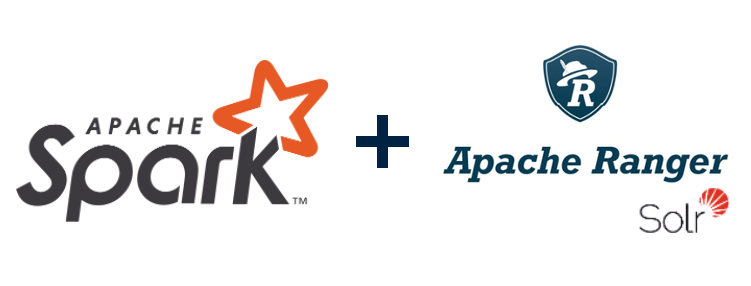
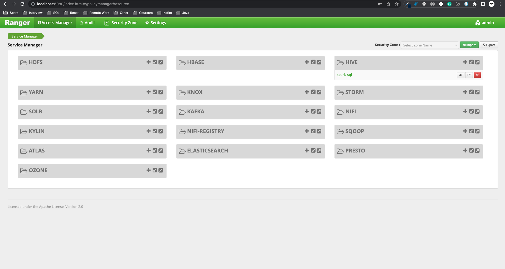
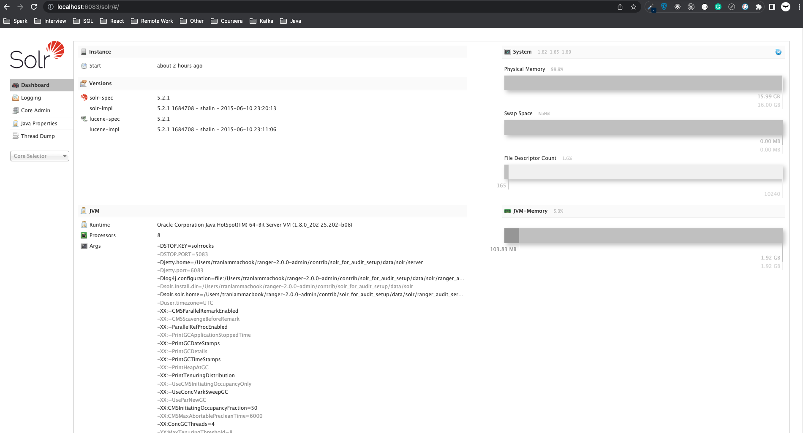

Spark and Ranger are widely used by many enterprises because of their powerful features. Spark is an in-memory data processing framework and Ranger is a framework to enable, monitor and manage comprehensive data security across the Hadoop platform. Thus, Ranger can be used to do authorization for Spark SQL and this blog will walk you through the integration of those two frameworks. This is the first part of the series, where we install the Ranger framework on our machine, and additionally, Apache Solr for auditing.



<!--truncate-->

### 1. Build process

This installation comes with these below components.

| Component   | Version      |
| ----------- | ------------ |
| MacOS       | M1/M2        |
| MySQL       | 8.0.33       |
| Java        | OpenJDK-8-jdk|
| Python      | 2.7.18       |
| Maven       | 3.6.3        |
| Ranger      | 2.0.0        |
| Solr        | 7.7.1        |

I install the framework on MacOS, but it is similar when it comes to any other Unix or Linux distributions.

Firstly, you need to have MySQL, Jdk8, Python 2.7, and Maven installed on your system, follow instructions from anywhere to make sure these components work as expected.

After that, you can download the source code of Ranger (I use release version 2.0.0) and start to build the source code.

```bash
# Get source code
wget https://downloads.apache.org/ranger/2.0.0/apache-ranger-2.0.0.tar.gz
tar -xvf apache-ranger-2.0.0.tar.gz
cd apache-ranger-2.0.0

# Build source code, it will output the ranger-2.0.0-admin.tar.gz in this repository in target/ folder
mvn clean compile package install assembly:assembly -Dmaven.test.skip=true -Drat.skip=true -Dpmd.skip=true -Dfindbugs.skip=true -Dspotbugs.skip=true -Dcheckstyle.skip=true
```

### 2. Ranger Admin installation

After the build process, you will have the `ranger-2.0.0-admin.tar.gz` file in the `target/` folder, you can go to the installation step of Ranger Admin. Our target is running a standalone Ranger with Solr for auditing then `ranger-2.0.0-admin.tar.gz` is enough in this case.

```bash
# Extract the tar file
cp ranger-2.0.0-admin.tar.gz ~
cd ~
tar -xvf ranger-2.0.0-admin.tar.gz
cd ranger-2.0.0-admin
```

We use MySQL as the database for Ranger and store all the information, setup step needs to connect to MySQL to initialize the database and tables. Thus, we need to have a MySQL connector to connect to MySQL from the setup code.

```bash
# Install mysql-connector
wget https://dev.mysql.com/get/Downloads/Connector-J/mysql-connector-java-8.0.26.tar.gz
tar -xvf mysql-connector-java-8.0.26.tar.gz
mv mysql-connector-java-8.0.26/mysql-connector-java-8.0.26.jar mysql-connector-java.jar
```

Now we are ready to edit the Ranger configuration.

```bash
vi install.properties
SQL_CONNECTOR_JAR=<path_to_mysql_connector>/mysql-connector-java.jar

db_name=ranger
db_user=admin
db_password=password12

rangerAdmin_password=YourPassword@123456
rangerTagsync_password=YourPassword@123456
rangerUsersync_password=YourPassword@123456
keyadmin_password=YourPassword@123456

audit_solr_urls=http://localhost:6083/solr/ranger_audits

unix_user=<your_mac_user>
unix_user_pwd=<your_mac_user_password>
unix_group=<your_mac_group>

RANGER_PID_DIR_PATH=$PWD/var/run/ranger
```

Currently, the configuration for our use case is completed, we now run the setup scripts.

```bash
# Comment setup user/group because it is currently compatible with Linux
vi setup.sh # then comment #setup_unix_user_group

# Setup scripts run python2
pyenv local 2.7.18

# After updating the required properties, run setup.sh
./setup.sh
```

Once the setup scripts are done, you will see this output `Installation of Ranger PolicyManager Web Application is completed.`, that means it is successful. Then, we can run our Ranger Admin service.

```bash
~/ranger-2.0.0-admin/ews/ranger-admin-services.sh start

# Check logs
tail -100f ~/ranger-2.0.0-admin/ews/logs/access_log.*
tail -100f ~/ranger-2.0.0-admin/ews/logs/catalina.out
tail -100f ~/ranger-2.0.0-admin/ews/logs/ranger-admin-*.log
```

To access Ranger Admin UI, go to `http://localhost:6080` with `user/password = admin/YourPassword@123456`.



Additional notes.

```bash
# Configure policy with
policy.download.auth.users=<your_user>
tag.download.auth.users=<your_user>

# We can test the policy with Rest APIs provided by Ranger
curl -ivk -H "Content-type:application/json" -u admin:YourPassword@123456 -X GET "http://localhost:6080/service/plugins/policies" # to get all policies
curl -ivk -H "Content-type:application/json" -u admin:YourPassword@123456 -X GET "http://localhost:6080/service/plugins/policies/download/dev_hive" # to get specific policy by service name

# Stop ranger admin
~/ranger-2.0.0-admin/ews/ranger-admin-services.sh stop 
```

### 3. Solr installation for auditing

Currently, Solr and Elasticsearch have supported sources for audit stores with Ranger. I will install Solr as it is built-in supported and does not require a good amount of infrastructure. This is also a standalone Solr which has no dependency on Zookeeper.

In the same Ranger build that we had done earlier, we would find an installation setup for enabling Solr audits. We also want to change some installation configurations for our specific use case.

```bash
cd ~/ranger-2.0.0-admin/contrib/solr_for_audit_setup

# Change config
vi install.properties
SOLR_USER=<your_mac_user>
SOLR_GROUP=<your_mac_group>

SOLR_INSTALL=true

JAVA_HOME=<your_java_home>
SOLR_DOWNLOAD_URL=http://archive.apache.org/dist/lucene/solr/7.7.1/solr-7.7.1.tgz

SOLR_INSTALL_FOLDER=<your_prefix_folder>/data/solr
SOLR_RANGER_HOME=<your_prefix_folder>/data/solr/ranger_audit_server
SOLR_RANGER_DATA_FOLDER=<your_prefix_folder>/data/solr/ranger_audit_server/data
SOLR_LOG_FOLDER=<your_prefix_folder>/var/log/solr/ranger_audits
```

After that, we can run the setup scripts.

```bash
# Setup directory
mkdir -p <SOLR_INSTALL_FOLDER>

# Setup scripts run python2
pyenv local 2.7.18

# After updating the required properties, run setup.sh
sudo ./setup.sh

# Change user:group for Solr directory
sudo chown -R <your_mac_user>:<your_mac_group> ~/ranger-2.0.0-admin/contrib

# Add write permission to Solr schema
chmod +w ~/ranger-2.0.0-admin/contrib/solr_for_audit_setup/data/solr/ranger_audit_server/ranger_audits/conf/managed-schema
```

Once the setup scripts are completed, we can start the Solr service.

```bash
# Instructions for start/stop Solr
cat <SOLR_RANGER_HOME>/install_notes.txt

# Start Solr
~/ranger-2.0.0-admin/contrib/solr_for_audit_setup/data/solr/ranger_audit_server/scripts/start_solr.sh

# Stop Solr
~/ranger-2.0.0-admin/contrib/solr_for_audit_setup/data/solr/ranger_audit_server/scripts/stop_solr.sh
```

Go to `http://localhost:6083`, you can see the information about your Solr service.



If you don't want to build the source code yourself then go to this repository, I have included the output file of the build process at **[https://github.com/lam1051999/ranger_build_output](https://github.com/lam1051999/ranger_build_output)**.

This is all about installing Ranger with Solr for auditing. In the next blog, I will talk about how we can customize Spark to get a policy from Ranger and do the authorization on Spark SQL.