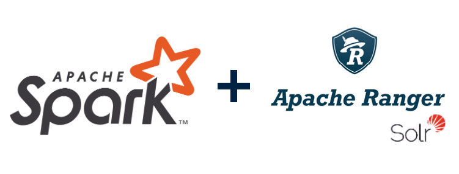
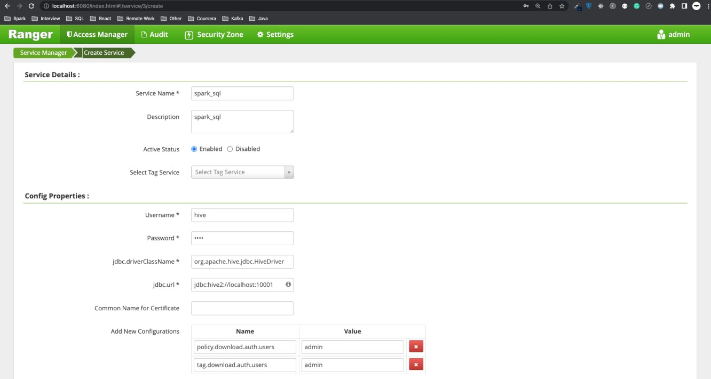
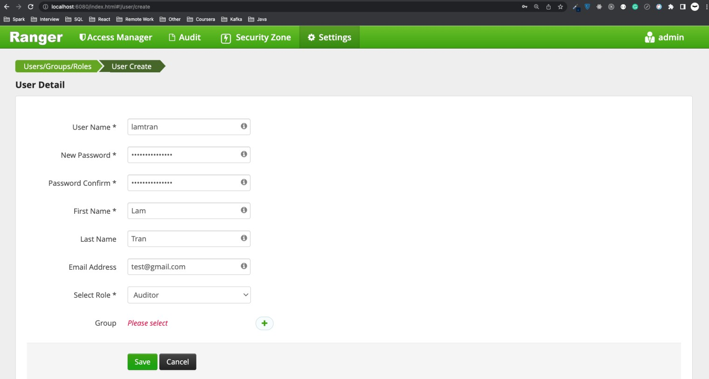
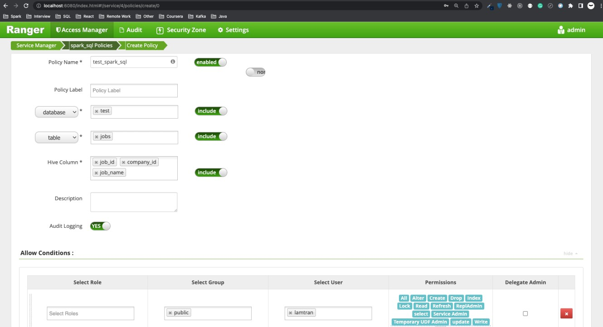

In the **[previous blog](/blog/2023-04-30-mini-spark3-authorizer-part-1/index.md)**, I have successfully installed a standalone Ranger service. In this article, I show you how we can customize the logical plan phase of **[Spark Catalyst Optimizer](/blog/2023-01-07-spark-catalyst-optimizer-and-spark-extension/index.md)** in order to archive authorization in Spark SQL with Ranger.



<!--truncate-->

### 1. Spark installation

Firstly, I will install Apache Spark 3.3.0 on my local machine. It is pretty easy with a few below steps.

```bash
# Get Spark build with hadoop, you can find specific version here: https://archive.apache.org/dist/spark/
cd ~
wget https://archive.apache.org/dist/spark/spark-3.3.0/spark-3.3.0-bin-hadoop3.tgz
tar -xvf spark-3.3.0-bin-hadoop3.tgz
cd spark-3.3.0-bin-hadoop3

# Configure some environment variables
export SPARK_HOME=~/spark-3.3.0-bin-hadoop3
export PATH=$PATH:$SPARK_HOME/bin

# Check if Spark is installed properly
spark-shell
```

### 2. Build a mini Spark Session Extension for Ranger authorization

The idea to make the authorizer is first inspired by [this GitHub repository](https://github.com/yaooqinn/spark-ranger). Currently, this repository has been archived and it is only compatible with Spark 2.4 and below, which does not help our use case (we use Spark 3.3.0). After weeks of trying multiple solutions but not having a result, I end up customizing the repository to work with Spark 3.3.0 myself.

Spark makes a huge update to migrate from 2.4 to 3.0 (see detail [here](https://spark.apache.org/docs/latest/sql-migration-guide.html#upgrading-from-spark-sql-24-to-30) and [here](https://spark.apache.org/releases/spark-release-3-0-0.html)) which create many new features. So we need to add more code and configure the project dependencies correctly in order not to conflict with Spark 3 dependencies (since Ranger and Spark 3 use the same library `jersey` to build RESTful Web Services, Ranger uses 1.x and Spark 3 uses 2.x).

The idea is to create a Spark Session Extension to customize the logical plan optimization phase of Spark Catalyst Optimizer, and since the logical plan is represented as **[TreeNode](/blog/2023-01-07-spark-catalyst-optimizer-and-spark-extension/index.md#1-treenode)**, it can be logical commands such as `CreateTableCommand`, `DropTableCommand`, `InsertIntoHiveTable`,... In these commands, we can extract the name of the database, table, and columns,... out of them, we collect them and check if the current user has proper access to those resources by Ranger-provided APIs.

The extension code can be found at: **[https://github.com/lam1051999/mini_spark3_authorizer](https://github.com/lam1051999/mini_spark3_authorizer)**.

```bash
# Build the project
cd ~
git clone https://github.com/lam1051999/mini_spark3_authorizer
cd mini_spark3_authorizer/spark3-ranger-custom
mvn clean package

# Copy output jar to Spark jars folder
cp target/spark-ranger-1.0-SNAPSHOT.jar $SPARK_HOME/jars

# Download dependency jars
cd $SPARK_HOME/jars
wget https://repo1.maven.org/maven2/commons-configuration/commons-configuration/1.10/commons-configuration-1.10.jar
wget https://repo1.maven.org/maven2/com/kstruct/gethostname4j/1.0.0/gethostname4j-1.0.0.jar
wget https://repo1.maven.org/maven2/net/java/dev/jna/jna/5.12.1/jna-5.12.1.jar
wget https://repo1.maven.org/maven2/org/apache/kudu/kudu-spark3_2.12/1.16.0/kudu-spark3_2.12-1.16.0.jar
wget https://repo1.maven.org/maven2/org/codehaus/jackson/jackson-jaxrs/1.9.13/jackson-jaxrs-1.9.13.jar
wget https://repo1.maven.org/maven2/org/codehaus/jackson/jackson-xc/1.9.13/jackson-xc-1.9.13.jar
```

After we have all the additional jars in Spark, we start to configure some properties for the extension.

```bash
# Get the template configuration file
cd $SPARK_HOME/conf
cp ~/mini_spark3_authorizer/spark3-conf/conf/ranger-spark-security.xml .
cp ~/mini_spark3_authorizer/spark3-conf/conf/ranger-spark-audit.xml .

# Modify the downloaded policy directory
vi ranger-spark-security.xml
ranger.plugin.spark.policy.cache.dir=<your_spark_home>/security/policycache
mkdir -p $SPARK_HOME/security/policycache

# Copy template policy file. The filename need to be exactly below, because in the extension code, plugin appId = ranger_customized, in Ranger Admin UI, the service we are going to create will have the name = spark_sql
cp ~/mini_spark3_authorizer/spark3-conf/security/policycache/ranger_customized_spark_sql.json $SPARK_HOME/security/policycache
```

At the moment, we go to Ranger Admin UI `http://localhost:6080` with `user/password = admin/YourPassword@123456`. In the `HIVE` plugin folder, create a service with the below input.



We can test if the service policy is accessible through RESTful APIs or not and if it is downloadable.

```bash
curl -ivk -H "Content-type:application/json" -u admin:YourPassword@123456 -X GET "http://localhost:6080/service/plugins/policies/download/spark_sql"
```

Add user you are going to test under `Settings -> Users/Groups/Roles -> Add New User`.



Add policy to the service `spark_sql`.



We create the database and table that we need.

```bash
# Create a table to Spark metastore
spark-shell

scala> val df = spark.read.parquet("file:///Users/tranlammacbook/mini_spark3_authorizer/jobs.parquet")
scala> df.printSchema
root
 |-- job_id: string (nullable = true)
 |-- company_id: string (nullable = true)
 |-- job_name: string (nullable = true)
 |-- taglist: string (nullable = true)
 |-- location: string (nullable = true)
 |-- three_reasons: string (nullable = true)
 |-- description: string (nullable = true)
scala> spark.sql("CREATE DATABASE test;")
scala> df.write.mode("overwrite").format("parquet").saveAsTable("test.jobs")
```

Now we can test our extension. As in the policy configuration, user `lamtran` only has permission to the columns `job_id, company_id, job_name` of table `test.jobs`.

```bash
spark-shell --conf spark.sql.extensions=mini.spark3.authorizer.RangerSparkSQLExtension --conf spark.sql.proxy-user=lamtran

# Check Spark configurations
scala> spark.conf.get("spark.sql.extensions")
res0: String = mini.spark3.authorizer.RangerSparkSQLExtension
scala> spark.conf.get("spark.sql.proxy-user")
res1: String = lamtran

# Check permitted columns
scala> spark.sql("SELECT job_id, company_id, job_name FROM test.jobs LIMIT 10").show(truncate=false)
+----------------------------------------------------+--------------+----------------------------------------+
|job_id                                              |company_id    |job_name                                |
+----------------------------------------------------+--------------+----------------------------------------+
|kms-technology:jrsr_qa_engineer_kms_labs_bonus      |kms-technology|(Jr/Sr) QA Engineer, KMS Labs - BONUS   |
|kms-technology:engineering_manager_bonus            |kms-technology|Engineering Manager - BONUS             |
|kms-technology:fullstack_mobile_mobilenodejs_kobiton|kms-technology|Fullstack Mobile (Mobile,NodeJs) Kobiton|
|kms-technology:jrsrprincipal_java_developer_bonus   |kms-technology|(Jr/Sr/Principal) Java Developer- BONUS |
|kms-technology:product_manager_kms_labs_bonus       |kms-technology|Product Manager, KMS Labs - BONUS       |
|kms-technology:sr_it_business_analyst_english_bonus |kms-technology|Sr IT Business Analyst (English) - BONUS|
|kms-technology:fullstack_dev_reactjsnodejs_kobiton  |kms-technology|Fullstack Dev (ReactJs,NodeJs) - Kobiton|
|kms-technology:senior_ruby_on_rails_engineer_bonus  |kms-technology|Senior Ruby on Rails Engineer - BONUS   |
|kms-technology:senior_data_engineer_bonus           |kms-technology|Senior Data Engineer - BONUS            |
|kms-technology:srjr_fullstack_nodejsreactjs_bonus   |kms-technology|Sr/Jr Fullstack (NodeJS,ReactJS) - BONUS|
+----------------------------------------------------+--------------+----------------------------------------+

# Check columns that are not allowed to select
scala> spark.sql("SELECT location, taglist, description FROM test.jobs LIMIT 10").show(truncate=false)
23/07/01 21:35:19 ERROR RangerSparkAuthorizerExtension: 
+===============================+
|Spark SQL Authorization Failure|
|-------------------------------|
|Permission denied: user [lamtran] does not have [SELECT] privilege on [test/jobs/location,taglist,description]
|-------------------------------|
|Spark SQL Authorization Failure|
+===============================+
             
org.apache.ranger.authorization.spark.authorizer.SparkAccessControlException: Permission denied: user [lamtran] does not have [SELECT] privilege on [test/jobs/location,taglist,description]
  at org.apache.ranger.authorization.spark.authorizer.RangerSparkAuthorizer$.$anonfun$checkPrivileges$6(RangerSparkAuthorizer.scala:127)
  at org.apache.ranger.authorization.spark.authorizer.RangerSparkAuthorizer$.$anonfun$checkPrivileges$6$adapted(RangerSparkAuthorizer.scala:124)
  at scala.collection.Iterator.foreach(Iterator.scala:943)
  at scala.collection.Iterator.foreach$(Iterator.scala:943)
  at scala.collection.AbstractIterator.foreach(Iterator.scala:1431)
  at scala.collection.IterableLike.foreach(IterableLike.scala:74)
  at scala.collection.IterableLike.foreach$(IterableLike.scala:73)
  at scala.collection.AbstractIterable.foreach(Iterable.scala:56)
  at org.apache.ranger.authorization.spark.authorizer.RangerSparkAuthorizer$.$anonfun$checkPrivileges$3(RangerSparkAuthorizer.scala:124)
  at org.apache.ranger.authorization.spark.authorizer.RangerSparkAuthorizer$.$anonfun$checkPrivileges$3$adapted(RangerSparkAuthorizer.scala:107)
  at scala.collection.mutable.ResizableArray.foreach(ResizableArray.scala:62)
  at scala.collection.mutable.ResizableArray.foreach$(ResizableArray.scala:55)
  at scala.collection.mutable.ArrayBuffer.foreach(ArrayBuffer.scala:49)
  at org.apache.ranger.authorization.spark.authorizer.RangerSparkAuthorizer$.checkPrivileges(RangerSparkAuthorizer.scala:107)
  at org.apache.spark.sql.extensions.RangerSparkAuthorizerExtension.apply(RangerSparkAuthorizerExtension.scala:58)
  at org.apache.spark.sql.extensions.RangerSparkAuthorizerExtension.apply(RangerSparkAuthorizerExtension.scala:14)
  at org.apache.spark.sql.catalyst.rules.RuleExecutor.$anonfun$execute$2(RuleExecutor.scala:211)
  at scala.collection.LinearSeqOptimized.foldLeft(LinearSeqOptimized.scala:126)
  at scala.collection.LinearSeqOptimized.foldLeft$(LinearSeqOptimized.scala:122)
  at scala.collection.immutable.List.foldLeft(List.scala:91)
  at org.apache.spark.sql.catalyst.rules.RuleExecutor.$anonfun$execute$1(RuleExecutor.scala:208)
  at org.apache.spark.sql.catalyst.rules.RuleExecutor.$anonfun$execute$1$adapted(RuleExecutor.scala:200)
  at scala.collection.immutable.List.foreach(List.scala:431)
  at org.apache.spark.sql.catalyst.rules.RuleExecutor.execute(RuleExecutor.scala:200)
  at org.apache.spark.sql.catalyst.rules.RuleExecutor.$anonfun$executeAndTrack$1(RuleExecutor.scala:179)
  at org.apache.spark.sql.catalyst.QueryPlanningTracker$.withTracker(QueryPlanningTracker.scala:88)
  at org.apache.spark.sql.catalyst.rules.RuleExecutor.executeAndTrack(RuleExecutor.scala:179)
  at org.apache.spark.sql.execution.QueryExecution.$anonfun$optimizedPlan$1(QueryExecution.scala:126)
  at org.apache.spark.sql.catalyst.QueryPlanningTracker.measurePhase(QueryPlanningTracker.scala:111)
  at org.apache.spark.sql.execution.QueryExecution.$anonfun$executePhase$2(QueryExecution.scala:185)
  at org.apache.spark.sql.execution.QueryExecution$.withInternalError(QueryExecution.scala:510)
  at org.apache.spark.sql.execution.QueryExecution.$anonfun$executePhase$1(QueryExecution.scala:185)
  at org.apache.spark.sql.SparkSession.withActive(SparkSession.scala:779)
  at org.apache.spark.sql.execution.QueryExecution.executePhase(QueryExecution.scala:184)
  at org.apache.spark.sql.execution.QueryExecution.optimizedPlan$lzycompute(QueryExecution.scala:122)
  at org.apache.spark.sql.execution.QueryExecution.optimizedPlan(QueryExecution.scala:118)
  at org.apache.spark.sql.execution.QueryExecution.assertOptimized(QueryExecution.scala:136)
  at org.apache.spark.sql.execution.QueryExecution.executedPlan$lzycompute(QueryExecution.scala:154)
  at org.apache.spark.sql.execution.QueryExecution.executedPlan(QueryExecution.scala:151)
  at org.apache.spark.sql.execution.QueryExecution.simpleString(QueryExecution.scala:204)
  at org.apache.spark.sql.execution.QueryExecution.org$apache$spark$sql$execution$QueryExecution$$explainString(QueryExecution.scala:249)
  at org.apache.spark.sql.execution.QueryExecution.explainString(QueryExecution.scala:218)
  at org.apache.spark.sql.execution.SQLExecution$.$anonfun$withNewExecutionId$6(SQLExecution.scala:103)
  at org.apache.spark.sql.execution.SQLExecution$.withSQLConfPropagated(SQLExecution.scala:169)
  at org.apache.spark.sql.execution.SQLExecution$.$anonfun$withNewExecutionId$1(SQLExecution.scala:95)
  at org.apache.spark.sql.SparkSession.withActive(SparkSession.scala:779)
  at org.apache.spark.sql.execution.SQLExecution$.withNewExecutionId(SQLExecution.scala:64)
  at org.apache.spark.sql.Dataset.withAction(Dataset.scala:3856)
  at org.apache.spark.sql.Dataset.head(Dataset.scala:2863)
  at org.apache.spark.sql.Dataset.take(Dataset.scala:3084)
  at org.apache.spark.sql.Dataset.getRows(Dataset.scala:288)
  at org.apache.spark.sql.Dataset.showString(Dataset.scala:327)
  at org.apache.spark.sql.Dataset.show(Dataset.scala:810)
  at org.apache.spark.sql.Dataset.show(Dataset.scala:787)
  ... 47 elided
```

Now check the downloaded policy file.

```bash
cd $SPARK_HOME/security/policycache
ls -lh
-rw-r--r--  1 tranlammacbook  staff    23K Jul  1 21:32 ranger_customized_spark_sql.json
```

We will see this is the new policy file and its content is refreshed every 10 seconds when the extension is in use.

### 3. Room for improvement

In this blog, we integrate a standalone Spark 3 with a standalone Ranger, but in production, Spark is often used in corporate with a Hadoop data cluster with Kerberos authentication enabled. Ranger will also sit in that Hadoop and do the authorization for many frameworks in Hadoop. Thus, there are a few more things that we need to implement.

- Config Spark and Ranger to work with Hadoop, and run Spark job in cluster mode.
- Policy refresher needs to be secure and use SPNego protocol (which use Kerberos keytab to generate token) to make RESTful API calls to Ranger service.
- The user of the Spark application and the user for authorizing Ranger need to be the keytab principal user.

I have also successfully implemented all the above functionalities in the production environment. If you need them, contact me on **[Linkedin](https://www.linkedin.com/in/lamtt1005)**.