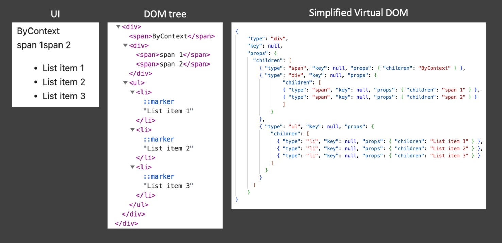
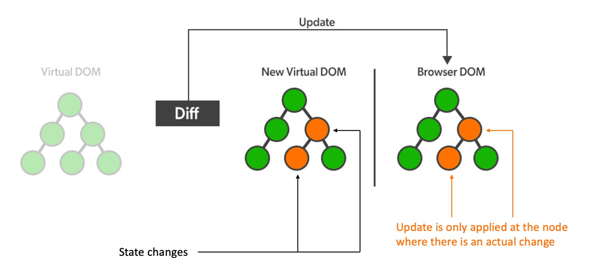

State is a very crucial part of React applications which will help update the information of the React components to change UI accordingly and make our application interactive with clients. In this article, I will walk you through the usage of state, its characteristic, and how we can use state in an efficient way.


<!--truncate-->

### 1. Virtual DOM

If you ever work with `React` or `Vue`, you probably know about a concept called Virtual DOM which those libraries/frameworks used to update the real DOM tree in the browser. Virtual DOM in React is a programming concept where the representation of a UI is kept in memory and synced with the real DOM.



In the picture above, whenever we have a UI in the browser on the left, we can inspect that UI and we can see the real DOM tree which contains several Html elements such as `div`, `ul`, `li`,... React will maintain a JavaScript object on the right to describe things on the real DOM and updates made to that object will be synchronized to the real DOM and modify the UI accordingly.

Thus, the Virtual DOM is a lightweight version of the real DOM, it provides a mechanism that abstracts manual DOM manipulations away from the developers, helping us to write more predictable code to interact with the real DOM.

### 2. React state

State is a plain JavaScript object used by React to represent a piece of information about the component's current situation. We modify state to manipulate the Virtual DOM.



Whenever state changes, it will modify some properties of the Virtual DOM. React will compare the new Virtual DOM with the old one to detect those changes and will synchronize them to the real DOM. The interesting thing here is that update is only applied at the node where there is an actual change. So, how can React do the diffing algorithm in an efficient way?

### 3. Diffing algorithm

Diffing is the algorithm that React uses in order to find differences between two Virtual DOM trees and update efficiently the real DOM. In this section, I will just explain very high-level rules used by this algorithm.

When diffing two trees, React will first compare the two root elements.

#### 3.1. Rule #1

Two elements of different types will produce different trees.


As shown in the picture, going from `<div>` to `<span>` will lead to full rebuild, its children will get unmounted and have their state destroyed.

#### 3.2. Rule #2

With the DOM elements of the same type, but different attributes, React knows to only modify the attribute that have been changed.

In this example, when the `className` attribute of the `<input>` is changed, React will only update that attribute instead of rebuilding the whole element.


With object value attribute, React updates only the properties that have been changed.


#### 3.3. Rule #3

This rule is about detecting the differences while recursing on children elements.


React iterates over both lists of lists of children at the same time, and generates mutation whenever there's a difference. As shown in above example, React will know to just generate the `List item 3` and append to the `ul` element.

So what if we prepend the list element instead of append? Because of iterating two lists at the same time and comparing, React will assume that all of those elements have been changed and rebuild all of them, which is a very bad case.


In order to get rid of the above case, we come to the `rule #4`

#### 3.4. Rule #4

Developers can hint at which elements may be stable across different renders with a `key` prop, so that elements with the same key will be compared with each other


In the picture above, we add a `key` property to each `li` element so React will know to pair check the elements with the `key="item-1"` and `key="item-2"` and only add the element with `key="item-3"` to the new DOM

### 4. State usage with useState hook

The `useState` hook is a built-in React hook that allows you to manage state in a functional component.

Consider an example below

```js
// define React state in functional components
const [count, setCount] = useState(0);

// update state
setCount(count + 1);
setCount((prevCount) => prevCount + 1);
```

`useState` returns an array contains the state (`count`) and a function used to update the state (`setCount`). The set function will take either the new value for the state or a callback function that returns new value as the argument.

There are some considerations when using state

- **`setState` function is asynchronous:** consider the below example, whenever we click the button to increase the count, we see the console logs the old value of state before it is updated. Because `setState` function is asynchronous, it will be pulled to an event loop, move to the lifecycle `Call stack -> WebAPIs -> Callback Queue -> Call stack -> being executed -> Pop out the stack` (you can refer to event loop **[here](https://www.webdevolution.com/blog/Javascript-Event-Loop-Explained)**), but basically, in JavaScript, in the same code block, the synchronous code will always run before the asynchronous code, that's why we see the console logs the value of state before it is updated.

Code: `UseStateM1.jsx`, tab `Mistake 1`

<iframe
  loading="lazy"
  style={{
    width: "100%",
    height: 900,
    outline: "1px solid #252525",
    border: 0,
    borderRadius: 8,
    marginBottom: 16,
    zIndex: 100
  }}
  src="https://codesandbox.io/s/state-management-24xt26?file=/src/components/UseStateM1.jsx"
></iframe>

- **Changes to state should be made by `setState` function:** in this example, we can see that the count actually changes in the console log but the UI is not updated. Because we modify the state value directly and it will not cause the rerender of the component. In this case, we need to update state value by `setState` function: `setCount(count + 3)`.

Code: `UseStateM2.jsx`, tab `Mistake 2`

<iframe
  loading="lazy"
  style={{
    width: "100%",
    height: 900,
    outline: "1px solid #252525",
    border: 0,
    borderRadius: 8,
    marginBottom: 16,
    zIndex: 100
  }}
  src="https://codesandbox.io/s/state-management-24xt26?file=/src/components/UseStateM2.jsx"
></iframe>

- **State should be treated as immutable:** each time we use `setState` function, we need to pass a brand new value to the function in order to rerender the component. React uses Shallow Comparision to check if the state is changed or not. In JavaScript, with primitive datatypes such as numbers, strings,... SC will compare their values, with object datatypes such as object, array,... SC will compare their references. Consider the example below, when we modify the state object directly, the component will not be rerendered and the UI will not be updated because the state actually holds the reference to the user object, not its value. In order to fix this, we use the spread operator to create a new object to make a new reference, and update properties in that object `{ ...prevUser, name: "No one", age: 30 }`, and our component will work as expected.

Code: `UseStateM3.jsx`, tab `Mistake 3`

<iframe
  loading="lazy"
  style={{
    width: "100%",
    height: 900,
    outline: "1px solid #252525",
    border: 0,
    borderRadius: 8,
    marginBottom: 16,
    zIndex: 100
  }}
  src="https://codesandbox.io/s/state-management-24xt26?file=/src/components/UseStateM3.jsx"
></iframe>

- **Pass function as argument to `setState` whenever the state value depends on its previous value:** in the example below, some might expect the value of `count` will increase 2 at a time, but it actually increases 1 because `setState` is an asynchronous function, it will not be executed immediately but pulled to the event loop, and those two `setState` functions will receive the same value `count = 0`. To fix this, we need to use `setCount((prev) => prev + 1)`, we make the output value depends on the previous value so no matter the order of execution of that two `setState`, the value will be increased by 2 at a time.

Code: `UseStateM4.jsx`, tab `Mistake 4`

<iframe
  loading="lazy"
  style={{
    width: "100%",
    height: 900,
    outline: "1px solid #252525",
    border: 0,
    borderRadius: 8,
    marginBottom: 16,
    zIndex: 100
  }}
  src="https://codesandbox.io/s/state-management-24xt26?file=/src/components/UseStateM4.jsx"
></iframe>

### 5. Update components in different DOM tree branches

State is often used within the body of a component and modify information about the component or its children, so, how can we sit in a component and modify the UI of other components that are in different scope?


#### 5.1. Using callback functions

In this approach, we are using callback functions in the child component to update state of the parent component, we also pass the state value from the parent to another child component to update its UI.

Code: `ByCallback.jsx`, tab `By Callback`

<iframe
  loading="lazy"
  style={{
    width: "100%",
    height: 900,
    outline: "1px solid #252525",
    border: 0,
    borderRadius: 8,
    marginBottom: 16,
    zIndex: 100
  }}
  src="https://codesandbox.io/s/state-management-24xt26?file=/src/pages/ByCallback.jsx"
></iframe>

In the code above, we define state in the `Root` component and pass the functions used to update state to `RootLeftLeft`, and pass the state value to `RootRightRight`. Now, we can sit in the `RootLeftLeft` and modify the UI of `RootRightRight` by updating the state in their common parent component.

Pros of this approach

- It does what we want, which is to update the UI of the component from other scopes.
- Easy to use and pretty straightforward, use the React built-in hooks.

Cons

- It will cause a lot of rerenders each time because the `Root` component is being rerendered, and so do its children.
- Ugly code when we have many duplicates and we also need to pass the props in the intermediate components in the way from `Root` component to our target components.

#### 5.2. Using React context

By using this approach, we can get rid of the ugly code problem in the first approach.

Code: `ByContext.jsx`, tab `By Context`

<iframe
  loading="lazy"
  style={{
    width: "100%",
    height: 900,
    outline: "1px solid #252525",
    border: 0,
    borderRadius: 8,
    marginBottom: 16,
    zIndex: 100
  }}
  src="https://codesandbox.io/s/state-management-24xt26?file=/src/pages/ByContext.jsx"
></iframe>

We define the `CountContext` context and provide it to our application part, we register the state value and the functions used to update state to the context, then, we use it directly in our target components, by using React `useContext` hook.

Even we don't have the smelly code anymore, this approach still cannot solve the performance problem when all components of the tree are still being rerendered.

#### 5.3. Using Redux

Redux is a powerful state management library that will help us avoid rerendering too many components.

Redux has a concept called a single source of truth when we maintain our whole application state in a single store.

The state is Redux is read-only as we cannot mutate directly, the only way to change state is to emit an action.

Changes will be made by pure functions, so reducers are the pure functions, their output will only depend on the inputs and will not cause any side effects.

Code: `ByRedux.jsx`, tab `By Redux`

<iframe
  loading="lazy"
  style={{
    width: "100%",
    height: 900,
    outline: "1px solid #252525",
    border: 0,
    borderRadius: 8,
    marginBottom: 16,
    zIndex: 100
  }}
  src="https://codesandbox.io/s/state-management-24xt26?file=/src/pages/ByRedux.jsx"
></iframe>

In this example, we define `store` as our single source of truth, with a reducer to manage the count value and provide it within our application part. We create a slice and define functions to mutate the value in `store`. Action creators can be extracted from the slice and then they will be used everywhere within the context that `store` is provided.

In this way, the only component that gets rerendered is `RootRightRight`, when its props changed over time.

### 6. Performance considerations when interacting with state

There are some useful hooks/functions used to cache/memorize things related to state to avoid components from rerendering, which are

- `React.memo()` for memorizing React components.
- `useMemo()` for memorizing some values.
- `useCallback()` for memorizing some callback functions.

I will apply theses to the **[ByContext](#52-using-react-context)** example above.

Code: `Memo.jsx`, tab `Memo`

<iframe
  loading="lazy"
  style={{
    width: "100%",
    height: 900,
    outline: "1px solid #252525",
    border: 0,
    borderRadius: 8,
    marginBottom: 16,
    zIndex: 100
  }}
  src="https://codesandbox.io/s/state-management-24xt26?file=/src/pages/Memo.jsx"
></iframe>

I use `useCallback` to memorize the callback functions used to update state, and prevent them from being recreated every time the `Root` component rerenders. Because the state value `count` changes over time so I will not cache that value.

I also use `React.memo()` to memorize the `RootLeft` component to prevent its rerendering when `Root` component rerenders (can also apply to other static components in the code, such as `RootRightLeft`,...).

Now, when we hit the increment/decrement buttons, we can see that event `Root` component rerenders, `RootLeft` and `RootLeftLeft` will not be rerendered.

This is pretty much about state management in React. Hope you enjoy reading it. See you in the next blogs.

### 7. References

[Reconciliation](https://legacy.reactjs.org/docs/reconciliation.html)

[What is Diffing Algorithm ?](https://www.geeksforgeeks.org/what-is-diffing-algorithm/)

[Javascript Event Loop Explained](https://www.webdevolution.com/blog/Javascript-Event-Loop-Explained)
