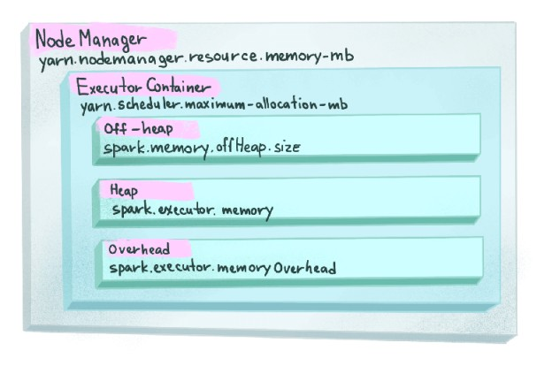

Spark is an in-memory data processing framework that can quickly perform processing tasks on very large data sets, and can also distribute tasks across multiple computers. Spark applications are memory heavy, hence, it is obvious that memory management plays a very important role in the whole system.



<!--truncate-->

### 1. Spark executor


Spark sends application code (defined by JAR or Python files passed to SparkContext) to each executor which will launch a JVM process for code execution. There are two types of memory in JVM.

- **On-Heap memory:** refers to objects that will be present in the Java heap (and also subject to GC).
- **Off-Heap memory:** refers to (serialized) objects that are managed by EHCache, but stored outside the heap (and also not subject to GC).

The Off-Heap store is used to avoid the overhead of GC on a heap that is several Megabytes or Gigabytes large. It is slightly slower than the On-Heap memory, but still faster than the disk store.

### 2. Spark memory manager

Before Spark 1.6, a simple scheme for memory management was adopted, which is Static Memory Manager (SMM). The size of Storage Memory and Execution Memory and other memory is fixed during application execution and it has been deprecated because of the lack of flexibility.

From Spark 1.6+, Spark came up with Unified Memory Manager (UMM) with dynamic memory allocation, shared by storage and execution. Thus, when Execution Memory is not used, the Storage Memory can borrow all the available memory and vice versa, by calling acquireMemory() to make changes to memory pools. Therefore, UMM has lots of advantages compared to SMM.

- Memory can be switched between Storage Memory and Execution Memory.
- When our application has no cache, all memory can be used by execution and thus prevent data spilling to disk.
- The application will be able to spend a minimum amount for Storage Memory for cached data and let the execution borrow the remaining.
- Dynamically improve performance without requiring the user to configure the memory portion for each manually.

#### 2.1. On-Heap Memory

The size of the On-Heap memory can be configured either by passing `--executor-memory` to command lines or setting `spark.executor.memory` to the Spark application, in the same format as JVM memory strings with a size unit suffix ("k", "m", "g" or "t") (e.g. 512m, 2g). This amount of memory can be breakdown into the below types.


Default values of those configurations in Spark v3.3.0

```bash
spark.executor.memory=1g
spark.memory.fraction=0.6
spark.memory.storageFraction=0.5
Usable Memory = On-Heap Memory - Reserved Memory
```

##### 2.1.1. Researved memory

Reserved Memory is the memory reserved for the system and is used to store Spark's internal objects. Its size is hardcoded `private val RESERVED_SYSTEM_MEMORY_BYTES = 300 * 1024 * 1024` in `org.apache.spark.memory.UnifiedMemoryManager`. If you want to make any modifications, you need to change the Spark source code and recompile it. Spark will require On-Heap memory greater or equal to 1.5 times of Reserved Memory or it will fail to initialize Spark session.

```bash
spark-shell --conf spark.executor.memory=300m

java.lang.IllegalArgumentException: Executor memory 314572800 must be at least 471859200. Please increase executor memory using the --executor-memory option or spark.executor.memory in Spark configuration.
	at org.apache.spark.memory.UnifiedMemoryManager$.getMaxMemory(UnifiedMemoryManager.scala:229)
    ...
```

##### 2.1.2. User memory

User Memory is the memory used to store user-defined data structures, any UDFs created by the user, the data needed for RDD conversion operations, etc. This memory segment is not managed by Spark and Spark will not be aware of/maintain it.

```bash
User Memory = Usable Memory * (1 - spark.memory.fraction)
```

##### 2.1.3. Spark memory

```bash
Spark Memory = Usable Memory * spark.memory.fraction
```

This memory pool is managed by Spark. Divided into two types of memory

- **Execution Memory:** Used for processing tasks, storing objects required during the execution of the tasks. When this pool has no space left, it will spill to the disk. Execution Memory tends to remain shorter than Storage Memory since it will be evicted immediately after each operation, making space for the next ones.

```bash
Storage Memory = Spark Memory * (1 - spark.memory.storageFraction)
```

- **Storage Memory:** used for storing the cached data (data with persist option MEMORY in it), broadcast variables, and data deserialization. When this region is full, cache data will be either written to disk or recomputed based on configuration. Spark also clears space for new cache requests by eliminating the old cache objects with the Least Recently Used (LRU) mechanism.

```bash
Storage Memory = Spark Memory * spark.memory.storageFraction
```

##### 2.1.3. Dynamic memory allocation between Storage Memory and Execution Memory

- Storage Memory can borrow space from Execution Memory only if blocks are not used in Execution Memory.
- Execution Memory can also borrow space from Storage Memory if blocks are not used in Storage Memory.
- If blocks from Execution Memory are used by Storage Memory, and Execution needs more memory, it can forcefully evict the excess blocks occupied by Storage Memory.
- If blocks from Storage Memory are used by Execution Memory and Storage needs more memory, it cannot forcefully evict the excess blocks occupied by Execution Memory, it will end up having less memory area. It will wait until Spark releases the excess blocks stored by Execution Memory and then occupies them.

#### 2.2. Off-Heap Memory

Most Spark operations happened entirely in On-Heap memory and utilize the mighty help of GC that sometimes can cause GC overhead. To minimize this effect, Spark introduces the Off-Heap memory for certain operations, which will reduce the impact of GC in the application.

Off-Heap memory means allocating memory objects (serialized to a byte array) to memory outside the heap of the JVM, which is directly managed by the operating system. This memory does not bound to GC but calls the Java API (sun.misc.Unsafe) for unsafe operations such as C which uses malloc() to use operating system memory.

Data accessing in this region can be slightly slower than accessing the On-Heap memory, but still faster than disk, and the user has to manually deal with managing the allocated memory. Data on Off-Heap memory can still be persisted even when the executor getting killed (data cache on On-Heap memory would be gone).

This memory region is disabled by default but can be enabled by setting these configurations.

```bash
spark.memory.offHeap.enabled = true (false by default)
spark.memory.offHeap.size = ?g (0 by default)
```

Off-Heap memory includes only Storage Memory and Execution Memory, which will be distributed in the following manner.


Therefore, the total memory of Storage Memory or Execution Memory will be the sum of each in both On-Heap and Off-Heap memories.

### 3. Spark memory calculation example

Despite we pass `spark.executor.memory` to On-Heap memory, the maximum amount of memory that the JVM will attempt to use will be slightly smaller than `spark.executor.memory`, which will be calculated with the below Java program.

```java
public class Helper {
    public static void main(String[] args) {
        long maxMem = Runtime.getRuntime().maxMemory();
        System.out.println(maxMem);
    }
}
```

```bash
spark.executor.memory=1024 (as 1GB in MB)
java -Xmx${spark_executor_memory}m -cp target/calculate-1.0-SNAPSHOT.jar Helper
954728448 (which is 0.88916015625 GB)
```

A small Python program to calculate the memory of each memory category, with the help of the Java code above.

```python
# MB will be the smallest unit
from distutils.util import strtobool
import subprocess

def get_valid_input(message, f, error_message):
    amount = None
    while amount is None:
        try:
            amount = f(input(message))
            return amount
        except ValueError:
            print(error_message)

def get_jvm_max_mem(mem):
    command = ["java", f"-Xmx{int(mem)}m", "-cp", "calculate/target/calculate-1.0-SNAPSHOT.jar", "Helper"]
    p = subprocess.Popen(command, stdout=subprocess.PIPE, stderr=subprocess.DEVNULL)
    text = p.stdout.read()
    ret = p.wait()
    if ret == 0:
        return float(text.decode("utf-8"))

if __name__ == "__main__":
    RESERVED_SYSTEM_MEMORY = 300
    SPARK_MEMORY_FRACTION=0.6
    SPARK_MEMORY_STORAGEFRACTION=0.5
    GB_TO_MB_RATE = 1024
    spark_executor_memory = get_valid_input("Amount of spark.executor.memory (in GB): ", float, "Invalid value for spark.executor.memory, must be a number") * GB_TO_MB_RATE
    spark_executor_memory = get_jvm_max_mem(spark_executor_memory) / pow(GB_TO_MB_RATE, 2)
    spark_memory_offheap_enabled = get_valid_input("Option spark.memory.offHeap.enabled: ", strtobool, "Invalid value for spark.memory.offHeap.enabled, must be a boolean string (true, false, True, False,...)")
    if spark_memory_offheap_enabled:
        spark_memory_offheap_size = get_valid_input("Amount of spark.memory.offHeap.size (in GB): ", float, "Invalid value for spark.memory.offHeap.size, must be a number") * GB_TO_MB_RATE
    on_heap_user_memory = (spark_executor_memory - RESERVED_SYSTEM_MEMORY) * (1 - SPARK_MEMORY_FRACTION)
    on_heap_spark_memory = (spark_executor_memory - RESERVED_SYSTEM_MEMORY) * SPARK_MEMORY_FRACTION
    on_heap_spark_storage_memory = on_heap_spark_memory * SPARK_MEMORY_STORAGEFRACTION
    on_heap_spark_execution_memory = on_heap_spark_memory * (1 - SPARK_MEMORY_STORAGEFRACTION)
    total_spark_memory = on_heap_spark_memory
    print("\n")
    print(f"------------------ On-Heap Memory: {spark_executor_memory} MB ------------------")
    print(f"Researved Memory: {RESERVED_SYSTEM_MEMORY} MB")
    print(f"User Memory: {on_heap_user_memory} MB")
    print(f"Spark Memory: {on_heap_spark_memory} MB")
    print(f"\tStorage Memory: {on_heap_spark_storage_memory} MB")
    print(f"\tExecution Memory: {on_heap_spark_execution_memory} MB")
    if spark_memory_offheap_enabled:
        off_heap_spark_storage_memory = spark_memory_offheap_size * SPARK_MEMORY_STORAGEFRACTION
        off_heap_spark_execution_memory = spark_memory_offheap_size * (1 - SPARK_MEMORY_STORAGEFRACTION)
        print("\n")
        print(f"------------------ Off-Heap Memory: {spark_memory_offheap_size} MB ------------------")
        print(f"Storage Memory: {off_heap_spark_storage_memory} MB")
        print(f"Execution Memory: {off_heap_spark_execution_memory} MB")
        total_spark_memory += spark_memory_offheap_size
    print("\n")
    print(f"------------------ Total Spark Memory (Spark Memory + Off-Heap Memory): {total_spark_memory} MB ({total_spark_memory / GB_TO_MB_RATE} GB) ------------------")
```

So for an application with `spark.executor.memory=1g`, `spark.memory.offHeap.enabled=true`, `spark.memory.offHeap.size=512m`.

```bash
python calculate.py

Amount of spark.executor.memory (in GB): 1
Option spark.memory.offHeap.enabled: true
Amount of spark.memory.offHeap.size (in GB): 0.5


------------------ On-Heap Memory: 910.5 MB ------------------
Researved Memory: 300 MB
User Memory: 244.20000000000002 MB
Spark Memory: 366.3 MB
        Storage Memory: 183.15 MB
        Execution Memory: 183.15 MB


------------------ Off-Heap Memory: 512.0 MB ------------------
Storage Memory: 256.0 MB
Execution Memory: 256.0 MB


------------------ Total Spark Memory (Spark Memory + Off-Heap Memory): 878.3 MB (0.85771484375 GB) ------------------
```

We start a spark shell with the following configurations.

```bash
spark-shell --conf spark.executor.memory=1g --conf spark.memory.offHeap.enabled=true --conf spark.memory.offHeap.size=512m
```

Then go to `http://localhost:4040/executors/`.


We can see that the total amount of Spark memory is exactly like our calculation.

That is how we calculate the memory in Spark. The source code can be found at: [https://github.com/lam1051999/spark_memory_calculator](https://github.com/lam1051999/spark_memory_calculator). See you in the next blogs.

### 4. References

[Spark Memory Management](https://community.cloudera.com/t5/Community-Articles/Spark-Memory-Management/ta-p/317794)

[Dive into Spark memory](https://luminousmen.com/post/dive-into-spark-memory)