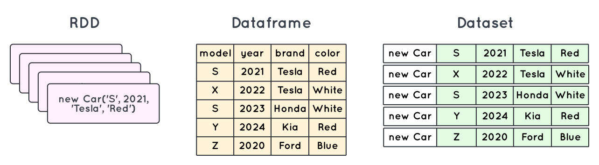
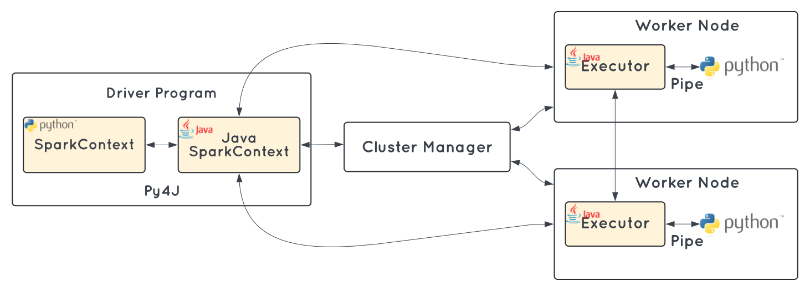
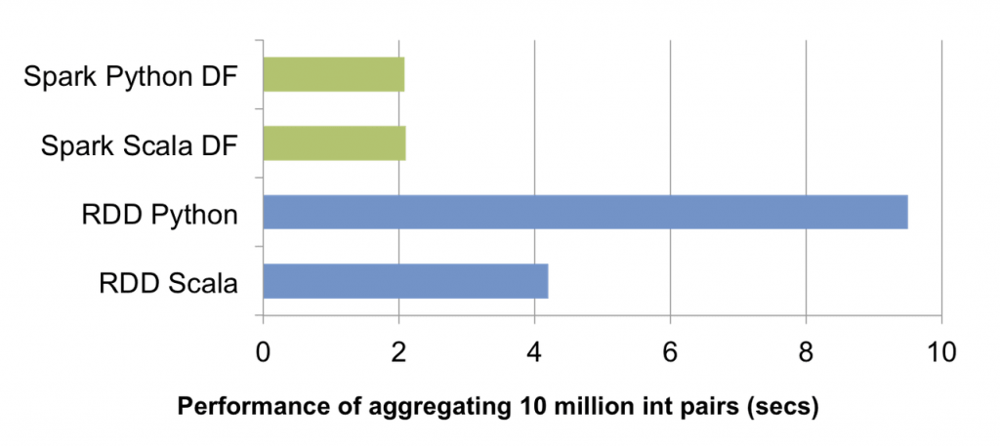

I have participated in fews technical interviews and have discussed with people topics around data engineering and things they have done in the past. Most of them are familiar with Apache Spark, obviously, one of the most adopted frameworks for big data processing. What I have been asked and what I often ask them is simple concepts around RDD, Dataframe, and Dataset and the differences between them. It sounds quite fundamental, right? Not really. If we have more closer look at them, there are lots of interesting things that can help us understand and choose which is the best suited for our project.

<!--truncate-->

## The overview

<table class="tg">
<thead>
  <tr>
    <th class="tg-0pky"></th>
    <th class="tg-0pky">RDD</th>
    <th class="tg-0pky">Dataframe</th>
    <th class="tg-0pky">Dataset</th>
  </tr>
</thead>
<tbody>
  <tr>
    <td class="tg-0pky">Data representation</td>
    <td class="tg-0pky">A distributed collection of data elements spread across many machines in the cluster. RDDs are a set of Java or Scala objects representing data</td>
    <td class="tg-0pky">A distributed collection of data organized into named columns. It is conceptually equal to a table in a relational database</td>
    <td class="tg-0pky">An extension of Dataframe API that provides the functionality of type-safe, object-oriented programming interface of the RDD API and performance benefits of the Catalyst query optimizer and off heap storage mechanism of a Dataframe API</td>
  </tr>
  <tr>
    <td class="tg-0pky">Data formats</td>
    <td class="tg-0pky">Can easily and efficiently process data which is structured as well as unstructured. But unlike Dataframe and Dataset, RDD does not infer the schema of the ingested data and requires the user to specify it</td>
    <td class="tg-0pky">It works only on structured and semi-structured data. It organizes the data in the named column. Dataframe allows the Spark to manage schema</td>
    <td class="tg-0pky">It also efficiently processes structured and unstructured data. It represents data in the form of JVM objects of row or a collection of row object. Which is represented in tabular forms through encoders</td>
  </tr>
  <tr>
    <td class="tg-0pky">Data source APIs</td>
    <td class="tg-0pky">Data source API allows that an RDD could come from any data source e.g. text file, a database via JDBC etc. and easily handle data with no predefined structure</td>
    <td class="tg-0pky">Data source API allows data processing in different formats (AVRO, CSV, JSON, and storage system HDFS, HIVE tables, MySQL). It can read and write from various data sources that are mentioned above</td>
    <td class="tg-0pky">Dataset API of Spark also support data from different sources</td>
  </tr>
  <tr>
    <td class="tg-0pky">Compile time type safety </td>
    <td class="tg-0pky">RDD provides a familiar object-oriented programming style with compile-time type safety</td>
    <td class="tg-0pky">If you are trying to access the column which does not exist in the table in such case Dataframe APIs does not support compile-time error. It detects attribute error only at runtime</td>
    <td class="tg-0pky">It provides compile-time type safety</td>
  </tr>
  <tr>
    <td class="tg-0pky">Optimization</td>
    <td class="tg-0pky">No inbuilt optimization engine is available in RDD. When working with structured data, RDDs cannot take advantages of Sparks advance optimizers. For example, Catalyst optimizer and Tungsten execution engine. Developers optimise each RDD on the basis of its attributes</td>
    <td class="tg-0pky">Optimization takes place using catalyst optimizer which contains four phases optimization stages</td>
    <td class="tg-0pky">It includes the concept of Dataframe Catalyst optimizer for optimizing query plan</td>
  </tr>
  <tr>
    <td class="tg-0pky">Serialization</td>
    <td class="tg-0pky">Whenever Spark needs to distribute the data within the cluster or write the data to disk, it does so use Java serialization. The overhead of serializing individual Java and Scala objects is expensive and requires sending both data and structure between nodes</td>
    <td class="tg-0pky">Spark Dataframe can serialize the data into off-heap storage (in memory) in binary format and then perform many transformations directly on this off heap memory because Spark understands the schema. There is no need to use java serialization to encode the data. It provides a Tungsten physical execution backend which explicitly manages memory and dynamically generates bytecode for expression evaluation</td>
    <td class="tg-0pky">When it comes to serializing data, the Dataset API in Spark has the concept of an encoder which handles conversion between JVM objects to tabular representation. It stores tabular representation using Spark internal Tungsten binary format. Dataset allows performing the operation on serialized data and improving memory use. It allows on-demand access to individual attribute without deserializing the entire object</td>
  </tr>
  <tr>
    <td class="tg-0pky">Garbage collection</td>
    <td class="tg-0pky">There is overhead for garbage collection that results from creating and destroying individual objects</td>
    <td class="tg-0pky">Avoids the garbage collection costs in constructing individual objects for each row in the dataset</td>
    <td class="tg-0pky">There is also no need for the garbage collector to destroy object because serialization takes place through Tungsten. That uses off heap data serialization</td>
  </tr>
  <tr>
    <td class="tg-0pky">Memory usage</td>
    <td class="tg-0pky">Efficiency is decreased when serialization is performed individually on a java and scala object which takes lots of time</td>
    <td class="tg-0pky">Use of off heap memory for serialization reduces the overhead. It generates byte code dynamically so that many operations can be performed on that serialized data. No need for deserialization for small operations</td>
    <td class="tg-0pky">It allows performing an operation on serialized data and improving memory use. Thus it allows on-demand access to individual attribute without deserializing the entire object</td>
  </tr>
  <tr>
    <td class="tg-0pky">Schema projection</td>
    <td class="tg-0pky">In RDD APIs use schema projection is used explicitly. Hence, we need to define the schema (manually)</td>
    <td class="tg-0pky">Auto-discovering the schema from the files and exposing them as tables through the Hive Meta store. We did this to connect standard SQL clients to our engine. And explore our dataset without defining the schema of our files</td>
    <td class="tg-0pky">Auto discover the schema of the files because of using Spark SQL engine</td>
  </tr>
  <tr>
    <td class="tg-0pky">Aggregation</td>
    <td class="tg-0pky">RDD API is slower to perform simple grouping and aggregation operations</td>
    <td class="tg-0pky">Dataframe API is very easy to use. It is faster for exploratory analysis, creating aggregated statistics on large datasets</td>
    <td class="tg-0pky">Dataset is fast on performing aggregation operations on large amount of data</td>
  </tr>
  <tr>
    <td class="tg-0pky">Use case</td>
    <td class="tg-0pky">You need fine-grained control, low-level transformation over data operations Your data is unstructured, like text streams or media You prefer functional programming constructs for data manipulation over domain-specific functions Defining a schema (like columnar format) isn't important during processing You prioritize direct access to data by index or position rather than named columns
    </td>
    <td class="tg-0pky">You want high-level data manipulation, rich semantics and powerful abstractions, making data processing more intuitive You prefer domain-specific APIs for tasks like filtering, mapping, aggregation (averages, sums), and SQL-like queries You have more efficient data access using column names (instead of indexes) and leverage columnar storage for faster processing The API remains consistent across various Spark libraries, simplifying development Your transformations are complex and need the help of Spark optimizers for improving performance</td>
    <td class="tg-0pky">You prefer features from Dataframe and also higher degree of type-safety at compile time</td>
  </tr>
</tbody>
</table>

**Dataset is not available in PySpark since Python is dynamically typed programming language.*

## More about the performance comparision

When PySpark interact with RDD, at the driver, `SparkContext` will use `Py4J` to launch a JVM and initiate `JavaSparkContext` and each transformed RDD will associate with `PythonRDD` objects in Java. When the tasks is distributed to worker nodes, `PythonRDD` objects run Python subprocesses using pipes, send both code and data to be processed within Python. While this approach allows PySpark to distribute the processing of the data to multiple Python subprocesses on multiple workers, the overall operation will cause a lot of context switches and communications between Java and Python, so there are more overhead to run the code and therefore it is slow when interact with RDD in Python.

On the other hand, Spark Dataframe have a significant advantage - their execution is automatically optimized by a query optimizer component.

Before any computations are performed on a DataFrame, the Catalyst Optimizer analyzes the sequence of operations used to construct the DataFrame. It then generates an optimized physical execution plan. The optimizer leverages its understanding of the operation semantics and the data structure to make intelligent decisions that can reorganize and optimize the execution plan, leading to more efficient computations compared to executing the operations naively. You can find more about Catalyst Optimizer in **[Spark Catalyst Optimizer And Spark Session Extension](/blog/2023-01-07-spark-catalyst-optimizer-and-spark-extension/index.md)**.

## References

[A Tale of Three Apache Spark APIs: RDDs vs DataFrames and Datasets](https://www.databricks.com/blog/2016/07/14/a-tale-of-three-apache-spark-apis-rdds-dataframes-and-datasets.html)

[RDD vs. DataFrame vs. Dataset](https://phoenixnap.com/kb/rdd-vs-dataframe-vs-dataset)

[Improving PySpark Performance Beyond the JVM](https://www.slideshare.net/hkarau/improving-pyspark-performance-spark-performance-beyond-the-jvm)

[How does PySpark work? — step by step (with pictures)](https://medium.com/analytics-vidhya/how-does-pyspark-work-step-by-step-with-pictures-c011402ccd57)

[Introducing DataFrames in Apache Spark for Large Scale Data Science](https://www.databricks.com/blog/2015/02/17/introducing-dataframes-in-spark-for-large-scale-data-science.html)