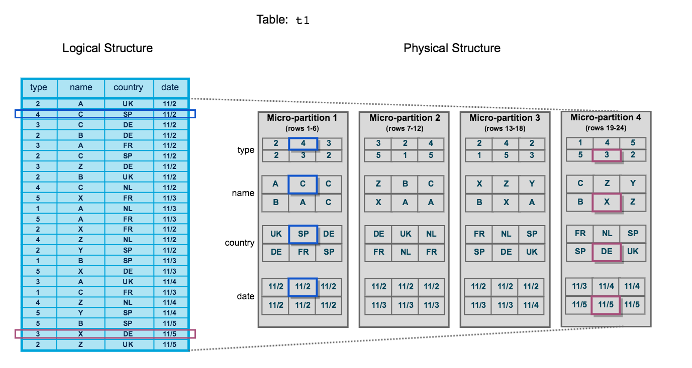
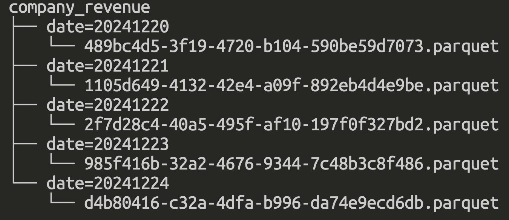
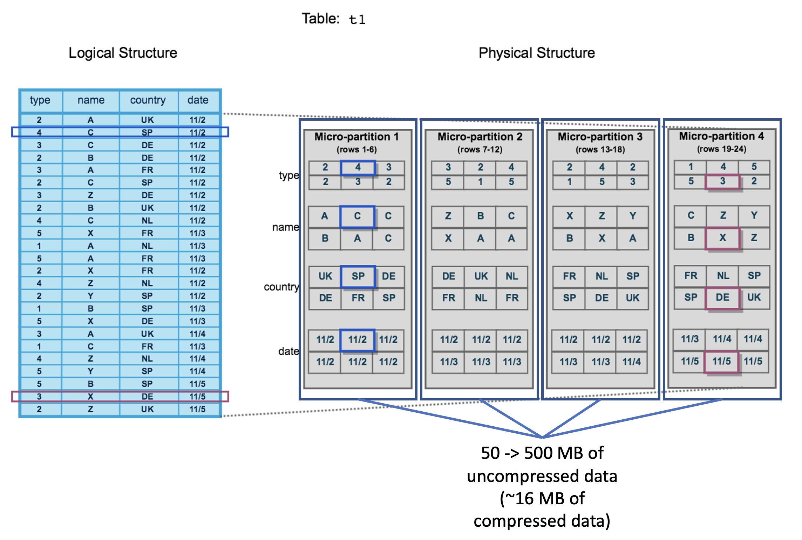
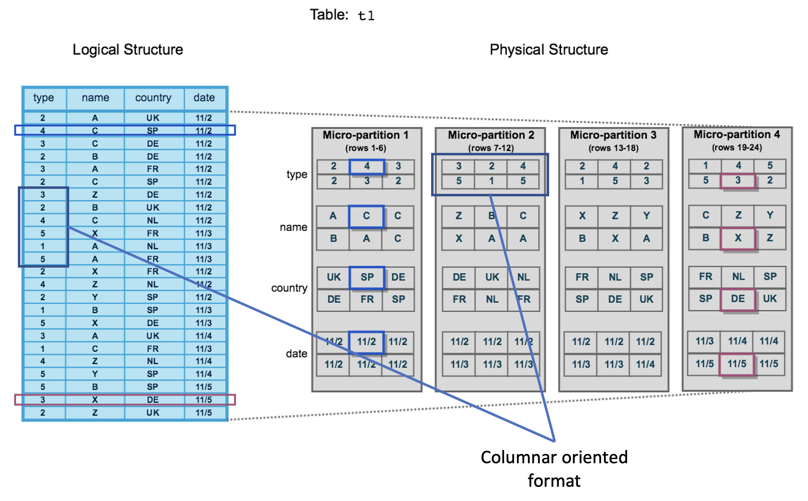
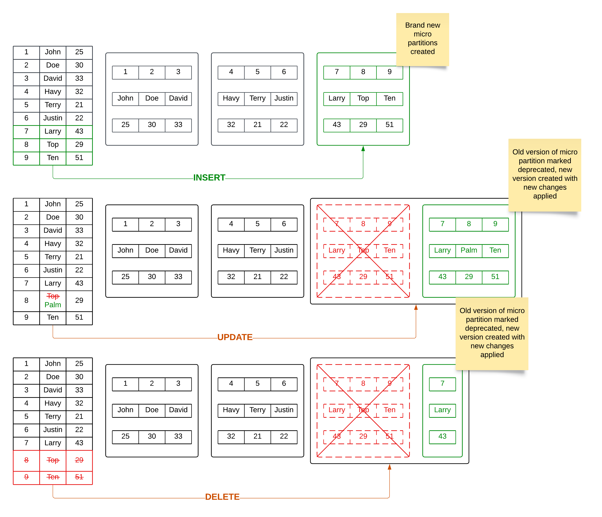
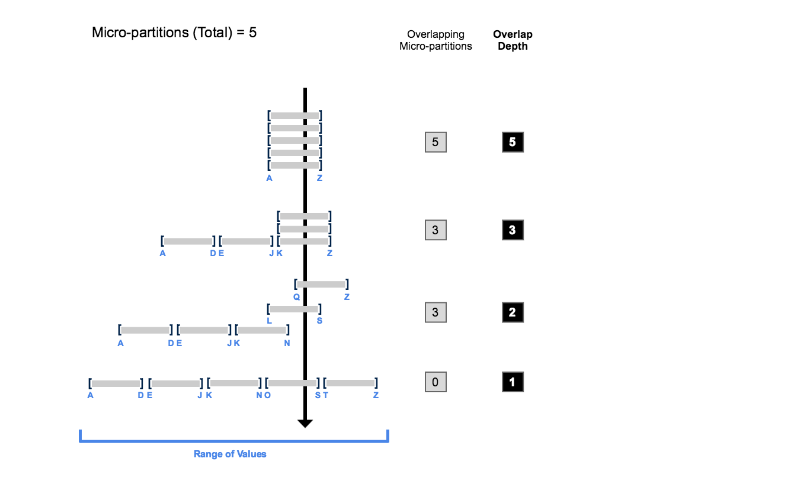
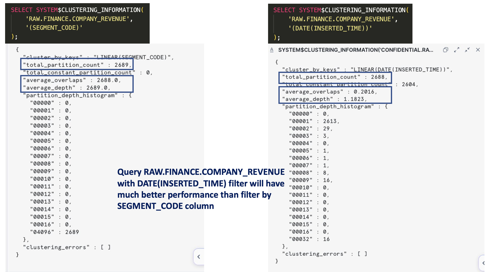

Snowflake is one of the most popular data warehouse solutions nowaday because of the various features that it can provide you to build a complete data platform. Understanding the Snowflake storage layer not only helps us to have a deep dive into how it organizes the data under the hood but it is also crucial for performance optimization of your queries.



<!--truncate-->

## 1. Partitioning in traditional Data Lake

When working with traditional Data Lake solution such as Hadoop, we often organized partitions of tables in hierarchical folder structure with partition column as subfolders, data stored in files​.



Although this approach is easy for visual exploration and query, there are many drawbacks

- We need to predefine the partition columns for the table​ and always be mindful in table design and partitions selection​ at the first place. 

```sql
CREATE TABLE company_revenue (
    id INTEGER NOT NULL,
    revenue DECIMAL(38, 15) NOT NULL
) PARTITION BY (date INTEGER);
```

- Overhead of maintenance: adding more partitioned columns to the table requires whole table rewrite and metadata changes, the more partitions the more metadata size and management burden,...​
- Low performance when filtering on non-partitioned columns​
- Suffer from the data skewness problem leading to low performance query even with partitioned data​
- Not having the best query pushdown and pruning​ since there are likely only partition columns that can be pruned

## 2. Snowflake micro-partitions overview

Snowflake Data Platform implements a powerful and unique form of partitioning, called micro-partitioning. Unlike traditional static partitioning schemes that require manual partition key definition, Snowflake's micro-partitions are automatically created during data ingestion based on natural sort order and file size optimization. This approach enables partition pruning, data clustering, and autonomous optimization without the overhead of partition management or the risk of partition skew.

- Tables in Snowflake are divided into micro partitions automatically without overhead of manual maintenance​


- Each micro partition contains 50 -> 500 MB of uncompressed data (~16 MB of compressed data), efficient for query pruning​. There can be overlap between micro partitions in the value ranges it stores, so that they can be similar in size, data volume, to reduce data skewness problem​



- Data stored in columnar oriented format for efficient query projection​. Snowflake decides the most efficient compression algorithm to use for each column based on the column datatype and statistics​



Snowflake stored metadata of each micro partition​
- The range of values for each of the columns​
- The number of distinct values​
- Additional properties used for both optimization and efficient query processing​

This information can help the query optimizer calculate the cost of each query plan and choose the best plan for processing the work units submitted to the virtual warehouse cluster.

## 3. How do Snowflake perform table updates?​

Snowflake micro partitions are immutable, they will not be modified once it is created. Data updates on the table will result in new micro partition creation, not modifying existing ones, with the changes applied compared with the old ones. The old micro partitions will either be destroyed immediately or remain for a certain amount of time based on the `DATA_RETENTION_TIME_IN_DAYS` parameter set on the table.

The immutable characteristic of micro partitions is also the reason that makes Time-Travel possible and easy to manage​ because of the ability to traverse back to the old version of data.



- If we insert new records into the table, new micro partitions will be created
- If we update or delete certain records of the table, old micro partitions will be obsoleted and new micro partitions will be created with the changes applied

## 4. Clustering information of micro partitions

During data ingestion into Snowflake tables, the platform automatically generates and maintains clustering metadata at the micro-partition level. This metadata contains statistical information about value distributions and data boundaries for each column within each micro-partition. 

The query optimizer then leverages this fine-grained metadata to implement partition pruning, eliminating non-qualifying micro-partitions from the scan path based on query predicates.

The number of micro partitions that are needed to scan depends dramatically on how the micro partitions are organized. There are 2 pieces of information that can show how well the table is clustered
- Clustering Depth: the average depth (1 or greater) of the overlapping micro-partitions for specified columns in a table
- Clustering Width: The number of micro-partitions containing values that overlap with each other



The smaller the clustering metrics are, the better clustered the table is with regards to the specified columns.​ Hence, the query that has filter/join conditions on that column will have better performance compare to the query on other columns.

For above picture, suppose that we have query `SELECT * FROM table_a WHERE column_a = 'h'`, the scenario that `clustering depth = 5`, we will need to scan all 5 partitions to get the result. Otherwise, `clustering depth = 1`, we will only need to scan the partition that contains value range from `e -> j`.

For checking the clustering information, use [SYSTEM$CLUSTERING_INFORMATION](https://docs.snowflake.com/en/sql-reference/functions/system_clustering_information) function.



In above case, try adding `DATE(INSERTED_TIME)` filter in every of your queries will boost the performance of READ query as a whole.

## 5. Clustered key and tips​

To overcome the problem that a certain set of columns of the table have bad clustering information, Snowflake introduces the Clustering key concept. Normally, it is similar to indexes in an operational database. The clustering key in Snowflake is a subset of columns in a table (or expressions on a table) that are explicitly designated to co-locate the data in the table in the same micro-partitions​.

Clustering key often provides the most benefits when​
- Applied on the table that has infrequent DML (less re-clustering operation needed)​
- Columns that are most actively used in selective filters​
- Columns frequently used in join predicates​
- Columns that have enough (medium) cardinality (number of distinct values of that column/number of records in the table) to not only enable effective pruning but also effectively group rows in the same micro-partitions​

For the `SEGMENT_CODE` column of the previous section table, we can put the clustering key in order to re-organize the data distribution and boost the performance of the query using the filter/join conditions on that column.

Be mindful that [Clustering key cost = 2 credits = 8$​](https://www.snowflake.com/legal-files/CreditConsumptionTable.pdf).

## 6. Real life use case

Imagine you have a very large table in Snowflake with billions of records, you are required to remove 90% of the records from the table as part of the data archival process
- Easy 😝 just `DELETE FROM <table> WHERE <dead_condition>;​`
- Wait 🤔 did you forget anything important? Snowflake will try to search for the eligible micro partitions and create a new micro partition from the old one. It will destroy the old version immediately or not based on the `DATA_RETENTION_TIME_IN_DAYS` we set on the table​. In the worst case, the records that need to be deleted are located in all table micro partitions then your query will scan the whole table and recreate lots of micro partitions​.
- There need to be a better solution right? 😵‍💫​
- Wait 😲 query 10% records that have `<suriving_condition>` will be a lot faster right? So we can do​

```sql
CREATE <new_table> AS SELECT * FROM <table> WHERE <suriving_condition>;​
ALTER TABLE <table> RENAME TO <table_backup>;​
ALTER TABLE <new_table> RENAME TO <table>;​
DROP TABLE <table_backup>;​
```

With the above approach, 1st query will be much faster when it scans only 10% of the data​. 2nd, 3rd, 4th are metadata queries so they are also fast​. Using the trick, you will save a lot of time and Snowflake credits. Depending on the size of your data, the cost saving can be tens of times.

## 7. References

[Micro-partitions & Data Clustering](https://docs.snowflake.com/en/user-guide/tables-clustering-micropartitions)

[Understanding & using Time Travel](https://docs.snowflake.com/en/user-guide/data-time-travel)

[The Impact of DML Operations with micro-partitions in Snowflake](https://www.linkedin.com/pulse/impact-dml-operations-micro-partitions-snowflake-minzhen-yang/)

[Clustering Keys & Clustered Tables](https://docs.snowflake.com/en/user-guide/tables-clustering-keys)

[Snowflake Service Consumption Table](https://www.snowflake.com/legal-files/CreditConsumptionTable.pdf)