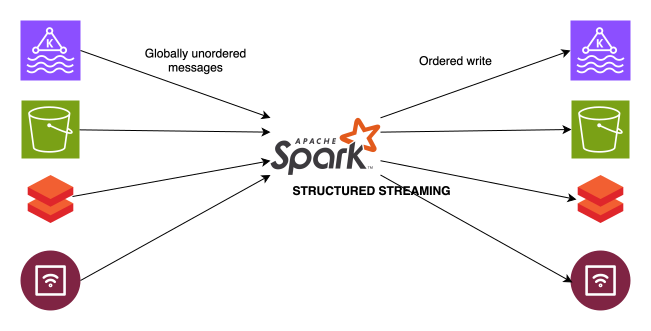

Distributed message systems like Kafka are built for throughput and fault tolerance, not ordering. A Kafka topic splits data across multiple partitions — each partition maintains its own internal order, but there is no ordering guarantee across partitions. When Spark reads from multiple partitions in parallel, records arrive in the executor in arrival order, not event order. A transaction timestamped `10:00:03` sitting in a lagging partition will arrive after a transaction timestamped `10:00:47` from a faster one. From Spark's perspective, the later event came first.

This breaks any application where output correctness depends on sequence:
- Transaction listings — rows must be displayed in the order they occurred. Out-of-order writes mean a user sees their payment history shuffled.
- Running balance calculations — each row's balance is derived from all prior rows. A single late-arriving event invalidates every balance computed after it.

This post covers how to tackle this in Spark Structured Streaming using watermarking, stateful operations, and controlled write semantics.



<!--truncate-->

Spark 4.0 introduces `transformWithState` operator for arbitrary stateful processing in Apache Spark, support for an umbrella of features such as object-oriented stateful processor definition, composite types, multiple separate state variables management, automatic TTL based eviction, timers,...

There are 2 types of time mode:
- `ProcessingTime`: register timer based on current clock, if the clock exceeds timer, and timer expiry callback (`handleExpiredTimer`) can be executed
- `EventTime`: timer expiry based on watermark on input stream, if the watermark exceeds timer, `handleExpiredTimer` will be executed

The idea for ordered write is to buffer input rows into a `ListState`, maintain a `ValueState` to store maximum event time seen so that we can reset timer accordingly, flush all rows into output stream when watermark advances past timer.

:::danger
State size is directly proportional to the watermark threshold — the wider the watermark, the more late events are buffered in state. Use this approach with caution: any event arriving later than the defined threshold will be silently dropped and is unrecoverable.
:::

Below code example illustrates the idea with a PySpark Structured Streaming application that read a Delta table as input stream, passed the data to a customized stateful processor, write the buffered data into output Delta table.

```python
from typing import Iterator
from pyspark.sql import Row, SparkSession, types as T, DataFrame
from pyspark.sql.streaming import StatefulProcessor, StatefulProcessorHandle
from logger_factory import LoggerFactory

logger = LoggerFactory.get_logger(__name__)

input_schema = T.StructType(
    [
        T.StructField("group_reference", T.StringType(), True),
        T.StructField("data", T.StringType(), True),
        T.StructField("created", T.TimestampType(), True),
    ]
)

output_schema = T.StructType(
    [
        T.StructField("group_reference", T.StringType(), True),
        T.StructField("data", T.StringType(), True),
        T.StructField("created", T.TimestampType(), True),
    ]
)

rows_state_schema = T.StructType(
    [
        T.StructField("data", T.StringType(), True),
        T.StructField("created", T.TimestampType(), True),
    ]
)

max_created_state_schema = T.StructType(
    [T.StructField("max_created", T.LongType(), True)]
)

WATERMARK = 3 * 60  # 3 minutes in seconds


class GroupBufferProcessor(StatefulProcessor):
    """
    Buffer incoming rows per group_reference using ListState with EventTime timers.
    Reset event-time timer on each new input batch with maximum op_ts seen.
    On timer expiry (watermark advances past timer), flushes all buffered rows to output.
    """

    def init(self, handle: StatefulProcessorHandle):
        self.handle = handle
        self.rows_state = handle.getListState("rows_state", rows_state_schema)
        self.max_created_state = handle.getValueState(
            "max_created_state", max_created_state_schema
        )  # Store maximum value of event time column in Unix timestamp format

    def handleInputRows(self, key, rows, timerValues) -> Iterator[Row]:
        current_max_created = 0
        if self.max_created_state.exists():
            current_max_created = self.max_created_state.get()[0]

        incoming_max_created = 0
        for row in rows:
            self.rows_state.appendValue((row[1], row[2]))  # (data, created)
            row_created = int(row[2].timestamp() * 1000)
            incoming_max_created = max(incoming_max_created, row_created)

        logger.info(
            f"""
            group_reference: {key[0]}
            current_max_created: {current_max_created}
            incoming_max_created: {incoming_max_created}
        """
        )

        if current_max_created < incoming_max_created:
            for timer in self.handle.listTimers():
                self.handle.deleteTimer(timer)

            self.max_created_state.update((incoming_max_created,))
            current_max_created = incoming_max_created

        logger.info(
            f"""
            group_reference: {key[0]}
            current_max_created: {current_max_created}
            incoming_max_created: {incoming_max_created}
        """
        )

        self.handle.registerTimer(current_max_created)

        return iter([])

    def handleExpiredTimer(self, key, timerValues, expiredTimerInfo):
        logger.info(
            f"Timer expired for group_reference: {key[0]}, write to output stream"
        )

        # Retrieve all accumulated rows from state
        group_reference = key[0]
        accumulated_rows = list(self.rows_state.get())

        # Clear the state
        self.rows_state.clear()
        self.max_created_state.clear()

        # Flush all buffered rows to output stream
        for state_row in accumulated_rows:
            yield Row(
                group_reference=group_reference, data=state_row[0], created=state_row[1]
            )

    def close(self):
        pass


def main():
    spark: SparkSession = SparkSession.builder.appName(
        "Ordered Streaming"
    ).getOrCreate()
    spark.conf.set(
        "spark.sql.streaming.stateStore.providerClass",
        "org.apache.spark.sql.execution.streaming.state.RocksDBStateStoreProvider",
    )

    input_delta_table = "./data/input_table/"
    output_delta_table = "./data/output_table/"
    checkpoint_location = "./data/checkpoint/"

    df: DataFrame = (
        spark.readStream.format("delta")
        .option("ignoreChanges", "true")
        .option("startingVersion", 0)
        .load(input_delta_table)
        .withWatermark("created", f"{WATERMARK} seconds")
    )

    result_df: DataFrame = df.groupBy("group_reference").transformWithState(
        statefulProcessor=GroupBufferProcessor(),
        outputStructType=output_schema,
        outputMode="Append",
        timeMode="EventTime",
    )

    query = (
        result_df.writeStream.format("delta")
        .outputMode("append")
        .option("checkpointLocation", checkpoint_location)
        .trigger(processingTime="10 seconds")
        .start(output_delta_table)
    )

    query.awaitTermination()

if __name__ == "__main__":
    main()
```

- Batch 1

```python
# Write init data to input table ./data/input_table/
data = [
  ("Group_A", '{"value": 10}', datetime(2026, 3, 21, 10, 0, 0)),
  ("Group_A", '{"value": 20}', datetime(2026, 3, 21, 10, 0, 0)),
  ("Group_A", '{"value": 30}', datetime(2026, 3, 21, 10, 0, 0)),
  ("Group_B", '{"value": 10}', datetime(2026, 3, 21, 10, 1, 0)),
  ("Group_B", '{"value": 20}', datetime(2026, 3, 21, 10, 1, 0)),
]    
```

`Group A timer = 2026-03-21 10:00:00`.

`Group B timer = 2026-03-21 10:01:00`.

`Watermark threshold = max event time seen - delay configured = 2026-03-21 10:01:00 - 3 minutes = 2026-03-21 09:58:00`.

Since the timer we set is the maximum event time seen for each group `self.handle.registerTimer(current_max_created)`, there are no timer expired yet. Check the data of tables

```bash
>>> spark.read.format("delta").load("./data/input_table").orderBy("created").show(truncate=False)
+---------------+-------------+-------------------+                             
|group_reference|data         |created            |
+---------------+-------------+-------------------+
|Group_A        |{"value": 10}|2026-03-21 10:00:00|
|Group_A        |{"value": 20}|2026-03-21 10:00:00|
|Group_A        |{"value": 30}|2026-03-21 10:00:00|
|Group_B        |{"value": 20}|2026-03-21 10:01:00|
|Group_B        |{"value": 10}|2026-03-21 10:01:00|
+---------------+-------------+-------------------+

>>> spark.read.format("delta").load("./data/output_table").orderBy("created").show(truncate=False)
+---------------+----+-------+
|group_reference|data|created|
+---------------+----+-------+
+---------------+----+-------+
```

Read state by
```bash
# Some errors on Spark recently that makes me unable to read `statestore` data source
>>> spark.read.format("statestore").option("stateVarName", "rows_state").load("./data/checkpoint").show()
# Should output 5 rows data for rows_state
>>> spark.read.format("statestore").option("stateVarName", "max_created_state").load("./data/checkpoint").show()
# Should output 2 rows max event time data for max_created_state
```

- Batch 2

```python
# Insert few more records into input table
data = [
  ("Group_A", '{"value": 40}', datetime(2026, 3, 21, 10, 1, 0)),
  ("Group_A", '{"value": 50}', datetime(2026, 3, 21, 10, 1, 0)),
  ("Group_A", '{"value": 60}', datetime(2026, 3, 21, 10, 1, 0)),
  ("Group_B", '{"value": 30}', datetime(2026, 3, 21, 10, 2, 0)),
  ("Group_B", '{"value": 40}', datetime(2026, 3, 21, 10, 3, 0)),
]
```

`Group A timer = 2026-03-21 10:01:00`.

`Group B timer = 2026-03-21 10:03:00`.

`Watermark threshold = max event time seen - delay configured = 2026-03-21 10:03:00 - 3 minutes = 2026-03-21 10:00:00`.

No timer expired yet

```bash
>>> spark.read.format("delta").load("./data/input_table").orderBy("created", "group_reference").show(truncate=False)
+---------------+-------------+-------------------+
|group_reference|data         |created            |
+---------------+-------------+-------------------+
|Group_A        |{"value": 20}|2026-03-21 10:00:00|
|Group_A        |{"value": 10}|2026-03-21 10:00:00|
|Group_A        |{"value": 30}|2026-03-21 10:00:00|
|Group_A        |{"value": 40}|2026-03-21 10:01:00|
|Group_A        |{"value": 60}|2026-03-21 10:01:00|
|Group_A        |{"value": 50}|2026-03-21 10:01:00|
|Group_B        |{"value": 20}|2026-03-21 10:01:00|
|Group_B        |{"value": 10}|2026-03-21 10:01:00|
|Group_B        |{"value": 30}|2026-03-21 10:02:00|
|Group_B        |{"value": 40}|2026-03-21 10:03:00|
+---------------+-------------+-------------------+

>>> spark.read.format("delta").load("./data/output_table").orderBy("created", "group_reference").show(truncate=False)
+---------------+----+-------+
|group_reference|data|created|
+---------------+----+-------+
+---------------+----+-------+
```

- Batch 3

```python
# Insert record that increment watermark to exceed Group_A timer
data = [
  ("Group_C", '{"value": 10}', datetime(2026, 3, 21, 10, 4, 0)),
]
```

`Group A timer = 2026-03-21 10:01:00`.

`Group B timer = 2026-03-21 10:03:00`.

`Group C timer = 2026-03-21 10:04:00`.

`Watermark threshold = max event time seen - delay configured = 2026-03-21 10:04:00 - 3 minutes = 2026-03-21 10:01:00`.

Timer of `Group_A` expired

```bash
>>> spark.read.format("delta").load("./data/input_table").orderBy("created", "group_reference").show(truncate=False)
+---------------+-------------+-------------------+
|group_reference|data         |created            |
+---------------+-------------+-------------------+
|Group_A        |{"value": 10}|2026-03-21 10:00:00|
|Group_A        |{"value": 20}|2026-03-21 10:00:00|
|Group_A        |{"value": 30}|2026-03-21 10:00:00|
|Group_A        |{"value": 50}|2026-03-21 10:01:00|
|Group_A        |{"value": 60}|2026-03-21 10:01:00|
|Group_A        |{"value": 40}|2026-03-21 10:01:00|
|Group_B        |{"value": 20}|2026-03-21 10:01:00|
|Group_B        |{"value": 10}|2026-03-21 10:01:00|
|Group_B        |{"value": 30}|2026-03-21 10:02:00|
|Group_B        |{"value": 40}|2026-03-21 10:03:00|
|Group_C        |{"value": 10}|2026-03-21 10:04:00|
+---------------+-------------+-------------------+

>>> spark.read.format("delta").load("./data/output_table").orderBy("created", "group_reference").show(truncate=False)
+---------------+-------------+-------------------+
|group_reference|data         |created            |
+---------------+-------------+-------------------+
|Group_A        |{"value": 10}|2026-03-21 17:00:00|
|Group_A        |{"value": 20}|2026-03-21 17:00:00|
|Group_A        |{"value": 30}|2026-03-21 17:00:00|
|Group_A        |{"value": 40}|2026-03-21 17:01:00|
|Group_A        |{"value": 50}|2026-03-21 17:01:00|
|Group_A        |{"value": 60}|2026-03-21 17:01:00|
+---------------+-------------+-------------------+
```

State of `Group_A` are dropped from `rows_state` and `max_created_state`.

- Batch 4

```python
# Insert more records
data = [
  ("Group_C", '{"value": 20}', datetime(2026, 3, 21, 10, 8, 0)),
]
```

`Group B timer = 2026-03-21 10:03:00`.

`Group C timer = 2026-03-21 10:08:00`.

`Watermark threshold = max event time seen - delay configured = 2026-03-21 10:08:00 - 3 minutes = 2026-03-21 10:05:00`.

Timer of `Group_B` expired

```bash
>>> spark.read.format("delta").load("./data/input_table").orderBy("created", "group_reference").show(truncate=False)
+---------------+-------------+-------------------+                             
|group_reference|data         |created            |
+---------------+-------------+-------------------+
|Group_A        |{"value": 20}|2026-03-21 10:00:00|
|Group_A        |{"value": 30}|2026-03-21 10:00:00|
|Group_A        |{"value": 10}|2026-03-21 10:00:00|
|Group_A        |{"value": 50}|2026-03-21 10:01:00|
|Group_A        |{"value": 60}|2026-03-21 10:01:00|
|Group_A        |{"value": 40}|2026-03-21 10:01:00|
|Group_B        |{"value": 10}|2026-03-21 10:01:00|
|Group_B        |{"value": 20}|2026-03-21 10:01:00|
|Group_B        |{"value": 30}|2026-03-21 10:02:00|
|Group_B        |{"value": 40}|2026-03-21 10:03:00|
|Group_C        |{"value": 10}|2026-03-21 10:04:00|
|Group_C        |{"value": 20}|2026-03-21 10:08:00|
+---------------+-------------+-------------------+

>>> spark.read.format("delta").load("./data/output_table").orderBy("created", "group_reference").show(truncate=False)
+---------------+-------------+-------------------+
|group_reference|data         |created            |
+---------------+-------------+-------------------+
|Group_A        |{"value": 10}|2026-03-21 17:00:00|
|Group_A        |{"value": 20}|2026-03-21 17:00:00|
|Group_A        |{"value": 30}|2026-03-21 17:00:00|
|Group_A        |{"value": 40}|2026-03-21 17:01:00|
|Group_A        |{"value": 50}|2026-03-21 17:01:00|
|Group_A        |{"value": 60}|2026-03-21 17:01:00|
|Group_B        |{"value": 10}|2026-03-21 17:01:00|
|Group_B        |{"value": 20}|2026-03-21 17:01:00|
|Group_B        |{"value": 30}|2026-03-21 17:02:00|
|Group_B        |{"value": 40}|2026-03-21 17:03:00|
+---------------+-------------+-------------------+
```

State of `Group_B` are dropped from `rows_state` and `max_created_state`.

:::note
The custom state processor logic is encapsulated in a UDF, expect a measurable performance cost when using.
:::
